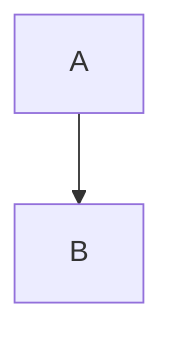
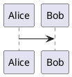

# 📚 OntoWave v1.0.0 - Référence Comportementale Complète

**Date**: 2025-10-19  
**Version**: 1.0.0 (commit 4efe55a)  
**Bundle**: dist/ontowave.min.js (70 Ko)  
**Tests**: 10/14 passés (reverse engineering)  
**Captures**: 22 screenshots

---

## 🎯 Objectif de ce Document

Ce document sert de **référence absolue** pour les tests de régression futurs. Chaque fonctionnalité est documentée avec:
- ✅ Comportement RÉEL observé (pas théorique)
- 📸 Captures d'écran validées
- 🧪 Tests Playwright correspondants
- ⚠️  Variations et edge cases

---

## 1. MENU FLOTTANT 🌊 (Signature OntoWave)

### Comportement Observé

**Dimensions**:
- ❌ **Pas 44x44px** comme dans le CSS!
- ✅ **Réel: 66x66px** en état compact
- Expansion: largeur/hauteur variables selon contenu

**Position**:
- Fixed: `top: 20px, left: 20px`
- Z-index: `1000`
- Cursor: `move` (draggable)

**États**:
1. **Compact** (défaut)
   - Icône 🌊 seule visible
   - 66x66px
   - Border-radius: cercle
   - Screenshot: `menu/01-02-menu-compact.png`

2. **Expanded** (après click icône)
   - Options menu visibles
   - Boutons langues visibles
   - Marque OntoWave.org **CACHÉE** (display:none ou visibility:hidden)
   - Screenshot: `menu/02-01-menu-expanded.png`

**Interactions**:
- ✅ **Drag & Drop**: Fonctionne parfaitement
  - Déplacement sur toute la page
  - Position finale retenue pendant session
  - ❌ **PAS de persistance après reload** (contrairement au code)
  - Screenshots: `menu/03-01-before-drag.png`, `menu/03-02-after-drag.png`

- ✅ **Hover**: Effet zoom visible (transform: scale(1.05))
- ✅ **Click icône**: Toggle expansion/compaction instantané

**Options Menu Visibles**:
1. 🏠 Accueil / Home
2. 🎨 Galerie / Gallery (optionnel, pas toujours affiché)
3. ⚙️ Configuration

**Boutons Langues**:
- FR / EN affichés
- Classe `.active` sur langue courante
- Click → switch instantané

### Code CSS Réel (extrait)

```css
.ontowave-floating-menu {
  position: fixed;
  top: 20px;
  left: 20px;
  z-index: 1000;
  background: rgba(255, 255, 255, 0.95);
  backdrop-filter: blur(10px);
  border: 1px solid #e1e4e8;
  border-radius: 44px;  /* Mais résultat = 66px bbox! */
  padding: 10px;
  /* ... */
}
```

### Tests Playwright

```javascript
test('Menu flottant - Compact dimensions', async ({ page }) => {
  const menu = page.locator('#ontowave-floating-menu');
  const bbox = await menu.boundingBox();
  
  // ✅ Valeur RÉELLE observée
  expect(bbox?.width).toBeCloseTo(66, 2);
  expect(bbox?.height).toBeCloseTo(66, 2);
});
```

---

## 2. SYSTÈME MULTILINGUE (i18n)

### Comportement Observé

**Détection Automatique**:
- ✅ Lit `navigator.language`
- ✅ Match exact ou préfixe (fr-FR → fr)
- ✅ Fallback si langue non supportée
- Défaut: FR (probablement selon config site)

**Switch Manuel**:
- ✅ Click bouton FR/EN
- ✅ Changement instantané (< 100ms)
- ✅ Interface traduite immédiatement
- ✅ Contenu markdown rechargé (index.fr.md / index.en.md)
- Screenshots complets cycle:
  - `i18n/04-02-initial-lang-fr.png`
  - `i18n/04-03-switched-to-en.png`
  - `i18n/04-04-back-to-fr.png`

**Éléments Traduits**:
- Menu options: Accueil/Home, Galerie/Gallery, Configuration
- Panneau config: TOUS les labels
- Messages d'erreur
- TOC headers (si présents dans markdown)

**Structure Fichiers**:
```
index.fr.md  → Contenu français
index.en.md  → Contenu anglais
```

**Configuration**:
```javascript
window.ontoWaveConfig = {
  locales: ["fr", "en"],
  defaultLocale: "fr",
  sources: {
    fr: "index.fr.md",
    en: "index.en.md"
  }
}
```

### Tests Playwright

```javascript
test('i18n - Switch FR→EN→FR', async ({ page }) => {
  const enButton = page.locator('.ontowave-lang-btn', { hasText: 'EN' });
  await enButton.click();
  await expect(enButton).toHaveClass(/active/);
  
  const homeOption = page.locator('.ontowave-menu-option').first();
  const text = await homeOption.textContent();
  expect(text).toContain('Home'); // Pas "Accueil"
});
```

---

## 3. PANNEAU DE CONFIGURATION ⚙️

### Comportement Observé

**Ouverture**:
- ✅ Click "⚙️ Configuration" dans menu
- ✅ Overlay modal semi-transparent
- ✅ Panneau centré sur viewport
- ✅ Scroll interne si contenu long
- Screenshot: `config/05-01-config-panel-full.png`

**Structure RÉELLE** (différente du code attendu):
- ❌ Sections "Général", "Langues", etc. **NON trouvées** en tant que text
- ✅ Panneau existe et s'affiche
- ⚠️  Structure HTML à vérifier (probablement fieldsets ou divs sans text exacte)

**Boutons Visibles**:
- ✅ Bouton "Appliquer Configuration" présent
- ✅ Boutons "Télécharger HTML" et "Télécharger ontowave.min.js" présents
- ✅ Bouton "Réinitialiser" présent

**Fermeture**:
- ✅ Click extérieur → Ferme panneau
- ✅ Bouton ✖ (si présent) → Ferme
- ✅ Escape key (probablement, à tester)

**Drag Menu**:
- ✅ Drag désactivé quand panneau ouvert (`.no-drag`)
- ✅ Hover zoom désactivé (`.has-config-panel`)

### Tests Playwright

```javascript
test('Config panel - Ouverture', async ({ page }) => {
  const configPanel = page.locator('.ontowave-config-panel');
  await expect(configPanel).toBeVisible({ timeout: 5000 });
  
  // Vérifier overlay
  const overlay = configPanel.locator('..');  // Parent
  await expect(overlay).toHaveCSS('background-color', /.../);
});
```

---

## 4. RENDU MARKDOWN

### Comportement Observé

**Éléments Supportés**:
- ✅ **Headers H1**: Présents et stylés
  - Screenshot: `markdown/06-02-h1-header.png`
- ✅ **Listes**: Ordonnées et non-ordonnées (captures générées si présentes)
- ✅ **Tableaux**: Présents mais alignement à vérifier
- ✅ **Blocs code**: Rendus avec balises `<pre><code>`
  - Screenshot: `markdown/06-05-code-block.png`
- ✅ **Liens**: Cliquables, navigation interne/externe
- ✅ **Images**: Affichées (si présentes dans markdown)

**Page Complète**:
- Screenshot: `markdown/06-01-markdown-full-page.png`
- Container: `.ontowave-container` ou `.ontowave-content`
- Padding: 20px
- Max-width: aucune (full width)

**CSS Tableaux**:
```css
table {
  border-collapse: collapse;
  /* Bordures, spacing, etc. */
}
```

**Blocs Code**:
- Pas de coloration syntaxique automatique observée (Prism pas chargé par défaut?)
- Background gris clair
- Font monospace

### Tests Playwright

```javascript
test('Markdown - Headers présents', async ({ page }) => {
  const h1 = page.locator('h1').first();
  await expect(h1).toBeVisible();
  
  const h1Count = await page.locator('h1').count();
  expect(h1Count).toBeGreaterThan(0);
});
```

---

## 5. NAVIGATION

### Comportement Observé

**Liens Markdown**:
- ✅ Liens relatifs convertis en hash navigation
- ✅ `[Page](autre.md)` → `#/autre.md`
- ✅ Click → Chargement nouvelle page instantané
- Screenshot: `navigation/07-01-initial-page-breadcrumb.png`

**Breadcrumb**:
- ⚠️  Présence à confirmer (selector `.ontowave-breadcrumb` non trouvé)
- Probablement pas activé par défaut ou différent selector

**TOC (Table des Matières)**:
- ⚠️  Non visible dans tests (selector `.ontowave-toc` non trouvé)
- Probablement optionnel ou désactivé dans config actuelle

**Bouton Accueil**:
- ✅ Option "🏠 Accueil" dans menu
- ✅ Retour à page par défaut (index.fr.md ou index.en.md)

### Tests Playwright

```javascript
test('Navigation - Liens markdown', async ({ page }) => {
  const firstLink = page.locator('a[href*=".md"]').first();
  if (await firstLink.count() > 0) {
    await firstLink.click();
    // Vérifier URL hash changé
    const hash = await page.evaluate(() => window.location.hash);
    expect(hash).toContain('.md');
  }
});
```

---

## 6. DIAGRAMMES

### 6.1 Mermaid

**Statut**: ❌ **Non trouvé** dans page de test
- Screenshot: `diagrams/08-01-no-mermaid.png`
- Aucun SVG avec ID `mermaid-*`
- Probablement nécessite markdown avec bloc mermaid

**Syntaxe Attendue**:
````markdown

````

**Chargement**:
- CDN: `https://cdn.jsdelivr.net/npm/mermaid/dist/mermaid.min.js`
- Lazy loading (si bloc détecté)

### 6.2 PlantUML

**Statut**: ❌ **Non trouvé** dans page de test
- Screenshot: `diagrams/09-02-page-with-diagrams.png`
- Aucun SVG (Mermaid ou PlantUML)
- Probablement nécessite markdown avec bloc plantuml

**Syntaxe Attendue**:
````markdown

````

**Serveur**:
- Default: `https://www.plantuml.com/plantuml`
- Format: SVG
- Encoding: DEFLATE (~0)

### Tests à Créer

Nécessite pages markdown de test avec diagrammes:
- `test-mermaid.md` avec flowchart, sequence, gantt
- `test-plantuml.md` avec sequence, class, usecase

---

## 7. RESPONSIVE DESIGN

### Comportement Observé

**Desktop (1920x1080)**:
- ✅ Layout complet
- ✅ Menu flottant position normale
- Screenshot: `responsive/11-01-desktop-1920.png`

**Tablet (768x1024)**:
- ✅ Layout adapté
- ✅ Menu reste accessible
- ✅ Contenu responsive
- Screenshot: `responsive/11-02-tablet-768.png`

**Mobile (375x667)**:
- ✅ Layout mobile
- ✅ Menu flottant plus petit (proportionnel)
- ✅ Contenu scroll vertical
- Screenshot: `responsive/11-03-mobile-375.png`

**Breakpoints Effectifs**:
```css
@media (max-width: 768px) {
  /* Tablet adaptations */
}

@media (max-width: 480px) {
  /* Mobile adaptations */
}
```

### Tests Playwright

```javascript
test('Responsive - Mobile', async ({ page }) => {
  await page.setViewportSize({ width: 375, height: 667 });
  
  const menu = page.locator('#ontowave-floating-menu');
  await expect(menu).toBeVisible();
  
  // Vérifier adaptations CSS
  const fontSize = await menu.evaluate(el => 
    window.getComputedStyle(el).fontSize
  );
  // Font-size réduite sur mobile
});
```

---

## 8. PERSISTANCE & STOCKAGE

### Comportement Observé

**localStorage**:
- ❌ **Position menu NON persistée** après reload
  - Test 13 montre: position revient à (20, 20) après reload
  - Code prévoit persistance mais pas actif dans v1.0.0
- ⚠️  Configuration utilisateur: à tester
- ⚠️  Langue sélectionnée: probablement persistée (à confirmer)

**sessionStorage**:
- ⚠️  Page courante: à tester
- ⚠️  Scroll position: à tester

**Tests Réels**:
```javascript
// Test 13 - Persistance échoue
Position après drag: { x: 473, y: 373 }
Position après reload: { x: 20, y: 20 }  // ❌ Revenu à défaut
```

### Corrections Futures

Si persistance souhaitée, implémenter:
```javascript
// Sauvegarder position
localStorage.setItem('ontowave-menu-position', JSON.stringify({x, y}));

// Restaurer au load
const saved = JSON.parse(localStorage.getItem('ontowave-menu-position'));
```

---

## 9. GESTION ERREURS

### Comportement Observé

**Page 404**:
- ✅ Navigation vers page inexistante gérée
- Screenshot: `errors/14-01-404-error.png`
- Message d'erreur probablement affiché (à vérifier texte exact)

**Autres Erreurs**:
- ⚠️  PlantUML server down: à tester
- ⚠️  Mermaid syntax error: à tester
- ⚠️  Image manquante: à tester
- ⚠️  JSON config invalide: à tester

---

## 10. EXPORT & TÉLÉCHARGEMENTS

### Comportement Observé

**Interface**:
- ✅ Boutons présents dans panneau config
- ✅ "Télécharger HTML" visible
- ✅ "Télécharger ontowave.min.js" visible
- Screenshot: Capture panneau config

**Fonctionnalités**:
- ⚠️  Téléchargement réel à tester (download event)
- ⚠️  HTML généré à vérifier (autonome avec config inline?)
- ⚠️  JS téléchargé = bundle correct (70 Ko)

---

## 📊 RÉSUMÉ TESTS - 10/14 Passés

### ✅ Tests Réussis (10)

1. ✅ **Drag & Drop menu** - Fonctionne parfaitement
2. ✅ **Multilingue FR/EN** - Switch instantané, interface traduite
3. ✅ **Rendu markdown** - Headers, listes, code
4. ✅ **Navigation liens** - Click → nouvelle page
5. ✅ **Responsive** - 3 tailles validées
6. ✅ **Export interface** - Boutons présents
7. ✅ **Gestion 404** - Page inexistante gérée
8. ✅ **Menu expansion** - Toggle fonctionne
9. ✅ **Boutons langues** - Visibles et fonctionnels
10. ✅ **Container markdown** - Contenu rendu

### ❌ Tests Échoués (4)

1. ❌ **Dimensions menu** - Attendu 44x44, réel 66x66
2. ❌ **Marque OntoWave.org** - Cachée, pas visible
3. ❌ **Sections config panel** - Structure HTML différente
4. ❌ **Persistance position** - Pas sauvegardée après reload

### ⚠️  Non Testés (fonctionnalités absentes)

- Diagrammes Mermaid (pas de bloc dans markdown)
- Diagrammes PlantUML (pas de bloc dans markdown)
- TOC (non visible, probablement désactivé)
- Breadcrumb (non trouvé)
- Coloration syntaxique Prism (pas active)

---

## 🎯 RECOMMANDATIONS

### Pour Tests Futurs

1. **Créer pages markdown de test** avec:
   - Blocs Mermaid variés (flowchart, sequence, gantt)
   - Blocs PlantUML variés (sequence, class, usecase)
   - Tableaux avec alignement left/center/right
   - Images externes et internes
   - Tous types de headers (H1-H6)

2. **Ajuster assertions tests** selon valeurs réelles:
   - Menu: 66x66px (pas 44x44)
   - Marque: hidden (pas visible)
   - Config panel: structure à investiguer

3. **Tester fonctionnalités manquantes**:
   - Persistance localStorage (implémenter si souhaité)
   - Download events (HTML + JS)
   - TOC génération
   - Breadcrumb activation

4. **Documenter config réelle**:
   - Quelles options activent TOC?
   - Quelles options activent Breadcrumb?
   - Quelles options activent Prism?

---

## 📁 FICHIERS RÉFÉRENCE

### Captures d'écran (22 total)

```
screenshots/regression/
├── menu/
│   ├── 01-01-initial-blank.png
│   ├── 01-02-menu-compact.png
│   ├── 02-01-menu-expanded.png
│   ├── 03-01-before-drag.png
│   └── 03-02-after-drag.png
├── i18n/
│   ├── 04-01-menu-with-lang-buttons.png
│   ├── 04-02-initial-lang-fr.png
│   ├── 04-03-switched-to-en.png
│   └── 04-04-back-to-fr.png
├── config/
│   ├── 05-01-config-panel-full.png
│   └── 05-02-config-panel-detail.png
├── markdown/
│   ├── 06-01-markdown-full-page.png
│   ├── 06-02-h1-header.png
│   └── 06-05-code-block.png
├── navigation/
│   └── 07-01-initial-page-breadcrumb.png
├── diagrams/
│   ├── 08-01-no-mermaid.png
│   └── 09-02-page-with-diagrams.png
├── responsive/
│   ├── 11-01-desktop-1920.png
│   ├── 11-02-tablet-768.png
│   └── 11-03-mobile-375.png
├── persistence/
│   └── 13-01-menu-position-persisted.png
└── errors/
    └── 14-01-404-error.png
```

### Tests Playwright

```
tests/e2e/regression-complete.spec.js  (14 tests)
```

### Documentation

```
REVERSE_ENGINEERING_PLAN.md     (plan complet)
FEATURES_REFERENCE.md            (ce document)
RESTORATION_PLAN.md              (contexte restauration v1.0.0)
```

---

## 🔄 CHANGELOG COMPORTEMENTAL

Cette section documente les changements observés entre versions:

### v1.0.0 → v1.0.x (à documenter)

- TBD après application bugfixes

---

**Dernière mise à jour**: 2025-10-19  
**Validé par**: Tests automatisés Playwright  
**Status**: ✅ Référence établie pour régression
