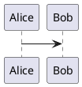

# 🚀 OntoWave - Package de Documentation Interactive

**OntoWave** transforme votre documentation en site interactif avec un seul include !

## ⚡ Installation Ultra-Simple

### Via CDN (Recommandé)

```html
<!DOCTYPE html>
<html>
<head><title>Ma Docs</title></head>
<body>
    <!-- Un seul include suffit ! -->
    <script src="https://cdn.jsdelivr.net/npm/ontowave@latest/dist/ontowave.min.js"></script>
</body>
</html>
```

### Via NPM

```bash
npm install ontowave
```

## 🎯 Fonctionnalités

- ✅ **Zero Config** - Fonctionne immédiatement
- ✅ **Un seul include** - Pas de dépendances externes
- ✅ **Mermaid intégré** - Diagrammes automatiques
- ✅ **PlantUML support** - Via serveur public
- ✅ **Navigation hash** - URLs partageables
- ✅ **Responsive design** - Mobile-friendly
- ✅ **Configuration JSON** - Optionnelle et flexible

## 📝 Configuration Optionnelle

```html
<script type="application/json" id="ontowave-config">
{
    "title": "Ma Documentation",
    "defaultPage": "index.md",
    "mermaid": { "theme": "default" }
}
</script>
<script src="https://cdn.jsdelivr.net/npm/ontowave@latest/dist/ontowave.min.js"></script>
```

## 🎨 Support Diagrammes

### Mermaid
```markdown

```

### PlantUML
```markdown

```

## 📦 Taille

- **12KB minifié**
- **4KB gzippé** 
- **Zéro dépendance**

## 🔗 Liens Utiles

- [Documentation détaillée](README-PACKAGE.md)
- [GitHub Repository](https://github.com/stephanedenis/OntoWave)
- [Package NPM](https://www.npmjs.com/package/ontowave)

---

## 🛠️ Développement Local (version complète)

Pour contribuer au développement d'OntoWave:

```bash
npm install
npm run dev
```

**Déploiement:**
```bash
npm run build
npm run preview
```

### Architecture

- `dist/ontowave.js`: Package distributable principal
- `dist/ontowave.min.js`: Version minifiée pour production
- `example-*.html`: Exemples d'utilisation du package
- `src/`: Code source de l'application Vite complète
- `content/`: Fichiers Markdown d'exemple

### Intégration submodules

Publiez/recopiez vos sous-modules vers des répertoires montés comme racines de `config.json` (ex: `RESEARCH/`). L'app les servira tels quels et gérera les liens `.md` → routes `#/…`.

### GitHub Pages et DNS

1) **Configuration Pages**
- Repo ➜ Settings ➜ Pages ➜ Build and deployment: Deploy from a branch
- Branch: `main`, Folder: `/docs`
- Custom domain: `ontowave.dev` (ou votre domaine)

2) **DNS requis côté registrar**
- Créez des enregistrements A pour l'apex/root:
  - `@` ➜ 185.199.108.153
  - `@` ➜ 185.199.109.153  
  - `@` ➜ 185.199.110.153
  - `@` ➜ 185.199.111.153
- Et/ou un CNAME pour sous-domaine:
  - `www` ➜ `<username>.github.io`

---

**Créé pour simplifier la documentation !** 🌊

## Structure
- `public/config.json`: configuration des racines de contenu (par défaut `content/`).
- `content/`: vos fichiers Markdown (exemples fournis).
- `src/`: app Vite (TypeScript), router et rendu Markdown.
- `tools/build-sitemap.mjs`: génère `public/sitemap.json` en scannant les racines.

## Intégration submodules
Publiez/recopiez vos sous-modules vers des répertoires montés comme racines de `config.json` (ex: `RESEARCH/`). L’app les servira tels quels et gérera les liens `.md` → routes `#/…`.

## GitHub Pages et DNS (custom domain)

1) Config Pages
- Repo ➜ Settings ➜ Pages ➜ Build and deployment: Deploy from a branch
- Branch: `main`, Folder: `/docs`
- Custom domain: `ontowave.dev` (ou votre domaine). Le fichier `docs/CNAME` est pris en compte.

2) DNS requis côté registrar
- Créez un enregistrement A (si apex/root):
	- `@` ➜ 185.199.108.153
	- `@` ➜ 185.199.109.153
	- `@` ➜ 185.199.110.153
	- `@` ➜ 185.199.111.153
- Et/ou un CNAME (pour un sous-domaine, ex: `www`):
	- `www` ➜ `<username>.github.io` (ex: `stephanedenis.github.io`)

3) HTTPS
- Dans Settings ➜ Pages, cochez "Enforce HTTPS" après propagation DNS.

4) Domaines alternatifs (.net/.com, www)
- Vous avez indiqué que `ontowawe.net`, `www.ontowave.net`, `ontowave.com` et `www.ontowave.com` pointent en CNAME vers `stephanedenis.github.io`.
- Pour un domaine canonique unique, ce projet utilise `ontowave.com` (voir `docs/CNAME`).
- Recommandation: laissez GitHub Pages gérer les redirections HTTPS (une seule entrée CNAME côté Pages). Si besoin, une redirection côté client existe dans `index.html` pour les hôtes alternatifs vers `https://ontowave.com`.

5) Validation / état actuel
- Projet configuré pour produire `docs/` (Vite outDir) et inclut `docs/CNAME` et `docs/.nojekyll`.
- Reste à faire côté compte GitHub: activer Pages sur `main/docs` et saisir le domaine custom `ontowave.com`.
- Reste à faire côté registrar: créer les enregistrements A/CNAME ci-dessus vers GitHub Pages.

6) Déploiement
- Chaque push sur `main` met à jour `docs/`; Pages sert la dernière version.
- Option: ajouter un workflow d’upload artefact si vous souhaitez conserver un build de référence.
***

## Mode sans serveur (file://) — Standalone

Ouvrez directement le site depuis un fichier HTML local (sans serveur HTTP):

1) Générez la version autonome qui embarque config et contenus:

```bash
npm run build:standalone
```

2) Ouvrez `docs/standalone/index.html` dans le navigateur (schéma `file://`).

Notes:
- Le bundle embarqué (`window.__ONTOWAVE_BUNDLE__`) inclut `public/config.json`, `public/{sitemap.json,nav.yml,pages.txt,search-index.json}` si présents, ainsi que tout `content/`.
- Le runtime tente d’abord l’accès embarqué, puis retombe sur `fetch` réseau. Ainsi, file:// fonctionne même sans serveur.
- La recherche avancée nécessite un `search-index.json` préconstruit; sinon, mode minimal (titres).


Limitations MVP:
- Pas d’indexation de recherche (prévue via `sitemap.json` + Web Worker elasticlunr).
- Sécurité XSS: le contenu est supposé de confiance. Ajoutez DOMPurify si nécessaire.

## Recherche (SPA, opt-in)

- L’index est inactif par défaut si aucun `search-index.json` n’est présent (à côté d’`index.html`).
- Activez-le via le panneau « Options » (mini-menu flottant), importez un `pages.txt` (liste de chemins `.md` relatifs aux racines), laissez l’index se construire, puis exportez `search-index.json`.
- En build, `npm run pageslist` génère automatiquement `public/pages.txt`; vous pouvez ensuite ouvrir le site, activer l’index, puis exporter.
- La recherche privilégie la langue courante (préfixe `#/fr/` ou `#/en/`), avec repli inter-langue si aucun résultat.

### Déploiement « copie statique »

Pour un usage sans pipeline (copie d’`index.html` + `assets` + `config.json` + contenus):

- Placez `config.json`, `nav.yml` (optionnel) et `sitemap.json`/`pages.txt` à côté d’`index.html`.
- Si vous ne voulez pas d’indexation en ligne, exportez `search-index.json` depuis le panneau Options et copiez-le avec le site.
- Optionnel: réduisez l’habillage via `ui` dans `public/config.json`:
	- `"ui": { "minimal": true }` pour masquer header/sidebar/toc/footer.
	- Ou au détail: `header:false`, `sidebar:false`, `toc:false`, `footer:false`, `menu:false`.
