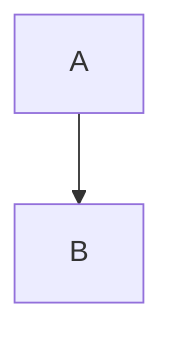
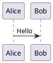

# 🔬 Reverse Engineering OntoWave v1.0.0 - Plan Complet

## Objectif

Documenter **TOUTES** les fonctionnalités d'OntoWave avec:
- Description comportementale précise
- Captures d'écran Playwright à chaque étape
- Tests de régression automatisés
- Référence pour validations futures

## Méthodologie

### Phase 1: Analyse du Code Source ✅
Extraction des fonctionnalités depuis `dist/ontowave.js` (103 Ko)

### Phase 2: Inventaire des Fonctionnalités
Catégorisation complète

### Phase 3: Tests Manuels + Captures
Validation visuelle avec screenshots

### Phase 4: Tests Automatisés
Suite Playwright complète

## Fonctionnalités Identifiées (Code Source)

### 1. MENU FLOTTANT 🌊 (Signature OntoWave)

**Classes CSS**:
- `.ontowave-floating-menu` - Menu principal
- `.ontowave-menu-icon` - Icône 🌊
- `.ontowave-menu-content` - Contenu du menu étendu
- `.ontowave-menu-brand` - Marque OntoWave.org

**États**:
- Compact: 44x44px, icône seule
- Expanded: Auto width/height, options visibles
- `.no-drag`: Déplacement désactivé (quand panneau config ouvert)
- `.has-config-panel`: Style spécial sans hover zoom

**Comportements**:
- Drag & Drop (déplaçable sur toute la page)
- Clic sur icône → Expansion/Réduction
- Hover → Zoom 1.05x (sauf si panneau ouvert)
- Position: Fixed top:20px left:20px
- Z-index: 1000

**Options du menu** (`.ontowave-menu-option`):
1. 🏠 Accueil / Home
2. 🎨 Galerie / Gallery (optionnel)
3. ⚙️ Configuration

**Boutons langues** (`.ontowave-lang-btn`):
- FR / EN
- Position dans menu ou fixe (config `languageButtons`)

### 2. SYSTÈME MULTILINGUE i18n

**Configuration**:
```javascript
locales: ["fr", "en"]
fallbackLocale: "en"
sources: {
  fr: "index.fr.md",
  en: "index.en.md"
}
```

**Détection automatique**:
- Lecture `navigator.language` / `navigator.languages`
- Matching exact ou par préfixe (fr-FR → fr)
- Fallback si langue non supportée
- Détection depuis URL (`.fr.md`, `.en.md`)

**Traductions interface** (`TRANSLATIONS`):
- Textes menu (menuHome, menuGallery, menuConfiguration)
- Labels panneau config (30+ chaînes traduites)
- Mise à jour dynamique au changement de langue

**Boutons langues**:
- Position: `menu` / `fixed` / `both`
- Classe active: `.active`
- Switch instantané sans rechargement

### 3. PANNEAU DE CONFIGURATION ⚙️

**Classe**: `.ontowave-config-panel`

**Sections**:

#### A. Général
- Titre du site
- Page par défaut
- URL de base

#### B. Langues et Localisation
- Langues supportées (comma-separated)
- Langue de fallback
- Note: "Laissez vide pour site monolingue"

#### C. Navigation et Interface
- ☑️ Afficher galerie d'exemples
- ☑️ Bouton Accueil
- ☑️ Fil d'Ariane (breadcrumb)
- ☑️ Table des matières

#### D. Diagrammes Mermaid
- Thème: default/dark/forest/neutral
- ☑️ Démarrage automatique
- ☑️ Utiliser largeur maximale

#### E. Diagrammes PlantUML
- Serveur PlantUML (URL)
- Format sortie: svg/png/txt

#### F. Coloration Syntaxique (Prism.js)
- Thème Prism
- ☑️ Chargement automatique

#### G. Interface Utilisateur
- Thème interface
- ☑️ Design responsive
- ☑️ Animations et transitions

**Boutons**:
- ✅ Appliquer Configuration
- 📥 Télécharger HTML
- 📥 Télécharger ontowave.min.js
- 🔄 Réinitialiser

**Comportements**:
- Overlay modal semi-transparent
- Fermeture: clic extérieur ou bouton ✖
- Sauvegarde: localStorage + sessionStorage
- Export HTML: génère fichier autonome avec config inline
- Désactive drag menu quand ouvert

### 4. RENDU MARKDOWN

**Moteur**: markdown-it (probablement)

**Extensions supportées**:
- Headers (H1-H6)
- Listes (ordonnées/non-ordonnées)
- Tableaux
- Blocs de code
- Citations
- Liens
- Images
- **Blocs Mermaid** (```mermaid)
- **Blocs PlantUML** (```plantuml)

**Traitement spécial**:
- Ancres automatiques sur headers
- TOC généré depuis headers
- Liens relatifs convertis en navigation interne

### 5. NAVIGATION

**Types de liens**:
- Liens markdown relatifs: `[Page](autre-page.md)`
- Liens hash: `[Section](#section-id)`
- Liens externes: ouverts dans nouvel onglet
- Navigation multilingue: `page.fr.md` / `page.en.md`

**Fil d'Ariane (Breadcrumb)**:
- Classe: `.ontowave-breadcrumb`
- Chemin de navigation cliquable
- Mis à jour automatiquement

**Bouton Accueil**:
- Retour à `defaultPage` ou `sources[lang]`

**Table des matières (TOC)**:
- Générée depuis headers H2-H4
- Liens anchor cliquables
- Mise à jour auto à chaque page

### 6. DIAGRAMMES MERMAID

**Syntaxe**: 
````markdown

````

**Types supportés**:
- Flowchart (graph TD/LR/BT/RL)
- Sequence diagrams
- Gantt charts
- Class diagrams
- State diagrams
- Pie charts
- Journey diagrams

**Configuration**:
- Theme: default/dark/forest/neutral
- useMaxWidth: true/false
- Rendu côté client via mermaid.js

**Chargement**:
- CDN: https://cdn.jsdelivr.net/npm/mermaid/dist/mermaid.min.js
- Lazy loading si présent dans markdown

### 7. DIAGRAMMES PLANTUML

**Syntaxe**:
````markdown

````

**Serveur**:
- Default: https://www.plantuml.com/plantuml
- Format: SVG (recommandé) / PNG / TXT

**Encodage**:
- DEFLATE compression (~0 format)
- URL: `{server}/{format}/~0{encoded}`

**Types supportés**:
- Sequence diagrams
- Use case diagrams
- Class diagrams
- Activity diagrams
- Component diagrams
- State diagrams
- Object diagrams
- Deployment diagrams
- Timing diagrams

**Rendu**:
- Requête HTTP vers serveur PlantUML
- SVG inséré inline dans page
- Pas de wrapper div supplémentaire

### 8. COLORATION SYNTAXIQUE (PRISM.JS)

**Blocs de code**:
````markdown
```javascript
console.log("Hello");
```
````

**Langages supportés**:
- JavaScript
- TypeScript
- Python
- Java
- C/C++
- HTML/CSS
- JSON
- YAML
- Bash
- ... (+ extensions Prism)

**Thèmes**:
- Default (clair)
- Dark
- Twilight
- ... (thèmes Prism standards)

**Chargement**:
- CDN Prism.js
- Autoload si présent dans config
- Highlight automatique des blocs

### 9. RECHERCHE (Optionnel)

**Note**: Présence à confirmer dans v1.0.0

**Si présent**:
- Indexation pages markdown
- Recherche full-text
- Résultats filtrés
- Navigation directe vers résultat

### 10. GESTION FICHIERS

**Chargement markdown**:
- Fetch HTTP des fichiers `.md`
- Support chemins relatifs/absolus
- Gestion 404 (page non trouvée)
- Cache potentiel (à vérifier)

**Candidats pages multilingues**:
```javascript
// Pour "page.md" avec locale "fr":
1. page.fr.md (priorité)
2. page.md (fallback)
```

**Support fichiers externes**:
- Images dans markdown
- Liens vers ressources
- Fichiers PlantUML `.puml` (à confirmer si v1.0.0)

### 11. RESPONSIVE DESIGN

**Breakpoints** (probables):
- Desktop: > 768px
- Tablet: 768px - 480px
- Mobile: < 480px

**Adaptations**:
- Menu flottant positionné adaptatif
- TOC collapsible sur mobile
- Tableaux scrollables horizontalement
- Images responsive (max-width: 100%)

### 12. THÈMES UI

**Modes**:
- Light (défaut)
- Dark (si présent)

**Éléments stylés**:
- Background colors
- Text colors
- Borders
- Shadows
- Links colors

### 13. ANIMATIONS & TRANSITIONS

**Éléments animés**:
- Menu expansion/collapse
- Hover effects
- Page transitions (possibles)
- Smooth scroll vers anchors
- Config panel fade in/out

**CSS Transitions**:
```css
transition: all 0.3s ease
```

### 14. EXPORT / TÉLÉCHARGEMENT

**Télécharger HTML**:
- Génère fichier `.html` autonome
- Intègre:
  - Configuration inline
  - Contenu markdown
  - Script ontowave.min.js (inline ou CDN)
  - Styles CSS

**Télécharger ontowave.min.js**:
- Download direct du bundle
- Utilisable pour intégration personnalisée

### 15. PERSISTANCE

**localStorage**:
- Position menu flottant (drag)
- Configuration utilisateur
- Langue sélectionnée
- Préférences UI

**sessionStorage**:
- État navigation (page courante)
- Scroll position (potentiel)

### 16. GESTION ERREURS

**Cas gérés**:
- Fichier markdown 404
- Serveur PlantUML inaccessible
- Mermaid syntax errors
- JSON config invalide
- Images manquantes

**Affichage**:
- Messages d'erreur dans console
- Fallbacks gracieux
- Page d'erreur ou message inline

## Structure HTML Générée Dynamiquement

```html
<body>
  <!-- Menu flottant -->
  <div class="ontowave-floating-menu" id="ontowave-floating-menu">
    <span class="ontowave-menu-icon">🌊</span>
    <div class="ontowave-menu-content">
      <div class="ontowave-menu-brand">OntoWave.org</div>
      <div class="ontowave-menu-option">🏠 Accueil</div>
      <div class="ontowave-menu-option">🎨 Galerie</div>
      <div class="ontowave-menu-option">⚙️ Configuration</div>
      <div class="ontowave-lang-buttons">
        <button class="ontowave-lang-btn active">FR</button>
        <button class="ontowave-lang-btn">EN</button>
      </div>
    </div>
  </div>

  <!-- Container principal -->
  <div class="ontowave-container" id="ontowave-container">
    <!-- Breadcrumb -->
    <div class="ontowave-breadcrumb"></div>
    
    <!-- Contenu markdown rendu -->
    <div class="ontowave-content">
      <!-- HTML généré depuis markdown -->
    </div>
    
    <!-- Table des matières -->
    <div class="ontowave-toc"></div>
  </div>

  <!-- Panneau configuration (si ouvert) -->
  <div class="ontowave-config-panel">
    <!-- Formulaire configuration -->
  </div>
</body>
```

## Plan de Tests

### Tests Manuels avec Screenshots

1. **Chargement initial**
   - Screenshot: Page vide → Menu apparaît
   - Vérifier: Menu position, icône 🌊

2. **Menu flottant**
   - Click icône → Expansion
   - Drag & Drop → Nouvelle position
   - Hover → Effet zoom
   - Screenshot chaque état

3. **Navigation markdown**
   - Clic lien → Nouvelle page
   - Breadcrumb mis à jour
   - TOC mis à jour
   - Screenshot avant/après

4. **Multilingue**
   - Click FR → Contenu français
   - Click EN → Contenu anglais
   - Interface traduite
   - Screenshot chaque langue

5. **Panneau configuration**
   - Ouvrir → Overlay visible
   - Modifier options → Appliquer
   - Fermer → Retour normal
   - Screenshot panneau complet

6. **Diagrammes Mermaid**
   - Page avec mermaid → SVG rendu
   - Types variés (flowchart, sequence, etc.)
   - Screenshot chaque type

7. **Diagrammes PlantUML**
   - Page avec plantuml → SVG rendu
   - Vérifier encoding DEFLATE
   - Screenshot rendu

8. **Code syntax highlighting**
   - Blocs code colorés
   - Langages variés
   - Screenshot avec/sans Prism

9. **Tableaux markdown**
   - Alignement left/center/right
   - Bordures CSS
   - Screenshot tableau complexe

10. **Responsive**
    - Desktop → Layout complet
    - Tablet → Adaptations
    - Mobile → Menu adaptatif
    - Screenshot 3 tailles

11. **Export**
    - Télécharger HTML → Fichier fonctionnel
    - Télécharger JS → Bundle correct
    - Screenshot dialogs

12. **Gestion erreurs**
    - Page 404 → Message
    - PlantUML error → Fallback
    - Screenshot erreurs

### Tests Automatisés Playwright

Créer specs pour:
- `01-menu-floating.spec.js` - Menu complet
- `02-navigation.spec.js` - Liens et breadcrumb
- `03-i18n.spec.js` - Multilingue
- `04-config-panel.spec.js` - Configuration
- `05-markdown-render.spec.js` - Rendu markdown
- `06-mermaid-diagrams.spec.js` - Mermaid
- `07-plantuml-diagrams.spec.js` - PlantUML
- `08-syntax-highlighting.spec.js` - Prism
- `09-tables.spec.js` - Tableaux
- `10-responsive.spec.js` - Responsive
- `11-export.spec.js` - Téléchargements
- `12-errors.spec.js` - Gestion erreurs

## Prochaines Étapes

1. ✅ Inventaire fonctionnalités depuis code source
2. ⏳ Serveur HTTP de test actif
3. ⏳ Tests manuels + captures screenshots
4. ⏳ Création specs Playwright automatisés
5. ⏳ Documentation finale comportements
6. ⏳ Référence régression pour futures versions

## Fichiers de Sortie

- `FEATURES_REFERENCE.md` - Documentation complète
- `screenshots/` - Captures organisées par feature
- `tests/e2e/regression/` - Suite tests régression
- `VALIDATION_CHECKLIST.md` - Checklist manuelle

---

**Status**: Phase 1 complète ✅  
**Next**: Phase 2 - Tests manuels avec captures
