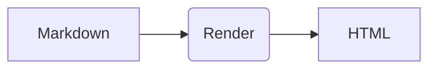

# Bienvenue

Ceci est un MVP « OntoWave ».

- Navigation: utilisez les liens markdown pour référencer d’autres pages.
- Exemples: [Page de démonstration](demo.md) · [Mermaid](demo/mermaid.md) · [PlantUML](demo/plantuml.md)

---

Formule KaTeX: $E = mc^2$.
