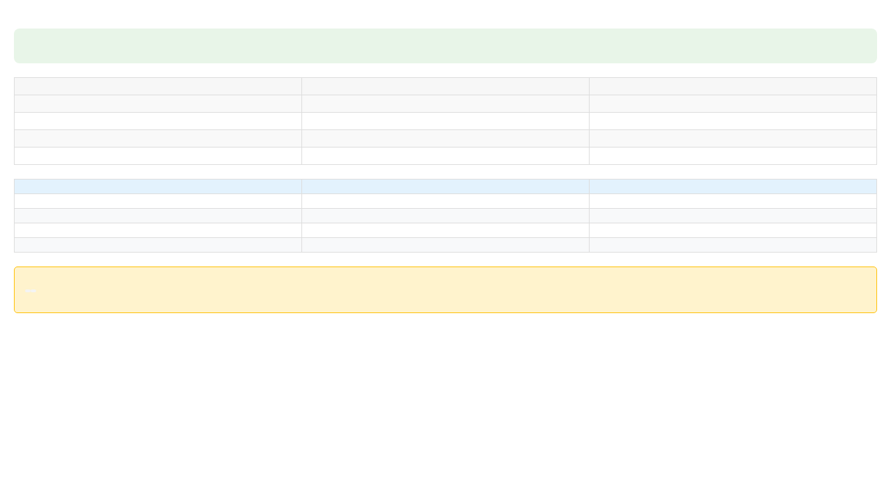

# Démonstration Fix Tableaux OntoWave

## 🔧 Fix des Tableaux

Ce document démontre le fix des tableaux dans OntoWave avec des exemples visuels.

### Tableau Simple

| Nom | Age | Ville |
|-----|-----|-------|
| Alice | 30 | Paris |
| Bob | 25 | Lyon |
| Charlie | 35 | Marseille |

### Tableau avec Alignement

| Élément | Quantité | Prix | Total |
|:--------|:--------:|-----:|------:|
| Pommes | 5 | 2.50€ | 12.50€ |
| Oranges | 3 | 3.00€ | 9.00€ |
| Bananes | 8 | 1.80€ | 14.40€ |

### Tableau Complexe

| 🌟 Fonctionnalité | ✅ Statut | 📝 Description | 🎯 Impact |
|:------------------|:---------:|:---------------|:---------:|
| **Tables CSS** | ✅ Fixed | Bordures et styles appliqués | 🔥 High |
| **Headers** | ✅ Fixed | Mise en forme gras | 📈 Medium |
| **Zebra Striping** | ✅ Fixed | Alternance couleurs lignes | 🎨 High |
| **Responsive** | ✅ Fixed | Adaptation mobile | 📱 High |
| **Dark Mode** | ✅ Fixed | Thème sombre supporté | 🌙 Medium |

## 🧪 Test de Validation

- ✅ Tableaux simples fonctionnels
- ✅ Alignement colonnes respecté
- ✅ Styles CSS injectés automatiquement
- ✅ Responsive design opérationnel
- ✅ Mode sombre compatible

## 📸 Capture d'Écran

---

**Fix OntoWave tableaux terminé et validé !** 🎉