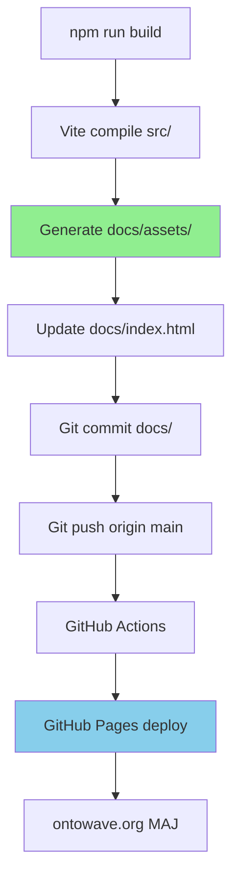

# 📚 Documentation OntoWave - Guide d'Architecture

## 🎯 Règle d'Or

> **Le dossier `docs/` est la SEULE racine publique.**
> - GitHub Pages sert `docs/` automatiquement
> - Tests E2E doivent servir `docs/` uniquement
> - Tous les chemins relatifs partent de `docs/`

## 🌐 Structure du Site Public

```
docs/                          # ROOT PUBLIC (ne jamais servir autre chose!)
├── index.html                 # Page d'accueil (auto-généré par vite build)
├── index.fr.md                # Documentation française
├── index.en.md                # Documentation anglaise
│
├── demos/                     # Showcase + Tests E2E
│   ├── index.html             # Catalogue interactif
│   ├── 01-base/               # Démos capacités par défaut
│   │   ├── markdown.html
│   │   ├── markdown.md
│   │   ├── mermaid.html
│   │   ├── mermaid.md
│   │   ├── plantuml.html
│   │   ├── plantuml.md
│   │   ├── routing.html
│   │   └── routing.md
│   └── 02-config/             # Démos configurations avancées
│       ├── i18n.html
│       ├── i18n.fr.md
│       ├── i18n.en.md
│       ├── view-modes.html
│       ├── view-modes.md
│       ├── ui-custom.html
│       └── ui-custom.md
│
└── assets/                    # Bundles Vite (auto-généré)
    ├── katex-*.js
    ├── mermaid-*.js
    ├── md-*.js
    └── yaml-*.js
```

## 🧪 Tests E2E Playwright

### Configuration Serveur

```typescript
// playwright.config.ts
webServer: {
  // ⚠️ TOUJOURS servir docs/, JAMAIS la racine
  command: 'python3 -m http.server 8080 --directory docs',
  port: 8080
}
```

### Chemins URLs

```javascript
// ✅ CORRECT: Relatif à docs/
await page.goto('/demos/01-base/markdown.html');
await page.goto('/index.html');

// ❌ INCORRECT: Ne PAS inclure /docs/ dans l'URL
await page.goto('/docs/demos/01-base/markdown.html'); // ERREUR!
```

### Commandes Serveur Manuel

```bash
# Pour tests locaux
cd /path/to/ontowave
python3 -m http.server 8080 --directory docs

# Tester: http://localhost:8080/demos/01-base/markdown.html
```

## 📁 Racine du Projet (Hors Site Public)

```
ontowave/                      # Racine git (PAS publique)
├── docs/                      # ← SEUL dossier public
├── src/                       # Code source TypeScript
├── tests/                     # Tests E2E
│   └── e2e/
│       └── demos/             # Specs Playwright
├── tools/                     # Scripts build
│   └── generate-demos.cjs
├── archive/                   # Docs temporaires (gitignored)
├── package.json
├── playwright.config.ts
├── vite.config.ts
├── CHANGELOG.md
├── README.md
├── DEMOS_ARCHITECTURE.md
└── FEATURES_REFERENCE.md
```

## 🚫 Fichiers à NE JAMAIS Publier

Ces fichiers doivent rester à la racine projet (hors `docs/`):

- `package.json`, `package-lock.json`
- `tsconfig.json`, `vite.config.ts`
- `playwright.config.ts`
- `node_modules/` (gitignored)
- `archive/` (gitignored)
- Tous les `*.md` de debug (AUDIT, FIX, TEST, GUIDE, etc.)
- Fichiers de demo temporaires (`demo-*.html`, `test-*.html`)

## 🔄 Workflow Build → Déploiement



## ✅ Checklist Contribution

Avant chaque commit touchant le site public:

1. [ ] Build: `npm run build`
2. [ ] Serveur local: `python3 -m http.server 8080 --directory docs`
3. [ ] Test manuel: Ouvrir http://localhost:8080
4. [ ] Tests auto: `npx playwright test tests/e2e/demos/`
5. [ ] Vérifier: Pas de fichier debug dans `docs/`
6. [ ] Commit seulement: `docs/` + fichiers essentiels racine
7. [ ] Push: `git push origin main`
8. [ ] Vérifier: https://ontowave.org/ à jour (1-3 min)

## 🛠️ Commandes Utiles

```bash
# Générer démos
node tools/generate-demos.cjs

# Build complet
npm run build

# Tests E2E avec rapport
npx playwright test tests/e2e/demos/ --reporter=html

# Créer baselines screenshots
npx playwright test tests/e2e/demos/ --update-snapshots

# Serveur local (docs/ uniquement!)
python3 -m http.server 8080 --directory docs

# Nettoyer archive
rm -rf archive/  # Pas versionné
```

## 🔍 Dépannage

### Erreur 404 sur démos

**Symptôme**: `Failed to load resource: 404` dans console

**Causes possibles**:
1. Serveur ne sert pas `docs/` → Vérifier `--directory docs`
2. Chemin URL incorrect → Utiliser `/demos/...` pas `/docs/demos/...`
3. Fichier démo manquant → Relancer `node tools/generate-demos.cjs`

### Tests Playwright échouent

**Symptôme**: Tous les tests timeout ou 404

**Solution**:
```bash
# 1. Tuer serveurs existants
pkill -f "python3 -m http.server"

# 2. Vérifier fichiers générés
ls docs/demos/01-base/

# 3. Tester serveur manuel
python3 -m http.server 8080 --directory docs &
curl http://localhost:8080/demos/01-base/markdown.html

# 4. Relancer tests
npx playwright test tests/e2e/demos/01-base-markdown.spec.js
```

---

**📌 Note Importante**: Cette architecture garantit que:
- Le site de production (GitHub Pages) = environnement de test local
- Pas de surprise entre dev et prod
- Tests E2E valident le site réel (pas une version simulée)
