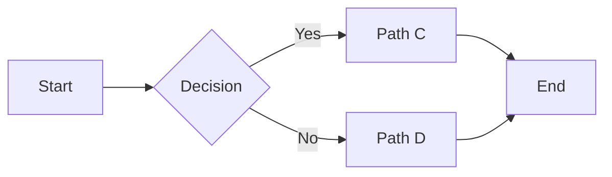
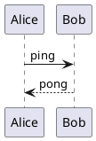
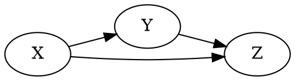

# Page Démo Complexe

Cette page exerce un maximum de fonctionnalités.

## Table des Matières Inline

1. [Diagrammes](#diagrammes)
2. [Code Multilingue](#code-multilingue)
3. [Tableaux Étendus](#tableaux-etendus)
4. [Admonitions & Citations](#admonitions--citations)
5. [Math](#math)
6. [Listes](#listes)
7. [Footnotes](#footnotes)
8. [Liens relatifs](#liens-relatifs)

---

## Diagrammes







```d2
card Style {
  label: "D2 Diagram"
}
Style -> Output: Produit
```

## Code Multilingue

```ts
interface User { id: string; name: string }
export function mapNames(users: User[]): string[] { return users.map(u => u.name) }
```

```python
def fib(n: int) -> int:
    if n < 2:
        return n
    return fib(n-1) + fib(n-2)
```

```bash
set -euo pipefail
for f in *.md; do echo $f; done
```

## Tableaux Étendus

| Colonne | Description | Exemple |
|---------|-------------|---------|
| A | Texte simple | `code` |
| B | Long paragraphe avec wrap automatique dans la cellule pour tester le rendu responsive. | Valeur |
| C | **Markdown** _interne_ | 123 |

## Admonitions & Citations

::: tip
Astuce: utiliser la recherche pour trouver rapidement « diagram ».
:::

> Citation multi-lignes\
> Continuation sur la deuxième ligne.

## Math

Inline: $a^2 + b^2 = c^2$.

Bloc:

$$
\sum_{k=1}^{n} k = \frac{n(n+1)}{2}
$$

## Listes

- Élément 1
  - Sous-élément 1.1
    - Sous-élément 1.1.1
- Élément 2

1. Premier
2. Deuxième
3. Troisième

## Footnotes

Texte avec note de bas de page.[^1]

[^1]: Contenu de la note de bas de page.

## Liens relatifs

- Vers Mermaid: ../../content/demo/mermaid.md
- Vers racine FR: #/fr

Fin.
