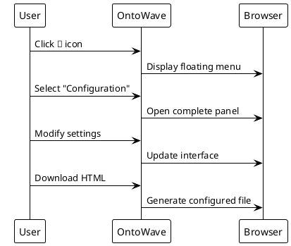

# Complete OntoWave Configuration

This page demonstrates all OntoWave features enabled.

## Demonstrated Features

- **Complete multilingual interface**: French/English with fixed buttons and menu
- **Syntax highlighting**: Integrated Prism.js for code
- **PlantUML diagrams**: Automatic diagram generation  
- **Configuration panel**: Complete setup interface
- **Export and download**: Generation of configured HTML pages

## Configuration Used

```javascript
window.OntoWaveConfig = {
    ui: {
        languageButtons: 'both',
        showTitle: true,
        theme: 'auto',
        showConfigPanel: true
    },
    content: {
        supportedLanguages: ['fr', 'en'],
        defaultLanguage: 'fr'
    },
    features: {
        syntaxHighlighting: true,
        diagrams: true,
        export: true
    }
};
```

## PlantUML Diagram Example



## Feature Testing

1. **Syntax highlighting**: The JavaScript code above uses Prism
2. **Diagram**: The PlantUML diagram is generated automatically  
3. **Multilingual interface**: Switch with FR/EN buttons
4. **Configuration**: Access panel via 🌊 icon
5. **Export**: Test download from panel

This maximum configuration shows the full power of OntoWave for creating interactive and multilingual documentation sites.
