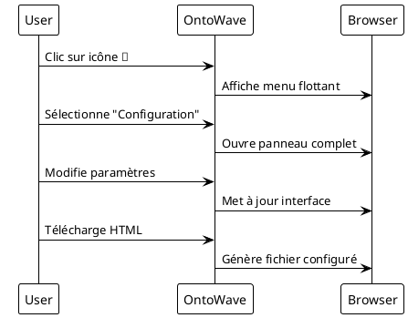

# Configuration complète OntoWave

Cette page démontre toutes les fonctionnalités d'OntoWave activées.

## Fonctionnalités démontrées

- **Interface multilingue complète** : Français/Anglais avec boutons fixes et menu
- **Coloration syntaxique** : Prism.js intégré pour le code
- **Diagrammes PlantUML** : Génération automatique de diagrammes  
- **Panneau de configuration** : Interface complète de paramétrage
- **Export et téléchargement** : Génération de pages HTML configurées

## Configuration utilisée

```javascript
window.OntoWaveConfig = {
    ui: {
        languageButtons: 'both',
        showTitle: true,
        theme: 'auto',
        showConfigPanel: true
    },
    content: {
        supportedLanguages: ['fr', 'en'],
        defaultLanguage: 'fr'
    },
    features: {
        syntaxHighlighting: true,
        diagrams: true,
        export: true
    }
};
```

## Exemple de diagramme PlantUML



## Test des fonctionnalités

1. **Coloration syntaxique** : Le code JavaScript ci-dessus utilise Prism
2. **Diagramme** : Le diagramme PlantUML est généré automatiquement  
3. **Interface multilingue** : Basculez avec les boutons FR/EN
4. **Configuration** : Accédez au panneau via l'icône 🌊
5. **Export** : Testez le téléchargement depuis le panneau

Cette configuration maximale montre toute la puissance d'OntoWave pour créer des sites de documentation interactifs et multilingues.
