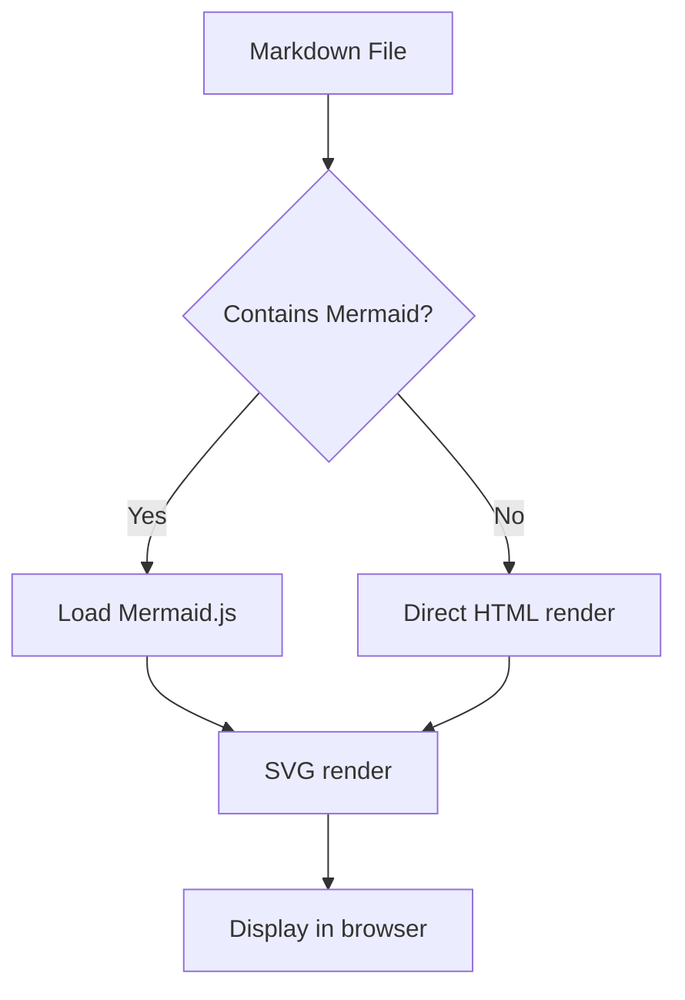
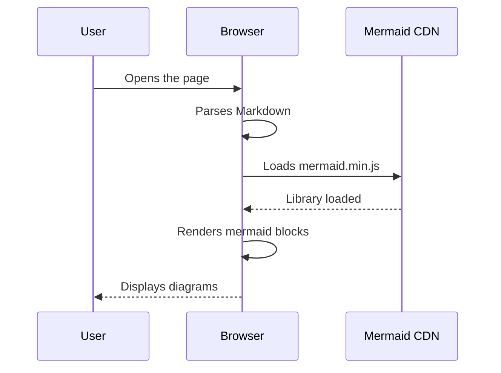
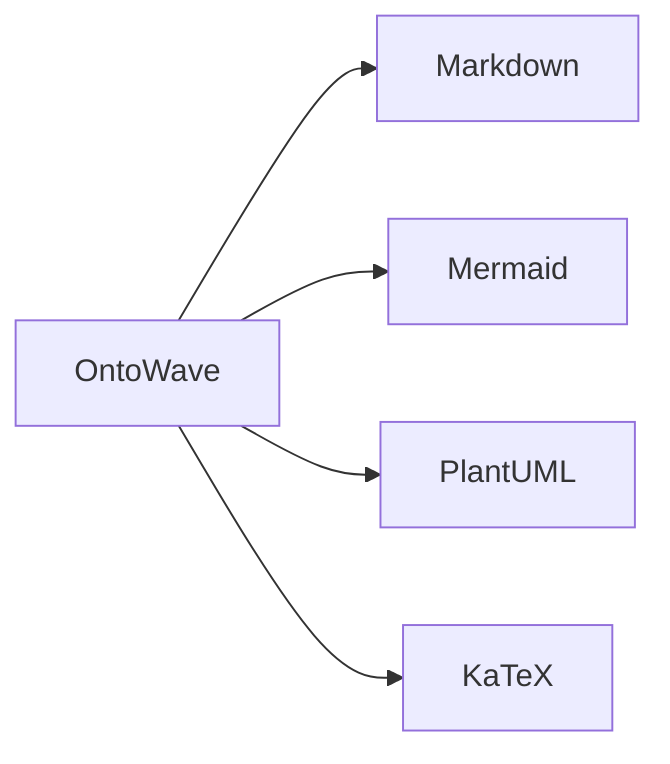

# Mermaid Diagrams

Demonstration of Mermaid rendering in OntoWave: flowcharts, sequence diagrams and graphs.

## Flowchart

## Sequence Diagram

## Simple Graph

## Known Limitations

- Mermaid is loaded asynchronously from CDN — diagrams appear after a brief delay
- Mermaid themes do not automatically adapt to OntoWave's dark/light theme
