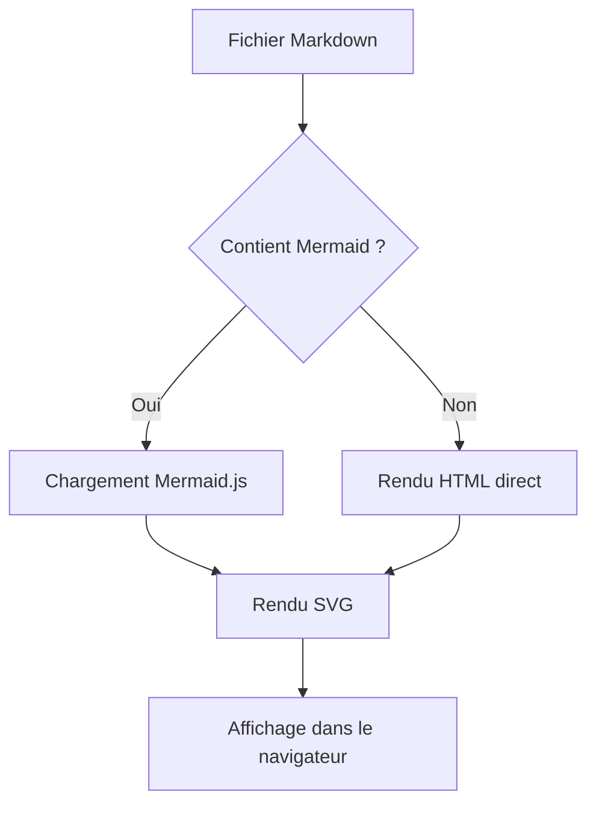
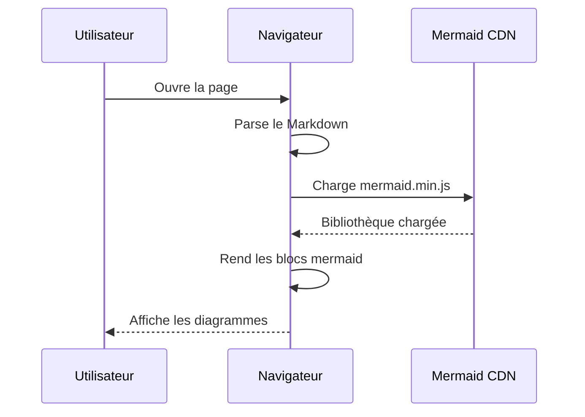
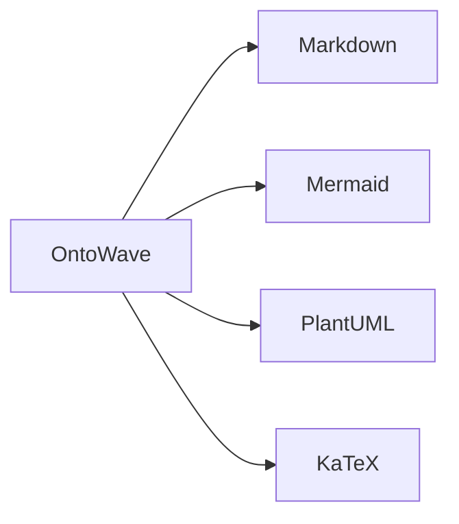

# Diagrammes Mermaid

Démonstration du rendu Mermaid dans OntoWave : diagrammes de flux, séquences et graphes.

## Diagramme de flux

## Diagramme de séquence

## Graphe simple

## Limite connue

- Mermaid est chargé depuis le CDN de manière asynchrone — les diagrammes apparaissent après un court délai
- Les thèmes Mermaid ne s'adaptent pas automatiquement au thème sombre/clair d'OntoWave
