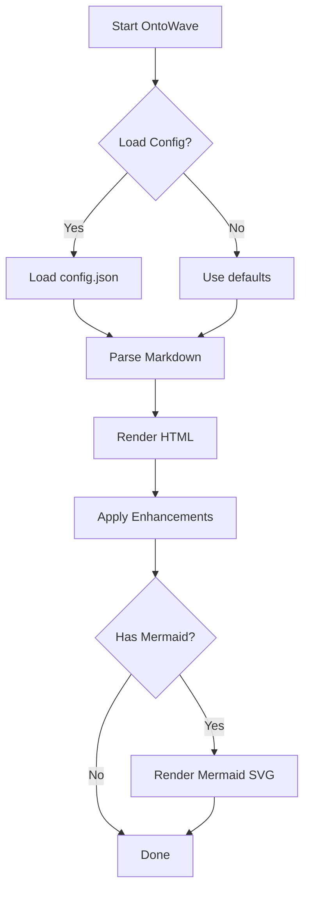
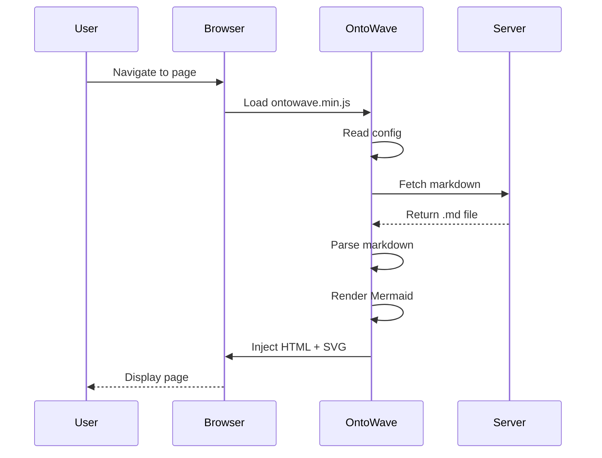
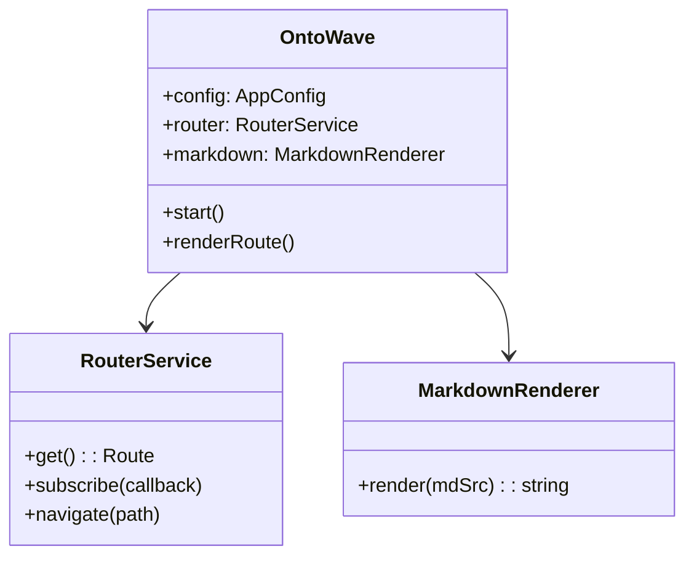
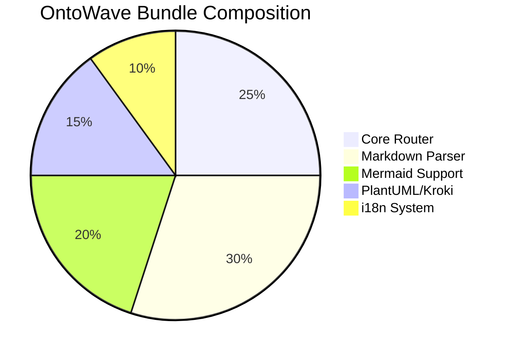

# Mermaid Diagrams

OntoWave renders Mermaid diagrams directly as inline SVG without iframes.

## Flowchart

```mermaid
graph TD
    A[Start OntoWave] --> B{Load Config?}
    B -->|Yes| C[Load config.json]
    B -->|No| D[Use defaults]
    C --> E[Parse Markdown]
    D --> E
    E --> F[Render HTML]
    F --> G[Apply Enhancements]
    G --> H{Has Mermaid?}
    H -->|Yes| I[Render Mermaid SVG]
    H -->|No| J[Done]
    I --> J
```

## Sequence Diagram

```mermaid
sequenceDiagram
    participant User
    participant Browser
    participant OntoWave
    participant Server
    
    User->>Browser: Navigate to page
    Browser->>OntoWave: Load ontowave.min.js
    OntoWave->>OntoWave: Read config
    OntoWave->>Server: Fetch markdown
    Server-->>OntoWave: Return .md file
    OntoWave->>OntoWave: Parse markdown
    OntoWave->>OntoWave: Render Mermaid
    OntoWave->>Browser: Inject HTML + SVG
    Browser-->>User: Display page
```

## Class Diagram

```mermaid
classDiagram
    class OntoWave {
        +config: AppConfig
        +router: RouterService
        +markdown: MarkdownRenderer
        +start()
        +renderRoute()
    }
    
    class RouterService {
        +get(): Route
        +subscribe(callback)
        +navigate(path)
    }
    
    class MarkdownRenderer {
        +render(mdSrc): string
    }
    
    OntoWave --> RouterService
    OntoWave --> MarkdownRenderer
```

## Pie Chart

```mermaid
pie title OntoWave Bundle Composition
    "Core Router" : 25
    "Markdown Parser" : 30
    "Mermaid Support" : 20
    "PlantUML/Kroki" : 15
    "i18n System" : 10
```
