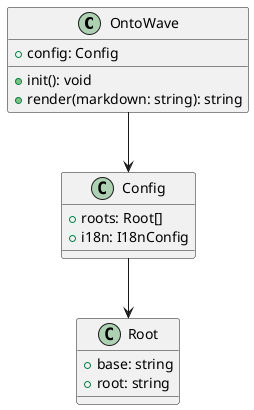
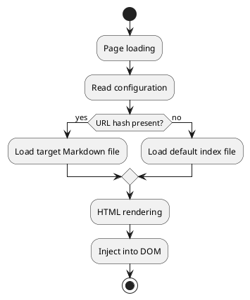

# PlantUML Diagrams

Demonstration of PlantUML rendering in OntoWave: class diagrams, activity diagrams and component diagrams.

## Class Diagram

## Activity Diagram

## Rendering Optimisations

PlantUML diagrams benefit from three optimisations:

- **Lazy loading**: diagrams outside the viewport are only fetched when they become visible (pre-loading 200 px before the viewport edge), using `IntersectionObserver`.
- **Smart cache**: generated SVGs are cached in memory and in `sessionStorage` with a 30-minute TTL, avoiding repeated network requests during navigation.
- **SVG compression**: received SVGs are compressed (removal of redundant whitespace between tags) before storage.

## Known Limitations

- PlantUML is rendered server-side via Kroki.io — diagrams require Internet access
- Long diagrams may exceed PlantUML's URL length limit
