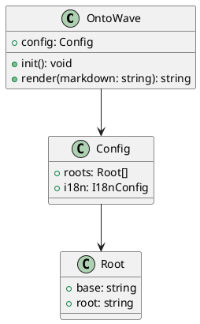
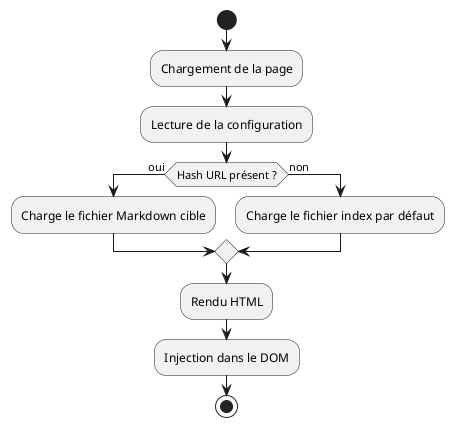

# Diagrammes PlantUML

Démonstration du rendu PlantUML dans OntoWave : diagrammes de classes, d'activités et de composants.

## Diagramme de classes

## Diagramme d'activité

## Optimisations de rendu

Les diagrammes PlantUML bénéficient de trois optimisations :

- **Lazy loading** : les diagrammes hors viewport ne sont chargés que lorsqu'ils deviennent visibles (pré-chargement à 200 px de la limite du viewport), via `IntersectionObserver`.
- **Cache intelligent** : les SVG générés sont mis en cache en mémoire et dans `sessionStorage` avec un TTL de 30 minutes, évitant les requêtes réseau répétées lors de la navigation.
- **Compression SVG** : les SVG reçus sont compressés (suppression des espaces superflus entre balises) avant stockage.

## Limite connue

- PlantUML est rendu côté serveur via Kroki.io — les diagrammes nécessitent Internet
- Les longs diagrammes peuvent dépasser la limite d'URL de PlantUML
