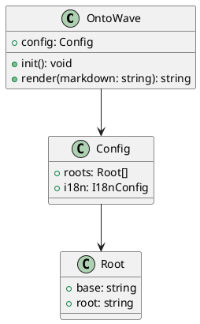
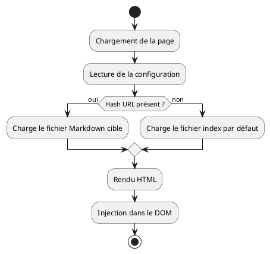

# Diagrammes PlantUML

Démonstration du rendu PlantUML dans OntoWave : diagrammes de classes, d'activités et de composants.

## Diagramme de classes

## Diagramme d'activité

## Limite connue

- PlantUML est rendu côté serveur via `plantuml.com` — les diagrammes nécessitent Internet
- Les longs diagrammes peuvent dépasser la limite d'URL de PlantUML
