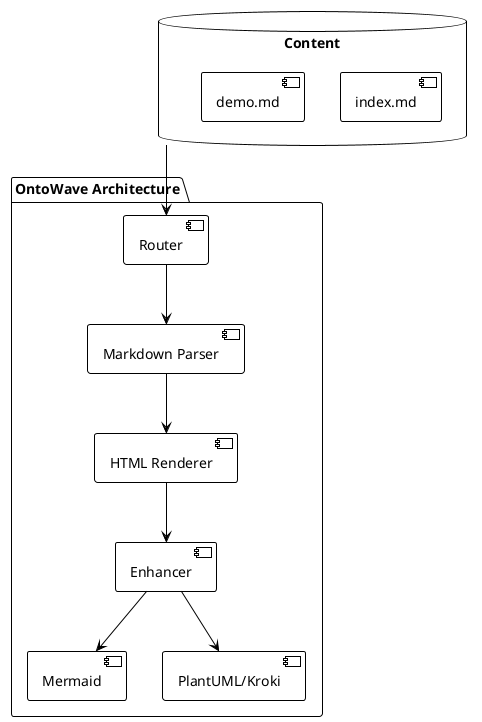
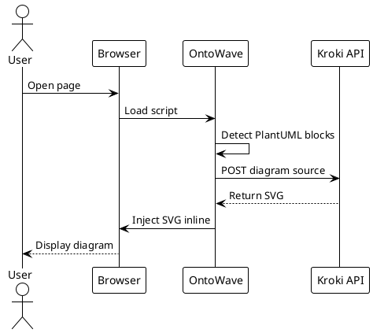
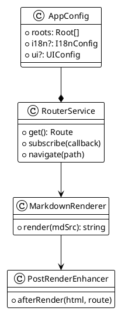

# PlantUML Diagrams

OntoWave supports PlantUML diagrams via the Kroki.io API, rendered as inline SVG.

## Component Diagram

## Sequence Diagram

## Class Diagram

**Note**: PlantUML diagrams require internet connection to Kroki.io API.
