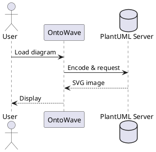
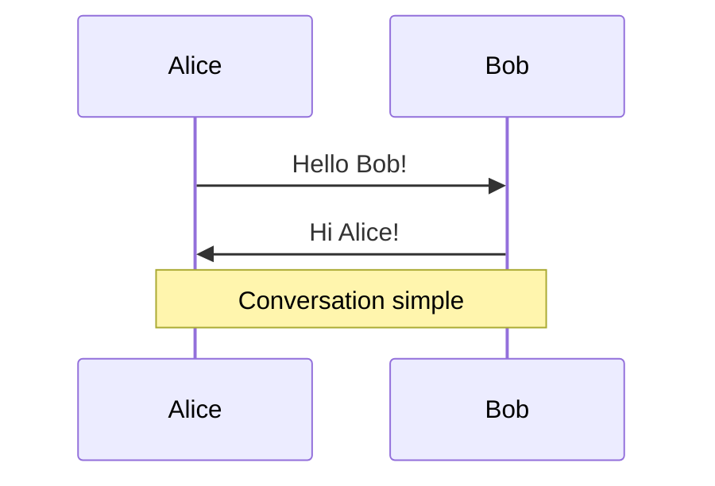

# 🎨 Code Source vs. Rendu - Guide des Bonnes Pratiques

## 📋 Objectif

Montrer comment **afficher le code source** d'un diagramme (Mermaid, PlantUML) au lieu de le **rendre graphiquement**.

---

## 🯠Approche Recommandée : Balises HTML + `
`

### ✅ Avantages

- Compatible GitHub, GitLab, CommonMark
- Prism reconnaît automatiquement le langage
- Pliable/dépliable (UX propre)
- **Déjà fonctionnel** dans OntoWave (aucun code ajouté)

---

## 📝 Exemple 1 : Code Mermaid avec Coloration

📠Voir le code source Mermaid (cliquer pour déplier)

<pre><code class="language-mermaid">
graph TD;
  A[OntoWave] --> B[Markdown Parser]
  B --> C[Mermaid.js Rendu]
  B --> D[Prism.js Coloration]
  
  C --> E[Diagramme SVG]
  D --> F[Code Coloré]
  
  style A fill:#4CAF50,stroke:#333,stroke-width:2px
  style E fill:#2196F3,stroke:#333,stroke-width:2px
  style F fill:#FF9800,stroke:#333,stroke-width:2px
</code></pre>

**💡 Note** : Le code ci-dessus est **coloré par Prism.js**, pas rendu en diagramme.

---

## 🎨 Exemple 2 : Rendu Graphique (Comportement par Défaut)

Voici le **même diagramme rendu** :

```mermaid
graph TD;
  A[OntoWave] --> B[Markdown Parser]
  B --> C[Mermaid.js Rendu]
  B --> D[Prism.js Coloration]
  
  C --> E[Diagramme SVG]
  D --> F[Code Coloré]
  
  style A fill:#4CAF50,stroke:#333,stroke-width:2px
  style E fill:#2196F3,stroke:#333,stroke-width:2px
  style F fill:#FF9800,stroke:#333,stroke-width:2px
```

---

## 🏭 Exemple 3 : Code PlantUML avec Coloration

📠Voir le code source PlantUML

<pre><code class="language-plantuml">
@startuml
!theme plain

' Configuration
skinparam backgroundColor #FEFEFE
skinparam titleFontSize 16

title Architecture OntoWave v1.0.2

' Participants
actor Utilisateur as U
participant "OntoWave\nCore" as OW
participant "Markdown\nRenderer" as MD
participant "Mermaid.js" as MM
participant "PlantUML\nServer" as PU
participant "Prism.js" as PR

' Flux principal
U -> OW : Charger page.md
activate OW

OW -> MD : renderMarkdown()
activate MD

alt Bloc mermaid
  MD -> MM : Rendu diagramme
  MM --> MD : SVG
else Bloc plantuml
  MD -> PU : Encodage + URL
  PU --> MD : Image SVG
else Bloc javascript
  MD -> PR : Coloration syntaxe
  PR --> MD : HTML coloré
end

MD --> OW : HTML final
deactivate MD

OW --> U : Affichage page
deactivate OW

@enduml
</code></pre>

**💡 Note** : Keywords `@startuml`, `participant`, `alt` sont colorés par Prism.js.

---

## 📊 Exemple 4 : Diagramme PlantUML Rendu

---

## 🔄 Exemple 5 : Code ET Rendu Ensemble

Pour une **documentation pédagogique**, montrez les deux :

📠Code source du diagramme

<pre><code class="language-mermaid">
sequenceDiagram
    participant A as Alice
    participant B as Bob
    
    A->>B: Hello Bob!
    B->>A: Hi Alice!
    
    Note over A,B: Conversation simple
</code></pre>

**Résultat :**

---

## 🛠️ Comment Implémenter

### Syntaxe HTML pour Code Source

**Méthode 1 : Balises `
` + `<pre>`**

    

    
📠Voir le code source

    
    <pre><code class="language-mermaid">
    graph TD;
      A --> B
    </code></pre>
    
    

**Rendu attendu** : Un bloc pliable avec code coloré par Prism.js

---

### Syntaxe Markdown pour Rendu

**Méthode 2 : Blocs de code avec triple backticks**

Utiliser la syntaxe suivante (remplacer `X` par `` ` ``):

    XXXmermaid
    graph TD;
      A --> B
    XXX

**Rendu attendu** : Diagramme graphique Mermaid rendu en SVG

---

## 📚 Langages Supportés pour Coloration

OntoWave supporte **11 langages** via Prism.js :

**ESSENTIELS :**
- `html`, `css`, `javascript`

**ADDITIONNELS :**
- `python`, `java`, `bash`
- `json`, `yaml`, `typescript`

**DIAGRAMMES :**
- `mermaid`, `plantuml`

---

## ⚡ Cas d'Usage

### 📖 Documentation Technique

Montrer **comment écrire** un diagramme :

**Structure recommandée :**

    

    
Code source

    ...code HTML...
    

    
    Résultat :
    XXXmermaid
    ...code diagramme...
    XXX

(Remplacer `XXX` par trois backticks `` ` ``)

### 🎓 Tutoriels

Expliquer la **syntaxe** avant de montrer le résultat.

### 🔍 Debugging

Afficher le **code brut** pour vérifier les erreurs.

---

## 🚀 Fonctionnalité Future (v1.1.0)

Support prévu pour **attributs Pandoc** :

**Exemple de syntaxe future :**

    XXXmermaid {render=false}
    graph TD;
      A --> B
    XXX

(Remplacer `XXX` par trois backticks `` ` ``)

**Comportement attendu :**
- `{render=false}` → Coloration Prism (code source uniquement)
- Sans attribut → Rendu Mermaid (défaut, comportement actuel)

---

## 📝 Résumé

**POUR CODE SOURCE (pas de rendu graphique) :**

    

    
📠Code source

    <pre><code class="language-mermaid">...</code></pre>
    

**POUR RENDU (diagramme graphique) :**

    XXXmermaid
    ...
    XXX

(Remplacer `XXX` par trois backticks `` ` ``)

**POUR LES DEUX :**

Combinez les deux approches dans votre documentation (voir exemples ci-dessus).

---

## 🔗 Liens Utiles

- [Documentation Mermaid](https://mermaid.js.org/)
- [Documentation PlantUML](https://plantuml.com/)
- [Documentation Prism.js](https://prismjs.com/)
- [OntoWave Features](../index.md)
