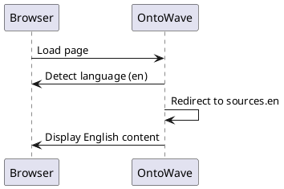

# Test i18n - English

This document tests automatic language detection with `navigator.language` override to English.

## English Content

Welcome to OntoWave! This page is in English.

### Tested Features

- Browser language detection (`navigator.language`)
- Override to `en-US` via script
- Redirect to `sources.en` when detected
- OntoWave menu in English

## Test Diagram

---

**Expected Tests** :

- ✅ OntoWave menu visible
- ✅ English content loaded
- ✅ `location.hash = "#demos/test-i18n-english.md"`
