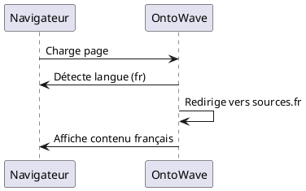

# Test i18n - Français

Ce document teste la détection automatique de langue avec fallback sur `defaultLocale: "fr"`.

## Contenu en Français

Bienvenue dans OntoWave ! Cette page est en français.

### Fonctionnalités testées

- Détection automatique de `navigator.language`
- Fallback sur `defaultLocale: "fr"`
- Redirection vers `sources.fr` si détecté
- Menu OntoWave en français

## Diagramme Test

---

