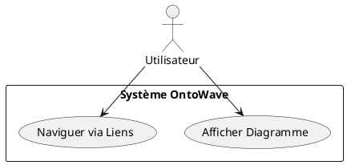

# Test PlantUML dans Markdown

Voici un diagramme PlantUML intégré dans du Markdown:

```plantuml
@startuml
actor Utilisateur
rectangle "Système OntoWave" {
  usecase "Afficher Diagramme" as UC1
  usecase "Naviguer via Liens" as UC2
}

Utilisateur --> UC1
Utilisateur --> UC2
@enduml
```

Ce diagramme doit être rendu en **SVG inline** directement dans la page, sans balise `` ni `
` wrapper.
