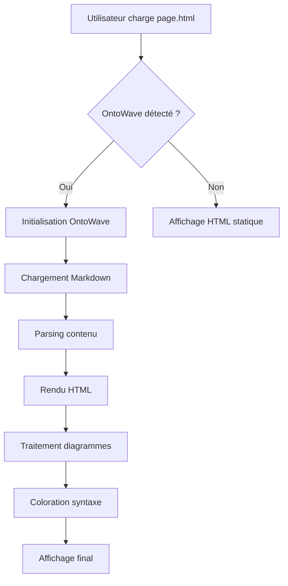
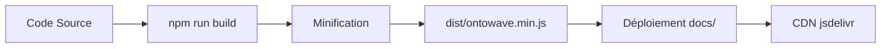
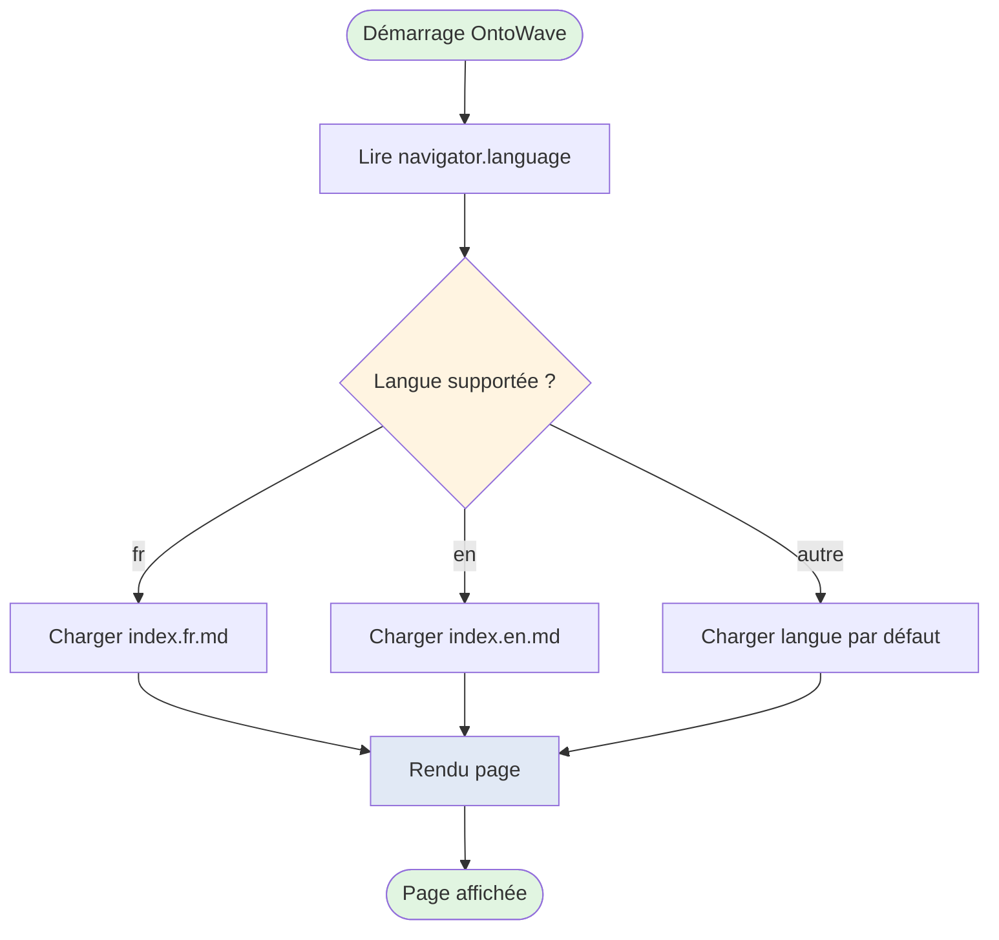
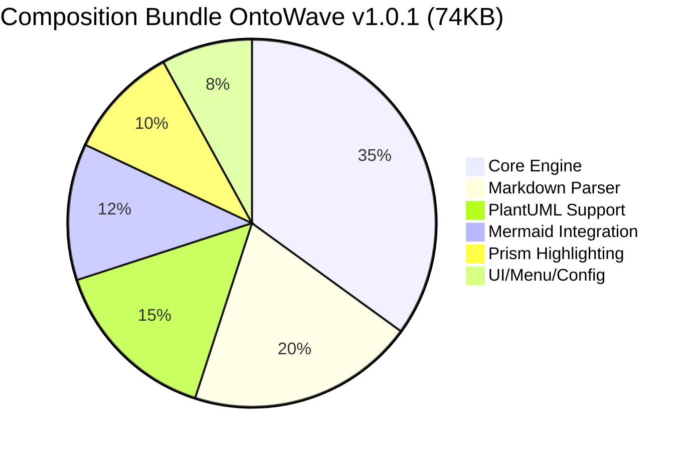
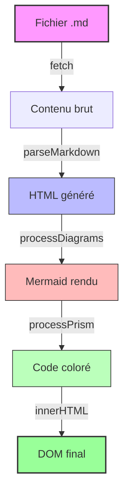

# 🌊 Démo Mermaid - Diagrammes de Flux (Flowcharts)

## 🎯 Pourquoi cette fonctionnalité est utile

Les diagrammes Mermaid permettent de créer des visualisations directement en Markdown, **sans images externes** ni outils tiers. Parfait pour :

- **Documentation technique** : Flux de processus, architectures
- **Collaboration** : Code source = diagramme (versionnable Git)
- **Maintenance** : Modifier le diagramme = modifier le texte
- **Portabilité** : Pas de dépendance à des outils graphiques

## 📋 Ce que vous allez voir dans cette démo

1. **Flowchart simple** (TD - Top Down)
2. **Graph horizontal** (LR - Left to Right)
3. **Flowchart avec décisions** (Conditions if/else)
4. **Pie Chart** (Graphique en camembert)
5. **Graph avec styles personnalisés**

---

## 1. Flowchart Simple - Architecture OntoWave

**Ce diagramme montre** : Le flux d'initialisation d'OntoWave, de la détection jusqu'au rendu final.

---

## 2. Graph Horizontal - Pipeline de Build

**Ce diagramme montre** : Le pipeline de build et déploiement d'OntoWave.

---

## 3. Flowchart avec Décisions - Détection Langue

**Ce diagramme montre** : La logique de détection automatique de langue (Fix #3 v1.0.1).

---

## 4. Pie Chart - Répartition Taille Bundle

**Ce graphique montre** : La répartition approximative des composants dans le bundle minifié.

---

## 5. Graph avec Styles - Cycle de Vie Contenu

**Ce diagramme montre** : Le traitement pipeline du contenu Markdown avec styles visuels.

---

## ✅ Tests Manuels

**Validation visuelle** :

- [ ] Les 5 diagrammes sont rendus correctement
- [ ] Les flowcharts utilisent les bonnes directions (TD, LR)
- [ ] Les formes sont variées : rectangles, losanges, cercles
- [ ] Les flèches sont correctement orientées
- [ ] Le pie chart affiche les pourcentages
- [ ] Les styles personnalisés (couleurs) sont appliqués
- [ ] Pas de message d'erreur Mermaid dans la console
- [ ] Diagrammes responsive (s'adaptent à la largeur)

**Tests interactifs** :

- [ ] Zoom navigateur (Ctrl +/-) : diagrammes restent lisibles
- [ ] Mode responsive (F12 > Toggle device) : pas de débordement
- [ ] Survol des éléments : pas d'effet indésirable

---

## 📚 Syntaxe Mermaid

**Formes disponibles** :

- `A[Rectangle]` : Rectangle
- `B(Rectangle arrondi)` : Coins arrondis
- `C{Losange}` : Décision/Condition
- `D([Stade])` : Début/Fin de processus
- `E[[Sous-routine]]` : Processus prédéfini
- `F[(Base de données)]` : Stockage

**Directions** :

- `graph TD` : Top-Down (vertical)
- `graph LR` : Left-Right (horizontal)
- `graph BT` : Bottom-Top
- `graph RL` : Right-Left

**Liens** :

- `A --> B` : Flèche simple
- `A --- B` : Ligne sans flèche
- `A -.-> B` : Flèche pointillée
- `A ==> B` : Flèche épaisse
- `A -->|texte| B` : Flèche avec label

---

**🔗 Retour** : [← Index démos](README.md)
