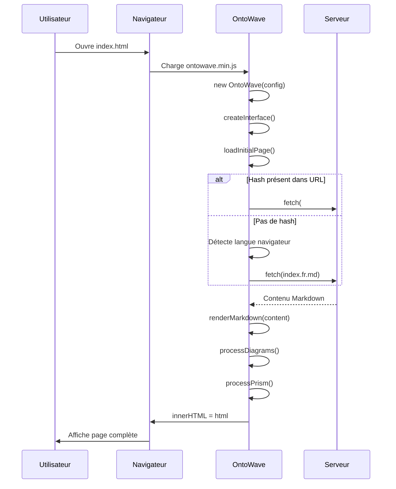
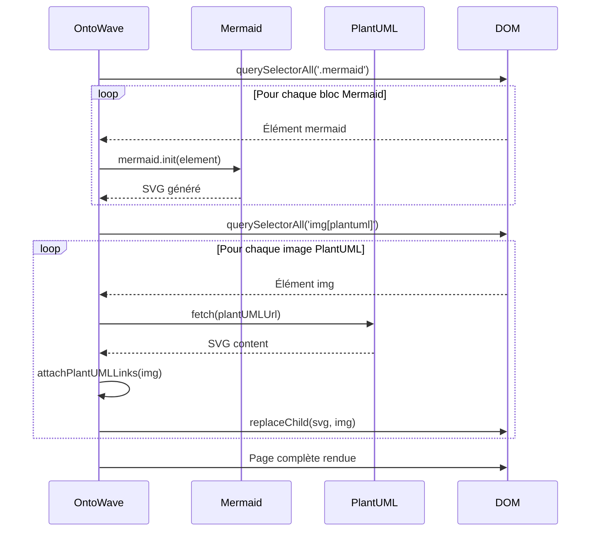
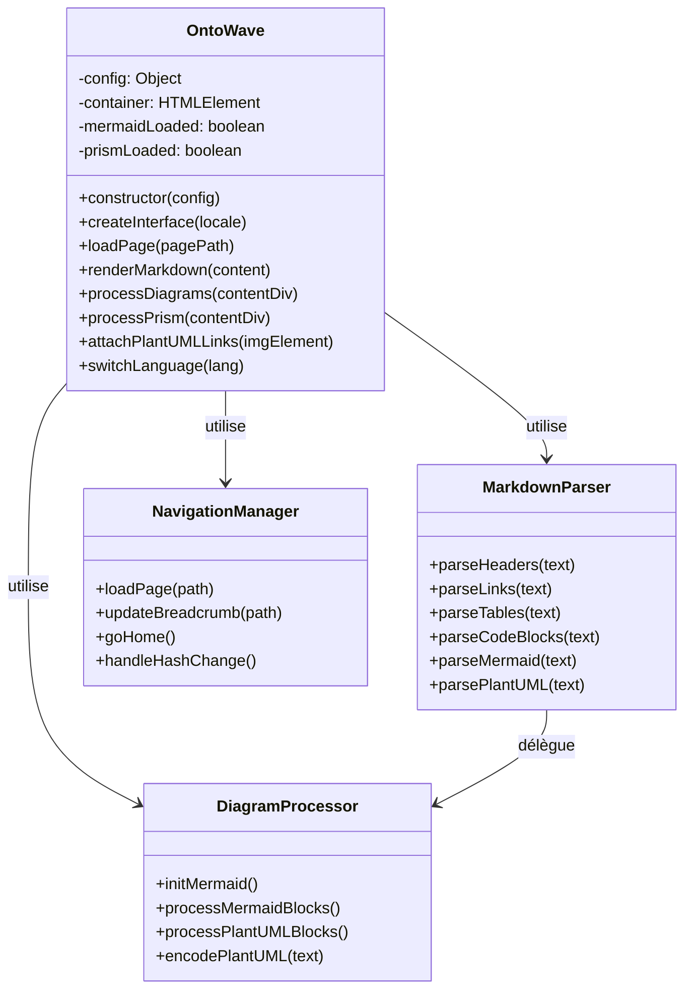
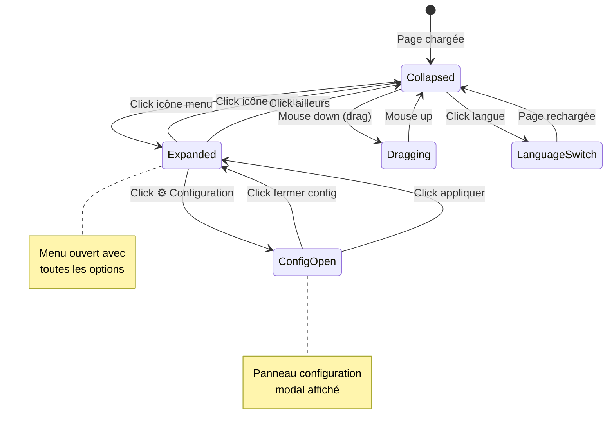
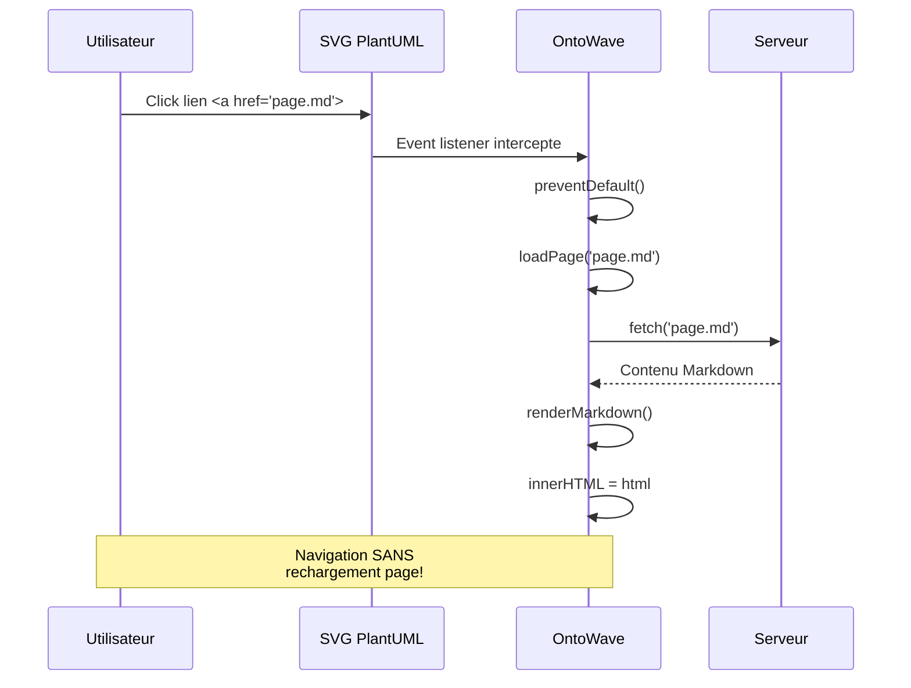

# 🔄 Démo Mermaid - Diagrammes de Séquence et Classes

## 🎯 Pourquoi cette fonctionnalité est utile

Les diagrammes de séquence et de classes sont essentiels pour :

- **Documentation API** : Montrer les interactions entre composants
- **Architecture logicielle** : Visualiser les relations entre classes
- **Processus métier** : Séquence d'appels et réponses
- **Debugging** : Comprendre le flow d'exécution

## 📋 Ce que vous allez voir dans cette démo

1. **Sequence Diagram simple** - Chargement page OntoWave
2. **Sequence avec boucles** - Traitement multi-diagrammes
3. **Class Diagram** - Architecture OntoWave
4. **State Diagram** - États du menu flottant

---

## 1. Sequence Diagram - Chargement Page OntoWave



**Ce diagramme montre** : Le flux complet d'initialisation et de chargement d'une page.

---

## 2. Sequence avec Boucles - Traitement Diagrammes



**Ce diagramme montre** : Le traitement parallèle des diagrammes Mermaid et PlantUML.

---

## 3. Class Diagram - Architecture OntoWave



**Ce diagramme montre** : La structure de classes simplifiée d'OntoWave.

---

## 4. State Diagram - États Menu Flottant



**Ce diagramme montre** : Les différents états possibles du menu flottant OntoWave.

---

## 5. Sequence - Navigation Interne avec PlantUML Links



**Ce diagramme montre** : Le mécanisme de navigation interne via les liens SVG PlantUML (Fix #2b).

---

## ✅ Tests Manuels

**Validation visuelle** :

- [ ] Sequence diagrams affichent les participants correctement
- [ ] Les flèches sont orientées dans le bon sens
- [ ] Les boucles (loop) sont bien délimitées
- [ ] Les alternatives (alt/else) sont claires
- [ ] Class diagram montre les relations entre classes
- [ ] State diagram affiche les transitions d'états
- [ ] Pas d'erreur Mermaid dans la console
- [ ] Diagrammes responsive

**Tests sémantiques** :

- [ ] Sequence diagram #1 reflète bien le processus réel OntoWave
- [ ] Class diagram correspond à l'architecture réelle
- [ ] State diagram menu est cohérent avec le comportement observé

---

## 📚 Syntaxe Mermaid

**Sequence Diagrams** :

```
sequenceDiagram
    participant A as Acteur A
    A->>B: Message synchrone
    A-->>B: Message asynchrone
    B->>B: Auto-message
    
    alt Condition vraie
        B->>C: Action 1
    else Condition fausse
        B->>D: Action 2
    end
    
    loop Boucle
        C->>C: Répéter
    end
```

**Class Diagrams** :

```
classDiagram
    class Animal {
        +name: string
        +age: int
        +makeSound()
    }
    
    class Dog {
        +breed: string
        +bark()
    }
    
    Animal <|-- Dog : Héritage
```

**State Diagrams** :

```
stateDiagram-v2
    [*] --> État1
    État1 --> État2 : transition
    État2 --> [*]
```

---

**🔗 Retour** : [← Index démos](index.md)
