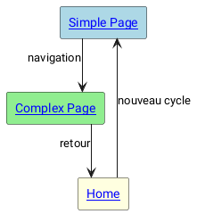

# Test PlantUML File

Ce test charge un fichier PlantUML externe:

```plantuml
@startuml test-navigation
skinparam linetype ortho
skinparam defaultFontName Roboto

rectangle "[[#simple.md Simple Page]]" as simple #lightblue
rectangle "[[#complex.md Complex Page]]" as complex #lightgreen  
rectangle "[[#index.md Home]]" as home #lightyellow

simple --> complex : navigation
complex --> home : retour
home --> simple : nouveau cycle
@enduml
```

Ce diagramme devrait être rendu en SVG inline directement, sans balise ``.
