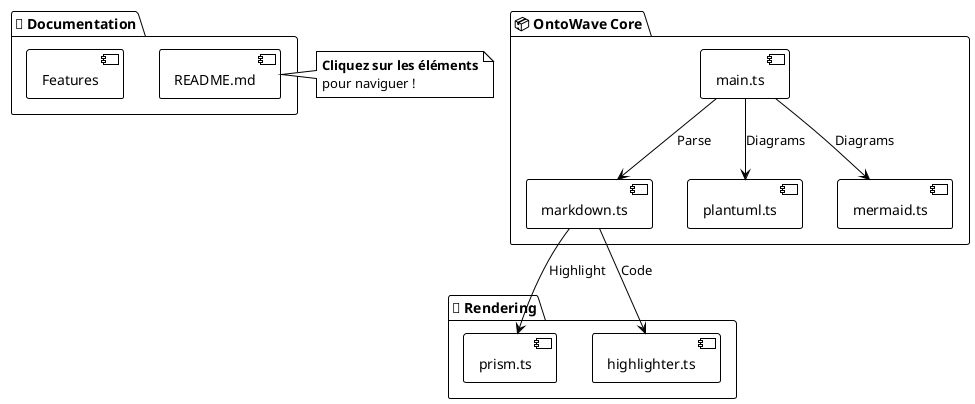

# 🔗 PlantUML - Liens Cliquables

OntoWave préserve les **liens hypertexte** dans les diagrammes PlantUML, permettant une navigation interactive directement depuis les éléments du diagramme.

## 📋 Fonctionnalité

Les liens PlantUML utilisent la syntaxe `[[URL]]` et sont préservés dans le SVG généré, rendant les éléments cliquables.

---

## 🎨 Exemple : Architecture OntoWave (Liens Interactifs)



---

## 🎯 Utilisation

### Syntaxe de Base

**Lien externe (ouvre dans nouvel onglet)** :

    [Element] [[https://example.com]]

**Lien interne (navigation dans la page)** :

    [Element] [[page.md]]
    [Element] [[#section]]

### Exemples de Liens

**Vers GitHub** :
```plantuml
[Code Source] [[https://github.com/stephanedenis/OntoWave]]
```

**Vers Documentation** :
```plantuml
[Documentation] [[index.md]]
[Installation] [[index.md#installation]]
```

**Navigation Locale** :
```plantuml
[Retour Accueil] [[#]]
```

---

## 💡 Cas d'Usage

### 📚 Documentation Interactive

Créez des diagrammes d'architecture avec liens vers :
- Code source sur GitHub
- Documentation technique
- Pages de référence

### 🗺️ Cartes de Navigation

Diagrammes de navigation de site avec liens directs vers les pages.

### 🔄 Diagrammes de Workflow

Processus métier avec liens vers :
- Formulaires
- Outils externes
- Documentation procédures

---

## 🔧 Comment Ça Marche

OntoWave **préserve les balises `<a>`** du SVG PlantUML généré :

1. PlantUML encode les liens dans le SVG
2. OntoWave insère le SVG directement (inline)
3. Les balises `<a>` restent intactes et fonctionnelles
4. Clic → Navigation native du navigateur

**Avantage** : Pas de JavaScript complexe, comportement natif du navigateur.

---

## 🎨 Essayez !

**Cliquez sur les éléments** du diagramme ci-dessus pour :
- 📂 Voir le code source sur GitHub
- 📖 Naviguer dans la documentation
- 🏠 Retourner à l'accueil
