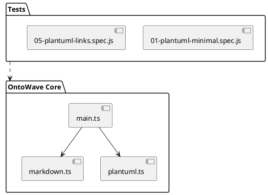

# Test PlantUML - Liens Cliquables

Ce document teste la préservation des liens cliquables dans les SVG PlantUML après insertion directe.

## Diagramme avec Liens

## Navigation Test

Cliquer sur les éléments avec liens dans le diagramme ci-dessus devrait :

- Ouvrir GitHub pour `main.ts`, `markdown.ts`, `plantuml.ts`
- Naviguer dans la page pour `05-plantuml-links.spec.js`

---

**Tests attendus** :

- ✅ Liens `<a>` présents dans le SVG
- ✅ Attributs `href` préservés
- ✅ Click fonctionnel (navigation)
- ✅ Pas de wrappers bloquant les événements
