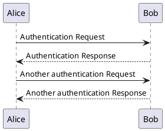
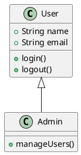
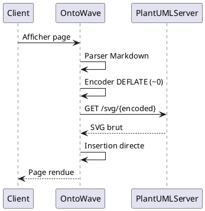

# Test PlantUML - Encodage ~0 (DEFLATE) + Insertion Directe

Ce document teste le nouveau système PlantUML avec encodage DEFLATE (`~0`) et insertion SVG directe sans wrappers.

## Diagramme Simple

## Diagramme de Classes

## Diagramme de Séquence

---

**Tests attendus** :
- ✅ Encodage DEFLATE (~0) au lieu de HUFFMAN (~1)
- ✅ Pas de wrapper `.plantuml-diagram-wrapper`
- ✅ Pas de wrapper `.diagram`
- ✅ SVG inséré directement dans le DOM
- ✅ Liens cliquables préservés
