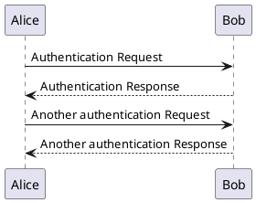
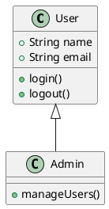
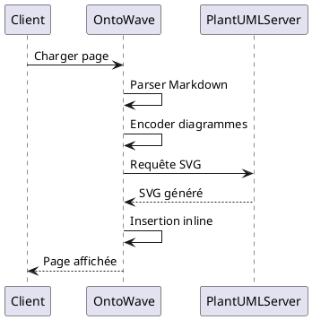

# 📊 PlantUML - Diagrammes de Séquence

OntoWave supporte les **diagrammes PlantUML** avec rendu SVG haute qualité directement dans la page.

## 🎯 Exemples

### Diagramme de Séquence Simple

### Diagramme de Classes

### Architecture OntoWave

---

## 💡 Avantages

- **SVG haute qualité** : Rendu vectoriel, zoom sans perte
- **Liens cliquables** : Navigation interactive préservée
- **Performance** : Insertion directe, pas de wrapper
- **Compatibilité** : Toute syntaxe PlantUML supportée
