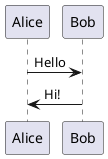

# OntoWave

## Micro-application for static sites

**OntoWave** is a lightweight micro-application that transforms your static sites into interactive and modern documentation platforms.

### ✨ Key Features

- **📝 Advanced Markdown rendering** - Full Markdown syntax support with extensions
- **📊 Mermaid diagrams** - Integrated interactive visualizations
- **🔍 Smart navigation** - Anchor preservation and smooth navigation
- **🎨 Modern interface** - Responsive and clean design
- **⚡ Ultra-lightweight** - Only 18KB, no dependencies
- **🚀 One-line installation** - Single script to include

### 🎯 Usage

OntoWave automatically transforms your Markdown files into interactive documentation. Simply:

1. **[Download ontowave.min.js](ontowave.min.js)** (18KB)
2. **Create** a minimal HTML file
3. **Add** your `.md` files in the same folder. The `index.md` file is your default entry point.

**Concrete example - HTML code of this page:**

```html
<!DOCTYPE html>
<html>
<head>
    <meta charset="UTF-8">
    <title>OntoWave</title>
</head>
<body>
    <script src="ontowave.min.js"></script>
</body>
</html>
```

**That's it!** OntoWave automatically detects `index.md` and generates:
- 📝 Navigation with floating menu
- 🔗 Internal links between pages
- 📊 Mermaid diagram rendering
- 🎨 Modern and responsive interface
- 🔍 URL anchor preservation

*This entire page works with just 8 lines of HTML!*

### 📚 Examples and demos

#### 🏭 PlantUML  
UML diagrams with official PlantUML server.



#### 📊 Tables

| Feature | Support | Size |
|---------|---------|------|
| Markdown | ✅ Complete | 18KB |
| Mermaid | ✅ Integrated | - |
| PlantUML | ✅ Server | - |

#### 🎯 Deep headings

##### Level 5
###### Level 6

Headings of all levels are properly rendered.

### 📄 License and attribution

[](https://creativecommons.org/licenses/by-nc-sa/4.0/)

OntoWave by **Stéphane Denis** is published under **CC BY-NC-SA 4.0** license (Creative Commons Attribution-NonCommercial-ShareAlike).

This software is provided "as is", without warranty of any kind, express or implied. In no event shall the authors be liable for any claim, damages or other liability.

**[📁 Source code](https://github.com/stephanedenis/OntoWave)** on GitHub.
