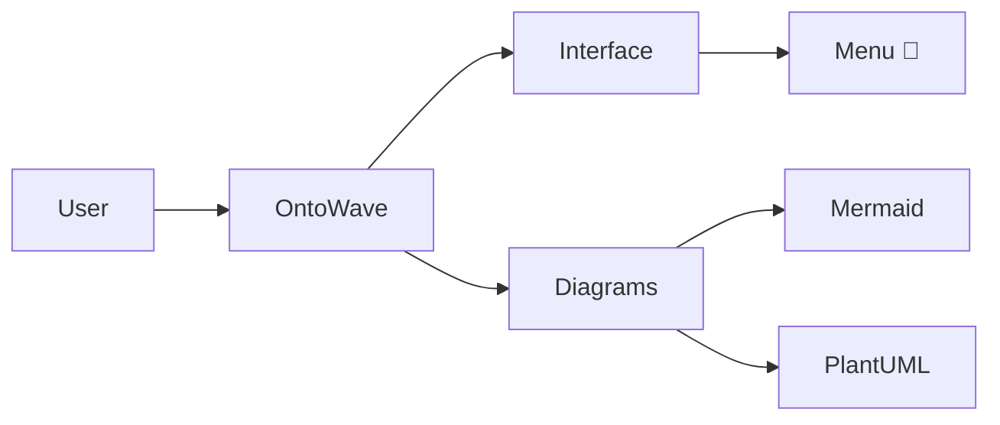
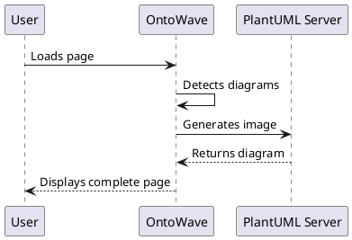

# OntoWave - Diagram generator for static sites

## Micro-application for static sites

OntoWave is a lightweight JavaScript diagram generator (18KB) designed for static sites. It makes it easy to add an interactive documentation system with floating menu and multilingual interface.

### Main features

- **Simple interface**: Floating menu with 🌊 icon
- **Multilingual**: Automatic French/English support  
- **Responsive**: Mobile and desktop adaptation
- **Configurable**: Integrated configuration panel
- **Lightweight**: Only 18KB minified
- **Ready to use**: One-line integration

### Usage

```html
<!DOCTYPE html>
<html>
<head>
    <title>My Site with OntoWave</title>
</head>
<body>
    <script src="ontowave.min.js"></script>
</body>
</html>
```

That's it! OntoWave loads automatically and displays its interface.

### Demos and examples

Explore our different configurations:

- **[Minimal configuration](demo/minimal.html)** - The simplest possible integration
- **[Advanced configuration](demo/advanced.html)** - With complete multilingual system  
- **[Full configuration](demo/full-config.html)** - All features enabled

### OntoWave Architecture


### Supported diagrams

OntoWave natively integrates **Mermaid** and **PlantUML** for your diagrams:

**Mermaid:**


**PlantUML:**

  file "index.en.md" as en
  file "ontowave.min.js" as js
  file "config.json" as config
  
  folder "demo/" {
    file "minimal.html" as minimal
    file "advanced.html" as advanced  
    file "full-config.html" as full
  }
}

index --> js : loads
index --> fr : content FR
index --> en : content EN
js --> config : configuration

demo --> js : examples
@enduml
```

### Configuration

The `config.json` file allows you to customize OntoWave:

```json
{
  "locales": ["fr", "en"],
  "defaultLocale": "fr",
  "sources": {
    "fr": "index.fr.md",
    "en": "index.en.md"
  }
}
```

### 📥 Download

Get OntoWave from the configuration panel:

1. Click on the 🌊 icon at bottom right
2. Select "Configuration"  
3. Use the download options

### Customization

OntoWave automatically adapts to your site's style. For advanced customization, check the examples in the `demo/` folder.

### 📜 License

Creative Commons Attribution-NonCommercial-ShareAlike (CC BY-NC-SA)

*Created by Stéphane Denis* • [Source code on GitHub](https://github.com/stephanedenis/OntoWave)

---

*OntoWave transforms your static sites into interactive documentation in seconds!*
- **[PlantUML](https://plantuml.com/) diagrams** - UML diagrams via official server
- **Smart navigation** - Anchor preservation and smooth navigation
- **Modern interface** - Responsive and clean design
- **Ultra-lightweight** - Only 19KB, no dependencies
- **One-line installation** - Single script to include

### Usage

```html
<!DOCTYPE html>
<html>
<head>
    <meta charset="UTF-8">
    <title>My Documentation</title>
</head>
<body>
    <script src="ontowave.min.js"></script>
</body>
</html>
```

*Click on the 🌊 OntoWave icon in the top left corner to open the configuration panel and discover all available options. This is also where you can download the `ontowave.min.js` file and dynamically build your complete HTML page.*

### License

 **Stéphane Denis**

OntoWave is published under the **CC BY-NC-SA 4.0** license (Creative Commons Attribution-NonCommercial-ShareAlike).

This software is provided "as is", without warranty of any kind, express or implied. In no event shall the authors be liable for any claims, damages or other liability.

**Source code:** [GitHub - OntoWave](https://github.com/stephanedenis/OntoWave)
