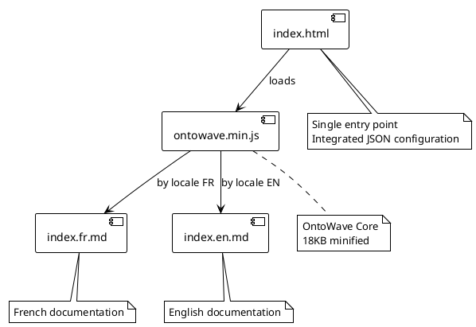
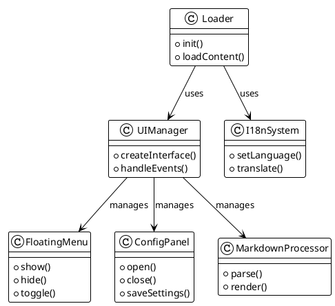
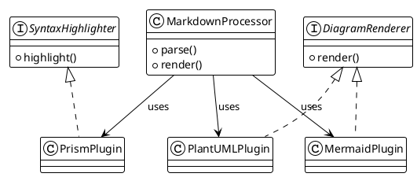

# OntoWave v1.0

Lightweight JavaScript micro-application (~18KB) for static sites with multilingual support, syntax highlighting and diagrams.

## Features

- **Markdown Processing**: Parse and render Markdown with syntax highlighting
- **Multilingual Support**: Built-in internationalization (i18n)
- **Prism Integration**: Automatic syntax highlighting for code blocks
- **Mermaid Diagrams**: Rendering of charts, sequence diagrams, etc.
- **PlantUML Support**: UML diagrams with online rendering
- **Lightweight**: ~18KB minified, no dependencies
- **Simple Configuration**: Drop-in script with automatic initialization

### Usage

```html
<!DOCTYPE html>
<html>
<head>
    <title>My Site with OntoWave</title>
</head>
<body>
    <script src="ontowave.min.js"></script>
</body>
</html>
```

That's it! OntoWave loads automatically and displays its interface. Click the 🌊 icon in the bottom right to access the configuration panel and generate an HTML page configured to your needs, then download the `ontowave.min.js` file for your project.

### 🏗️ OntoWave Architecture

#### Component Overview



#### Main Classes



#### Plugin System



### License

 **Stéphane Denis**

OntoWave is released under **CC BY-NC-SA 4.0** (Creative Commons Attribution-NonCommercial-ShareAlike) license.

This software is provided "as is", without warranty of any kind, express or implied. In no event shall the authors be liable for any claim, damages or other liability.

**Source code:** [GitHub - OntoWave](https://github.com/stephanedenis/OntoWave)
