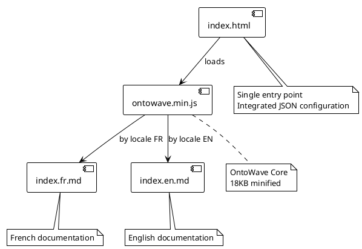
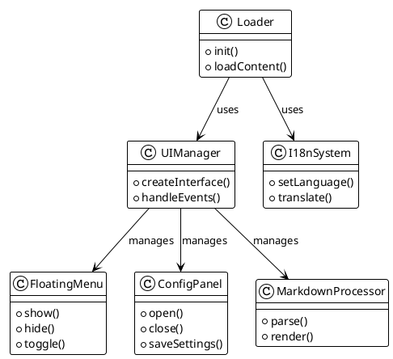
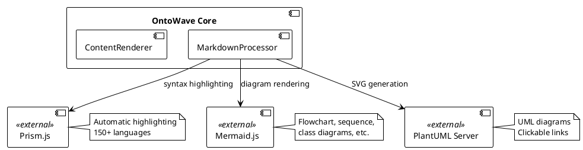

# OntoWave v1.0.1

Lightweight JavaScript micro-application (~74KB) for static sites with multilingual support, syntax highlighting and diagrams.

## Features

- **Markdown Processing**: Parse and render Markdown with table alignments support
- **Multilingual Support**: Built-in internationalization (i18n) with auto language detection
- **Prism Integration**: Automatic syntax highlighting for code blocks (150+ languages)
- **Mermaid Diagrams**: Render flowcharts, sequence diagrams, class diagrams, state diagrams, and more
- **PlantUML Support**: UML diagrams with online rendering and clickable SVG links
- **.puml Files**: Direct PlantUML file loading
- **Lightweight**: ~74KB minified, no dependencies
- **Simple Configuration**: Drop-in script with automatic initialization

### 🧪 Demonstrations

Explore all OntoWave v1.0.1 features through 11 interactive demos:

**Featured Demos:**
- **[Mermaid Flowcharts](demos/09-mermaid-flowcharts.html)** - Architecture diagrams, pie charts, styled graphs
- **[Mermaid Sequence](demos/10-mermaid-sequence.html)** - Sequence, class, and state diagrams
- **[Prism Highlighting](demos/11-prism-highlight.html)** - 8 languages with production-ready code
- **[Markdown Tables](demos/06-markdown-tables.html)** - Column alignments (left, center, right)
- **[PlantUML Files](demos/07-plantuml-file.html)** - Direct `.puml` file loading
- **[PlantUML Links](demos/05-plantuml-links.html)** - Clickable diagrams with SPA navigation
- **[Internationalization](demos/02-i18n-french.html)** - Auto language detection

[📋 See all 11 demos with full documentation →](demos/)

### Usage

```html
<!DOCTYPE html>
<html>
<head>
    <title>My Site with OntoWave</title>
</head>
<body>
    <script src="ontowave.min.js"></script>
</body>
</html>
```

That's it! OntoWave loads automatically and displays its interface. Click the 🌊 icon in the bottom right to access the configuration panel and generate an HTML page configured to your needs, then download the `ontowave.min.js` file for your project.

### 🏗️ OntoWave Architecture

#### Component Overview



#### Main Classes



#### External Integrations



### License

 **Stéphane Denis**

OntoWave is released under **CC BY-NC-SA 4.0** (Creative Commons Attribution-NonCommercial-ShareAlike) license.

This software is provided "as is", without warranty of any kind, express or implied. In no event shall the authors be liable for any claim, damages or other liability.

**Source code:** [GitHub - OntoWave](https://github.com/stephanedenis/OntoWave)
