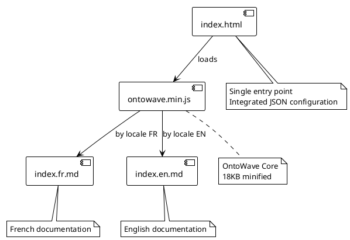
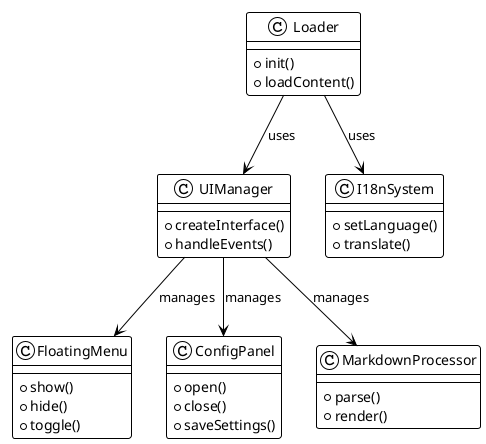
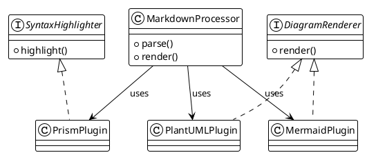

# OntoWave v1.0.9

Lightweight JavaScript micro-application (~80KB) for static sites with multilingual support, syntax highlighting and diagrams.

## Features

- **Markdown Processing**: Parse and render Markdown with table alignments support
- **Multilingual Support**: Built-in internationalization (i18n) with auto language detection
- **Mermaid Diagrams**: Render flowcharts, sequence diagrams, class diagrams as inline SVG
- **PlantUML Support**: UML diagrams via Kroki.io with inline SVG rendering
- **.puml Files**: Direct PlantUML file loading
- **Smart SVG Cache**: In-memory cache with 5min TTL for optimal performance
- **View Modes**: Normal, Split View (source + render), Source-only
- **SPA Routing**: Hash-based navigation without page reload
- **Lightweight**: ~80KB minified, no heavy dependencies
- **Simple Configuration**: Drop-in script with automatic initialization

### 🧪 Interactive Demonstrations

Explore OntoWave v1.0.9 through **interactive and tested demos**:

#### ✨ Base Capabilities (no configuration needed)
- **[Markdown Features](demos/01-base/markdown.html)** - Tables, lists, links, formatting
- **[Mermaid Diagrams](demos/01-base/mermaid.html)** - Flowcharts, sequence, class diagrams
- **[PlantUML via Kroki](demos/01-base/plantuml.html)** - UML diagrams, components
- **[SPA Routing](demos/01-base/routing.html)** - Navigation without reload, 404 handling

#### ⚙️ Advanced Configurations
- **[Internationalization](demos/02-config/i18n.html)** - Auto language detection, fallback
- **[View Modes](demos/02-config/view-modes.html)** - Split view, source-only, normal
- **[UI Customization](demos/02-config/ui-custom.html)** - Sidebar, header, TOC, minimal mode

[📋 See all demos in the catalog →](demos/)

### Usage

```html
<!DOCTYPE html>
<html>
<head>
    <title>My Site with OntoWave</title>
</head>
<body>
    <!-- CDN -->
    <script src="https://cdn.jsdelivr.net/npm/ontowave@latest/dist/ontowave.min.js"></script>
</body>
</html>
```

That's it! OntoWave loads automatically and displays its interface.

### 🏗️ OntoWave Architecture

#### Component Overview



#### Main Classes



#### Plugin System



### License

 **Stéphane Denis**

OntoWave is released under **CC BY-NC-SA 4.0** (Creative Commons Attribution-NonCommercial-ShareAlike) license.

This software is provided "as is", without warranty of any kind, express or implied. In no event shall the authors be liable for any claim, damages or other liability.

**Source code:** [GitHub - OntoWave](https://github.com/stephanedenis/OntoWave)
