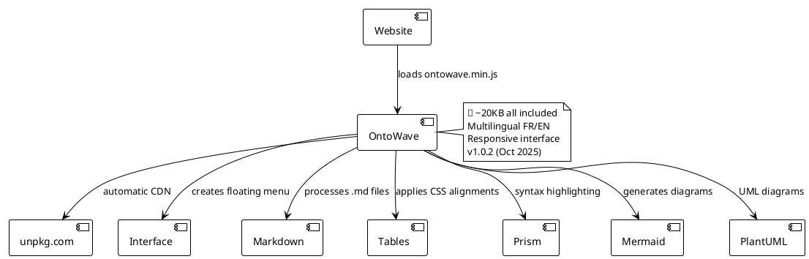

# OntoWave - Micro**That's it!** OntoWave loads automatically and transforms your markdown content into interactive documentation.

---

OntoWave is a lightweight HTML/SVG rendering engine (~20KB) for creating rich documentation on static sites. It transforms your markdown files into interactive pages with navigation menu, multilingual support, formatted tables, syntax highlighting and vector diagrams.

### ✨ Key Features

- **Intuitive interface**: Floating menu with 🌊 icon and configuration panel
- **Multilingual**: Automatic French/English support with locale detection
- **Enhanced Markdown**: Tables with alignments, lists, quotes, inline code
- **Advanced Tables**: Multiple alignments (left, center, right), HTML formatting
- **Syntax highlighting**: Integrated Prism.js for 50+ languages
- **Vector diagrams**: Mermaid (flows, sequences, Gantt) and PlantUML (full UML)
- **Responsive**: Automatic mobile, tablet and desktop adaptation
- **Configurable**: Configuration panel to customize appearance
- **Lightweight & fast**: ~20KB minified, instant loading
- **Ready to use**: One-line HTML integration
- **unpkg CDN**: Always up-to-date automatically, no maintenanceStatic Sites

## Quick Start

```html
<!DOCTYPE html>
<html>
<head>
    <meta charset="UTF-8">
    <title>My Site with OntoWave</title>
</head>
<body>
    <!-- Automatically loads the latest version from NPM -->
    <script src="https://unpkg.com/ontowave/dist/ontowave.min.js"></script>
</body>
</html>
```

**That's it!** OntoWave loads automatically and transforms your markdown content into interactive documentation.

---

OntoWave is a lightweight JavaScript diagram generator (~20KB) designed for static sites. It makes it easy to add an interactive documentation system with complete markdown table support and multilingual interface.

### ✨ Main Features

- **Simple interface**: Floating menu with 🌊 icon
- **Multilingual**: Automatic French/English support  
- **Markdown Tables**: Complete alignments (left, center, right)
- **Diagrams**: Integrated Mermaid and PlantUML
- **Responsive**: Mobile and desktop adaptation
- **Configurable**: Built-in configuration panel
- **Lightweight**: Only ~20KB minified
- **Ready to use**: One-line integration
- **unpkg CDN**: Always up-to-date automatically

---

## Table Examples

OntoWave supports standard markdown syntax for alignments:

### Table with Mixed Alignments

| Product | Quantity | Unit Price | Total |
|:--------|:--------:|:----------:|------:|
| Laptop | 2 | 899.99€ | 1799.98€ |
| Wireless Mouse | 5 | 25.50€ | 127.50€ |
| **TOTAL** | **7** | | **1927.48€** |

**Syntax:**
- `:---` or `---` → Left alignment
- `:---:` → Center alignment  
- `---:` → Right alignment

**[▶️ See more table examples](demo-tables.md)**

---

## OntoWave Architecture



---

## Installation

### Via CDN (recommended)

```html
<!-- Latest version automatically -->
<script src="https://unpkg.com/ontowave/dist/ontowave.min.js"></script>
```

### Via NPM

```bash
npm install ontowave
```

**[📖 JavaScript/NPM Usage Guide](usage-npm.md)**

---

## Useful Links

- 📦 **NPM**: [npmjs.com/package/ontowave](https://www.npmjs.com/package/ontowave)
- 🐙 **GitHub**: [github.com/stephanedenis/OntoWave](https://github.com/stephanedenis/OntoWave)
- 📚 **Table Demo**: [demo-tables.md](demo-tables.md)

---

## Latest Version: v1.0.2

**Date:** October 16, 2025

### What's New

- ✅ **Complete fix for markdown table alignments**
  - Support for 3 syntaxes: `:---`, `:---:`, `---:`
  - Correct CSS class application
  - Empty cell handling

- ✅ **unpkg.com CDN available**
  - Automatic version: `https://unpkg.com/ontowave/`
  - Auto-update for ontowave.org site

- ✅ **Improved infrastructure**
  - Automatic NPM GitHub Actions workflow
  - Automatic publication on merge
  - Non-blocking tests

- ✅ **Complete documentation**
  - Main guide with examples
  - Complete table demonstration
  - Minimal test pages
  - Detailed release notes

**[📝 Complete Release Notes on GitHub](https://github.com/stephanedenis/OntoWave/blob/main/RELEASE_NOTES.md)**

---

## License


**OntoWave** © 2025 **Stéphane Denis**

This software is published under **Creative Commons BY-NC-SA 4.0 License** ([Creative Commons Attribution-NonCommercial-ShareAlike 4.0](https://creativecommons.org/licenses/by-nc-sa/4.0/))

- ✅ Free use for non-commercial projects
- ✅ Modification and redistribution allowed
- ⚠️ Attribution required
- ⚠️ Share under same conditions
- ❌ Commercial use prohibited without permission

### Disclaimer

This software is provided "as is", without warranty of any kind, express or implied. In no event shall the authors be liable for any claims, damages or other liability, whether in an action of contract, tort or otherwise, arising from, out of or in connection with the software or the use or other dealings in the software.

---

## Credits

- **Author**: Stéphane Denis
- **Project**: Panini Ecosystem
- **Technologies**: marked.js, Mermaid, PlantUML, Prism, KaTeX
- **CDN Hosting**: unpkg.com

---

*🌊 OntoWave transforms your static sites into interactive documentation in seconds!*
