# OntoWave

A powerful JavaScript library for creating beautiful, interactive documentation from Markdown sources.

## Features

- **Markdown-based**: Write documentation in familiar Markdown syntax
- **Multilingual**: Built-in internationalization support
- **Themeable**: Customizable appearance and styling
- **Responsive**: Mobile-friendly design
- **Fast**: Optimized for performance

### Usage

```html
<!DOCTYPE html>
<html>
<head>
    <title>My Site with OntoWave</title>
</head>
<body>
    <script src="ontowave.min.js"></script>
</body>
</html>
```

That's it! OntoWave loads automatically and displays its interface. Click on the 🌊 icon at the top left to access the configuration panel and generate an HTML page configured to your needs, then download.

### Demos and examples

Explore our different configurations:

- **[Minimal configuration](demo/minimal.html)** - The simplest possible integration
- **[Advanced configuration](demo/advanced.html)** - With complete multilingual system  
- **[Full configuration](demo/full-config.html)** - All features enabled

### OntoWave Architecture

```plantuml
@startuml
!theme plain
skinparam backgroundColor transparent

[Website] --> [OntoWave] : loads ontowave.min.js
[OntoWave] --> [Interface] : creates floating menu
[OntoWave] --> [Markdown] : processes .md files
[OntoWave] --> [Prism] : syntax highlighting
[OntoWave] --> [Mermaid] : generates diagrams

note right of [OntoWave]
  🌊 69KB all included
  Multilingual FR/EN
  Responsive interface
end note
@enduml
```



### Customization

OntoWave automatically adapts to your site's style. For advanced customization, check the examples in the `demo/` folder.

### License

 **Stéphane Denis**

OntoWave is published under the **CC BY-NC-SA 4.0** license (Creative Commons Attribution-NonCommercial-ShareAlike).

*OntoWave transforms your static sites into interactive documentation in seconds!*
- **[PlantUML](https://plantuml.com/) diagrams** - UML diagrams via official server
- **Smart navigation** - Anchor preservation and smooth navigation
- **Modern interface** - Responsive and clean design
- **Ultra-lightweight** - Only 69KB, no dependencies
- **One-line installation** - Single script to include

This software is provided "as is", without warranty of any kind, express or implied. In no event shall the authors be liable for any claims, damages or other liability.

**Source code:** [GitHub - OntoWave](https://github.com/stephanedenis/OntoWave)
