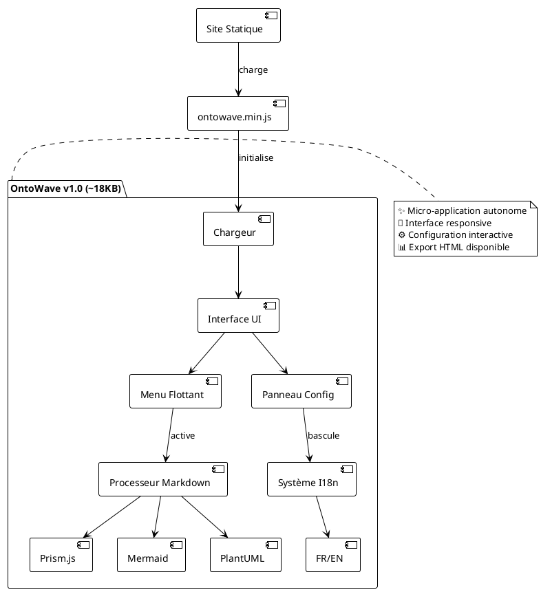

# OntoWave v1.0

Micro-application JavaScript légère (~18KB) pour sites statiques avec support multilingue, coloration syntaxique et diagrammes.

## Fonctionnalités

- **Traitement Markdown**: Analyse et rendu Markdown avec coloration syntaxique
- **Support Multilingue**: Internationalisation (i18n) intégrée
- **Intégration Prism**: Coloration syntaxique automatique pour les blocs de code
- **Diagrammes Mermaid**: Rendu de graphiques, diagrammes de séquence, etc.
- **Support PlantUML**: Diagrammes UML avec rendu en ligne
- **Léger**: ~18KB minifié, aucune dépendance
- **Configuration Simple**: Script à intégrer avec initialisation automatique

### Utilisation

**Téléchargement direct :**
Téléchargez `ontowave.min.js` et incluez-le dans votre projet.

```html
<!DOCTYPE html>
<html>
<head>
    <title>Mon Site avec OntoWave</title>
</head>
<body>
    <script src="ontowave.min.js"></script>
</body>
</html>
```

C'est tout ! OntoWave se charge automatiquement et affiche son interface. Cliquez sur l'icône 🌊 en bas à droite pour accéder au panneau de configuration et générer une page html configurée selon vos besoins, puis télécharger.

### Architecture OntoWave



###  Licence

 **Stéphane Denis**

OntoWave est publié sous licence **CC BY-NC-SA 4.0** (Creative Commons Attribution-NonCommercial-ShareAlike).

Ce logiciel est fourni "tel quel", sans garantie d'aucune sorte, expresse ou implicite. En aucun cas les auteurs ne seront responsables de réclamations, dommages ou autres responsabilités.

**Code source :** [GitHub - OntoWave](https://github.com/stephanedenis/OntoWave)
