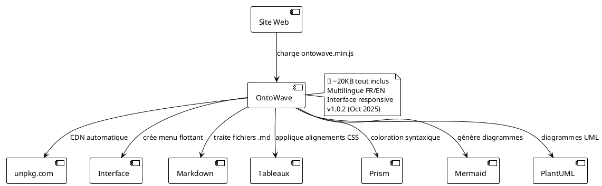

# OntoWave - Micro-application pour sites statiques

## Utilisation Rapide

```html
<!DOCTYPE html>
<html>
<head>
    <meta charset="UTF-8">
    <title>Mon Site avec OntoWave</title>
</head>
<body>
    <!-- Charge automatiquement la dernière version depuis NPM -->
    <script src="https://unpkg.com/ontowave/dist/ontowave.min.js"></script>
</body>
</html>
```

**C'est tout !** OntoWave se charge automatiquement et transforme votre contenu markdown en documentation interactive.

---

OntoWave est un moteur de rendu HTML/SVG léger (~20KB) pour créer une documentation riche sur sites statiques. Il transforme vos fichiers markdown en pages interactives avec menu de navigation, support multilingue, tableaux formatés, coloration syntaxique et diagrammes vectoriels.

### ✨ Fonctionnalités principales

- **Interface intuitive** : Menu flottant avec icône 🌊 et panneau de configuration
- **Multilingue** : Support français/anglais automatique avec détection locale
- **Markdown enrichi** : Tableaux avec alignements, listes, citations, code inline
- **Tableaux avancés** : Alignements multiples (gauche, centre, droite), formatage HTML
- **Coloration syntaxique** : Prism.js intégré pour 50+ langages
- **Diagrammes vectoriels** : Mermaid (flux, séquences, Gantt) et PlantUML (UML complet)
- **Responsive** : Adaptation automatique mobile, tablette et desktop
- **Configurable** : Panneau de configuration pour personnaliser l'apparence
- **Léger et performant** : ~20KB minifié, chargement instantané
- **Prêt à l'emploi** : Intégration en une ligne HTML
- **CDN unpkg** : Toujours à jour automatiquement, pas de maintenance

---

## Exemples de Tableaux

OntoWave supporte la syntaxe markdown standard pour les alignements :

### Tableau avec Alignements Mixtes

| Produit | Quantité | Prix Unitaire | Total |
|:--------|:--------:|:-------------:|------:|
| Ordinateur Portable | 2 | 899.99€ | 1799.98€ |
| Souris Sans Fil | 5 | 25.50€ | 127.50€ |
| **TOTAL** | **7** | | **1927.48€** |

**Syntaxe :**
- `:---` ou `---` → Alignement à gauche
- `:---:` → Alignement centré  
- `---:` → Alignement à droite

**[▶️ Voir plus d'exemples de tableaux](demo-tables.md)**

---

## Architecture OntoWave



---

## Installation

### Via CDN (recommandé)

```html
<!-- Dernière version automatique -->
<script src="https://unpkg.com/ontowave/dist/ontowave.min.js"></script>
```

### Via NPM

```bash
npm install ontowave
```

**[📖 Guide d'utilisation JavaScript/NPM](usage-npm.md)**

---

## Liens Utiles

- 📦 **NPM** : [npmjs.com/package/ontowave](https://www.npmjs.com/package/ontowave)
- 🐙 **GitHub** : [github.com/stephanedenis/OntoWave](https://github.com/stephanedenis/OntoWave)
- 📚 **Démo Tableaux** : [demo-tables.md](demo-tables.md)

---

## Dernière Version : v1.0.2

**Date :** 16 octobre 2025

### Nouveautés

- ✅ **Fix complet des alignements de tableaux markdown**
  - Support des 3 syntaxes : `:---`, `:---:`, `---:`
  - Application correcte des classes CSS
  - Gestion des cellules vides

- ✅ **CDN unpkg.com disponible**
  - Version automatique : `https://unpkg.com/ontowave/`
  - Mise à jour auto du site ontowave.org

- ✅ **Infrastructure améliorée**
  - Workflow GitHub Actions NPM automatique
  - Publication automatique sur merge
  - Tests non-bloquants

- ✅ **Documentation complète**
  - Guide principal avec exemples
  - Démo complète des tableaux
  - Pages de test minimales
  - Release notes détaillées

**[📝 Notes de version complètes sur GitHub](https://github.com/stephanedenis/OntoWave/blob/main/RELEASE_NOTES.md)**

---

## Licence


**OntoWave** © 2025 **Stéphane Denis**

Ce logiciel est publié sous **Licence Creative Commons BY-NC-SA 4.0** ([Creative Commons Attribution-NonCommercial-ShareAlike 4.0](https://creativecommons.org/licenses/by-nc-sa/4.0/))

- ✅ Utilisation libre pour projets non-commerciaux
- ✅ Modification et redistribution autorisées
- ⚠️ Attribution requise
- ⚠️ Partage dans les mêmes conditions
- ❌ Utilisation commerciale interdite sans autorisation

### Disclaimer

Ce logiciel est fourni "tel quel", sans garantie d'aucune sorte, expresse ou implicite. En aucun cas les auteurs ne seront responsables de réclamations, dommages ou autres responsabilités, que ce soit dans une action contractuelle, délictuelle ou autre, découlant de, hors de ou en lien avec le logiciel ou l'utilisation ou d'autres transactions dans le logiciel.

---

## Crédits

- **Auteur** : Stéphane Denis
- **Projet** : Panini Ecosystem
- **Technologies** : marked.js, Mermaid, PlantUML, Prism, KaTeX
- **Hébergement CDN** : unpkg.com

---

*🌊 OntoWave transforme vos sites statiques en documentation interactive en quelques secondes !*
