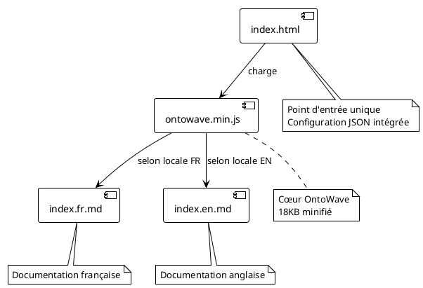
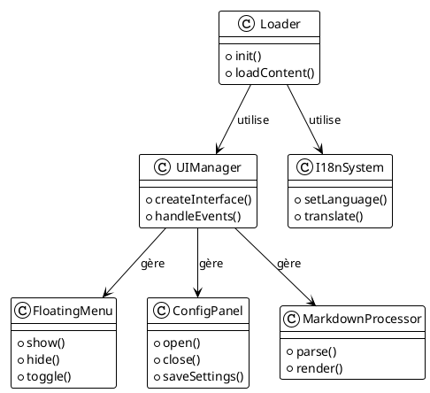
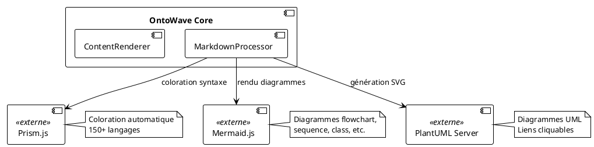

# OntoWave v1.0.1

Micro-application JavaScript légère (~74KB) pour sites statiques avec support multilingue, coloration syntaxique et diagrammes.

## Fonctionnalités

- **Traitement Markdown**: Analyse et rendu Markdown avec support alignements tableaux
- **Support Multilingue**: Internationalisation (i18n) intégrée avec détection automatique langue
- **Intégration Prism**: Coloration syntaxique automatique pour les blocs de code (150+ langages)
- **Diagrammes Mermaid**: Rendu de graphiques, diagrammes de séquence, classes, états, etc.
- **Support PlantUML**: Diagrammes UML avec rendu en ligne et liens SVG cliquables
- **Fichiers .puml**: Chargement direct de fichiers PlantUML
- **Léger**: ~74KB minifié, aucune dépendance
- **Configuration Simple**: Script à intégrer avec initialisation automatique

### 🧪 Démonstrations

Explorez toutes les fonctionnalités d'OntoWave v1.0.1 à travers 11 démos interactives :

**Démos Principales :**
- **[Mermaid Flowcharts](demos/09-mermaid-flowcharts.html)** - Diagrammes d'architecture, graphiques, styles personnalisés
- **[Mermaid Sequence](demos/10-mermaid-sequence.html)** - Diagrammes de séquence, classes et états
- **[Prism Highlighting](demos/11-prism-highlight.html)** - 8 langages avec code production-ready
- **[Tableaux Markdown](demos/06-markdown-tables.html)** - Alignements colonnes (gauche, centre, droite)
- **[Fichiers PlantUML](demos/07-plantuml-file.html)** - Chargement direct fichiers `.puml`
- **[Liens PlantUML](demos/05-plantuml-links.html)** - Diagrammes cliquables avec navigation SPA
- **[Internationalisation](demos/02-i18n-french.html)** - Détection automatique langue

[📋 Voir les 11 démos avec documentation complète →](demos/)

### Utilisation

```html
<!DOCTYPE html>
<html>
<head>
    <title>Mon Site avec OntoWave</title>
</head>
<body>
    <script src="ontowave.min.js"></script>
</body>
</html>
```

C'est tout ! OntoWave se charge automatiquement et affiche son interface. Cliquez sur l'icône 🌊 en bas à droite pour accéder au panneau de configuration et générer une page HTML configurée selon vos besoins, puis télécharger le fichier `ontowave.min.js` pour votre projet.

### 🏗️ Architecture OntoWave

#### Vue d'ensemble des composants



#### Classes principales



#### Intégrations externes



###  Licence

 **Stéphane Denis**

OntoWave est publié sous licence **CC BY-NC-SA 4.0** (Creative Commons Attribution-NonCommercial-ShareAlike).

Ce logiciel est fourni "tel quel", sans garantie d'aucune sorte, expresse ou implicite. En aucun cas les auteurs ne seront responsables de réclamations, dommages ou autres responsabilités.

**Code source :** [GitHub - OntoWave](https://github.com/stephanedenis/OntoWave)
