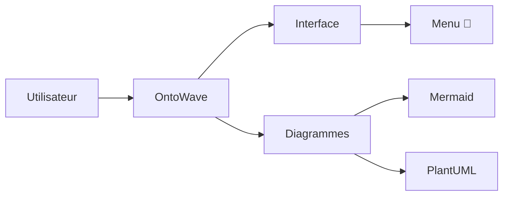
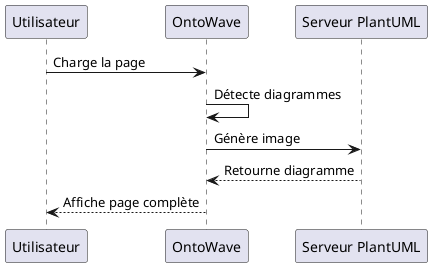
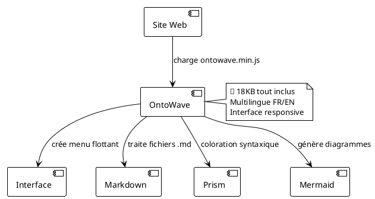

# OntoWave - Générateur de diagrammes pour sites statiques

## Micro-application pour sites statiques

OntoWave est un générateur de diagrammes JavaScript léger (18KB) conçu pour les sites statiques. Il permet d'ajouter facilement un système de documentation interactive avec menu flottant et interface multilingue.

### Fonctionnalités principales

- **Interface simple** : Menu flottant avec icône 🌊
- **Multilingue** : Support français/anglais automatique  
- **Responsive** : Adaptation mobile et desktop
- **Configurable** : Panneau de configuration intégré
- **Léger** : Seulement 18KB minifié
- **Prêt à l'emploi** : Integration en une ligne

### Utilisation

```html
<!DOCTYPE html>
<html>
<head>
    <title>Mon Site avec OntoWave</title>
</head>
<body>
    <script src="ontowave.min.js"></script>
</body>
</html>
```

C'est tout ! OntoWave se charge automatiquement et affiche son interface.

### Diagrammes supportés

OntoWave intègre nativement **Mermaid** et **PlantUML** pour vos diagrammes :

**Mermaid :**


**PlantUML :**


### Démos et exemples

Explorez nos différentes configurations :

- **[Configuration minimale](demo/minimal.html)** - L'intégration la plus simple possible
- **[Configuration avancée](demo/advanced.html)** - Avec système multilingue complet  
- **[Configuration complète](demo/full-config.html)** - Toutes les fonctionnalités activées

### Architecture OntoWave



### Configuration

Le fichier `config.json` permet de personnaliser OntoWave :

```json
{
  "locales": ["fr", "en"],
  "defaultLocale": "fr",
  "sources": {
    "fr": "index.fr.md",
    "en": "index.en.md"
  }
}
```

### 📥 Téléchargement

Récupérez OntoWave depuis le panneau de configuration :

1. Cliquez sur l'icône 🌊 en bas à droite
2. Sélectionnez "Configuration"  
3. Utilisez les options de téléchargement

### Personnalisation

OntoWave s'adapte automatiquement au style de votre site. Pour une personnalisation avancée, consultez les exemples dans le dossier `demo/`.

### 📜 Licence

### 📜 Licence

 **Stéphane Denis**

OntoWave est publié sous licence **CC BY-NC-SA 4.0** (Creative Commons Attribution-NonCommercial-ShareAlike).

Ce logiciel est fourni "tel quel", sans garantie d'aucune sorte, expresse ou implicite. En aucun cas les auteurs ne seront responsables de réclamations, dommages ou autres responsabilités.

**Code source :** [GitHub - OntoWave](https://github.com/stephanedenis/OntoWave)
