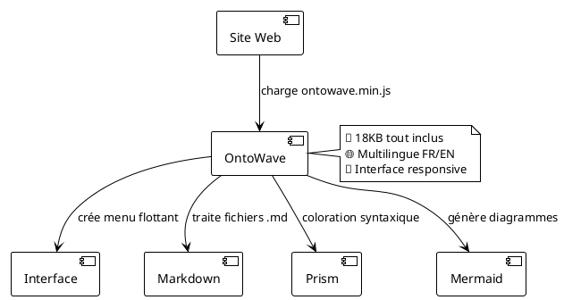

# OntoWave - Générateur de diagrammes pour sites statiques

## 🌊 Micro-application pour sites statiques

OntoWave est un générateur de diagrammes JavaScript léger (18KB) conçu pour les sites statiques. Il permet d'ajouter facilement un système de documentation interactive avec menu flottant et interface multilingue.

### ✨ Fonctionnalités principales

- **🎯 Interface simple** : Menu flottant avec icône 🌊
- **🌐 Multilingue** : Support français/anglais automatique  
- **📱 Responsive** : Adaptation mobile et desktop
- **⚙️ Configurable** : Panneau de configuration intégré
- **📦 Léger** : Seulement 18KB minifié
- **🚀 Prêt à l'emploi** : Integration en une ligne

### 🎯 Utilisation (HTML)

```html
<!DOCTYPE html>
<html>
<head>
    <title>Mon Site avec OntoWave</title>
</head>
<body>
    <script src="ontowave.min.js"></script>
</body>
</html>
```

**C'est tout !** OntoWave se charge automatiquement et affiche son **menu flottant** avec l'icône 🌊 en bas à droite de la page.

#### 🌊 Menu flottant et panneau de configuration

- **Cliquez sur l'icône 🌊** pour accéder au menu OntoWave
- **Panneau de configuration intégré** avec options avancées
- **Téléchargement direct** du fichier `ontowave.min.js` 
- **Export HTML complet** avec votre configuration personnalisée
- **Interface multilingue** (FR/EN) avec boutons de langue
- **Construction dynamique** de votre page HTML optimisée

C'est également là que vous pouvez télécharger le fichier `ontowave.min.js` et construire dynamiquement votre page HTML complète.

### 📊 Démos et exemples

Explorez nos différentes configurations :

- **[Configuration minimale](demo/minimal.html)** - L'intégration la plus simple possible
- **[Configuration avancée](demo/advanced.html)** - Avec système multilingue complet  
- **[Configuration complète](demo/full-config.html)** - Toutes les fonctionnalités activées

### 🏗️ Architecture OntoWave



###  Licence

 **Stéphane Denis**

OntoWave est publié sous licence **CC BY-NC-SA 4.0** (Creative Commons Attribution-NonCommercial-ShareAlike).

**Code source :** [GitHub - OntoWave](https://github.com/stephanedenis/OntoWave)
