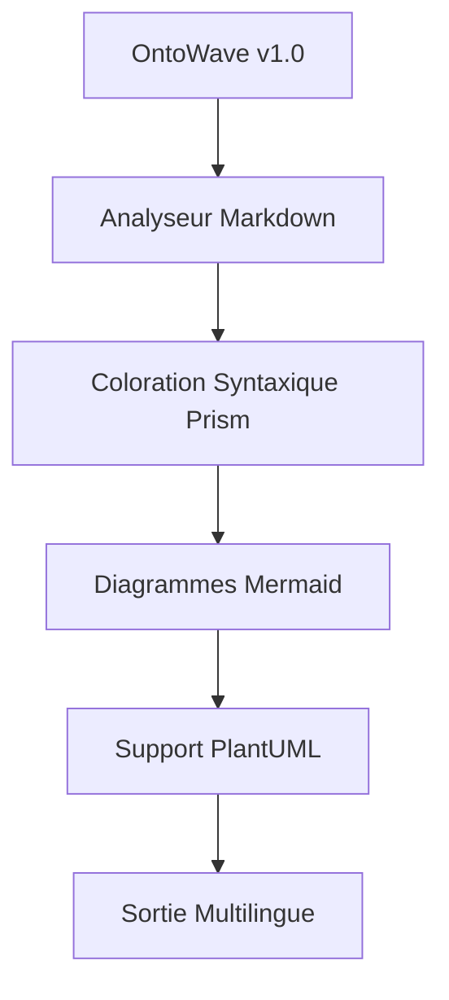
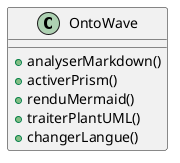
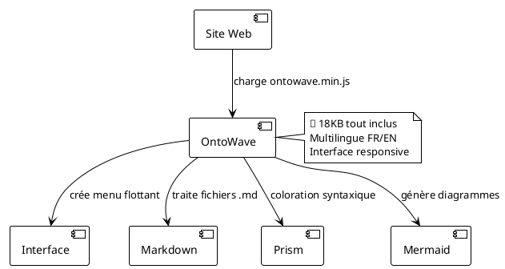

# OntoWave v1.0

Micro-application JavaScript légère (~18KB) pour sites statiques avec support multilingue, coloration syntaxique et diagrammes.

## Fonctionnalités

- **Traitement Markdown**: Analyse et rendu Markdown avec coloration syntaxique
- **Support Multilingue**: Internationalisation (i18n) intégrée
- **Intégration Prism**: Coloration syntaxique automatique pour les blocs de code
- **Diagrammes Mermaid**: Rendu de graphiques, diagrammes de séquence, etc.
- **Support PlantUML**: Diagrammes UML avec rendu en ligne
- **Léger**: ~18KB minifié, aucune dépendance
- **Configuration Simple**: Script à intégrer avec initialisation automatique

## Démarrage Rapide

```html
<!DOCTYPE html>
<html>
<head>
    <title>Ma Documentation</title>
</head>
<body>
    <script src="ontowave.min.js"></script>
</body>
</html>
```

## Configuration

```javascript
window.ontoWaveConfig = {
    locales: ["fr", "en"],
    defaultLocale: "fr",
    sources: {
        fr: "docs.fr.md",
        en: "docs.en.md"
    },
    enablePrism: true,
    enableMermaid: true,
    enablePlantUML: true
};
```

### Utilisation

**Téléchargement direct :**
Téléchargez `ontowave.min.js` et incluez-le dans votre projet.

### Exemples de diagrammes

#### Mermaid



#### PlantUML



### Licence

**CC BY-NC-SA** - Stéphane Denis  
[](https://github.com/stephanedenis/OntoWave)

OntoWave v1.0 est distribué sous licence Creative Commons Attribution - Pas d'Utilisation Commerciale - Partage dans les Mêmes Conditions 4.0. Cette licence vous permet de partager et adapter le contenu pour des usages non-commerciaux, à condition de mentionner l'auteur et de conserver la même licence pour les œuvres dérivées.

**Licence commerciale disponible** - Contactez-nous pour les licences d'usage commercial.

Une bibliothèque JavaScript puissante pour créer de la documentation interactive et élégante à partir de sources Markdown.

## Fonctionnalités

- **Basé sur Markdown**: Rédigez la documentation dans la syntaxe Markdown familière
- **Multilingue**: Support d'internationalisation intégré
- **Personnalisable**: Apparence et style personnalisables
- **Responsive**: Design adapté mobile
- **Rapide**: Optimisé pour les performances

### Utilisation

```html
<!DOCTYPE html>
<html>
<head>
    <title>Mon Site avec OntoWave</title>
</head>
<body>
    <script src="ontowave.min.js"></script>
</body>
</html>
```

C'est tout ! OntoWave se charge automatiquement et affiche son interface. Cliquez sur l'icône 🌊 en haut à gauche pour accéder au panneau de configuration et générer une page html configurée selon vos besoins, puis télécharger.

### Démos et exemples

Explorez nos différentes configurations :

- **[Configuration minimale](demo/minimal-demo.html)** - L'intégration la plus simple possible
- **[Configuration avancée](demo/advanced-demo.html)** - Avec système multilingue complet  
- **[Configuration complète](demo/full-config.html)** - Toutes les fonctionnalités activées

### Architecture OntoWave



###  Licence

 **Stéphane Denis**

OntoWave est publié sous licence **CC BY-NC-SA 4.0** (Creative Commons Attribution-NonCommercial-ShareAlike).

Ce logiciel est fourni "tel quel", sans garantie d'aucune sorte, expresse ou implicite. En aucun cas les auteurs ne seront responsables de réclamations, dommages ou autres responsabilités.

**Code source :** [GitHub - OntoWave](https://github.com/stephanedenis/OntoWave)
