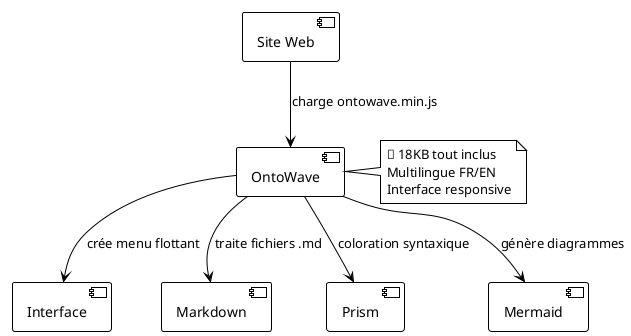

# OntoWave

Une bibliothèque JavaScript puissante pour créer de la documentation interactive et élégante à partir de sources Markdown.

## Fonctionnalités

- **Basé sur Markdown**: Rédigez la documentation dans la syntaxe Markdown familière
- **Multilingue**: Support d'internationalisation intégré
- **Personnalisable**: Apparence et style personnalisables
- **Responsive**: Design adapté mobile
- **Rapide**: Optimisé pour les performances

## Démarrage Rapide

```html
<script src="ontowave.min.js"></script>
<script>
window.ontoWaveConfig = {
    sources: { fr: "documentation.md" }
};
</script>
```

## Démonstrations

- **[Démo Minimale](demo/minimal-demo.html)** - Configuration simple, monolingue
- **[Démo Avancée](demo/advanced-demo.html)** - Interface complète similaire à MkDocs
- [Exemples Hérités](demo/basic/) - Collection d'exemples originaux
- [Suite de Tests](demo/testing/)

### Utilisation

```html
<!DOCTYPE html>
<html>
<head>
    <title>Mon Site avec OntoWave</title>
</head>
<body>
    <script src="ontowave.min.js"></script>
</body>
</html>
```

C'est tout ! OntoWave se charge automatiquement et affiche son interface. Cliquez sur l'icône 🌊 en haut à gauche pour accéder au panneau de configuration et générer une page html configurée selon vos besoins, puis télécharger.

### Démos et exemples

Explorez nos différentes configurations :

- **[Configuration minimale](demo/minimal.html)** - L'intégration la plus simple possible
- **[Configuration avancée](demo/advanced.html)** - Avec système multilingue complet  
- **[Configuration complète](demo/full-config.html)** - Toutes les fonctionnalités activées

### Architecture OntoWave



###  Licence

 **Stéphane Denis**

OntoWave est publié sous licence **CC BY-NC-SA 4.0** (Creative Commons Attribution-NonCommercial-ShareAlike).

Ce logiciel est fourni "tel quel", sans garantie d'aucune sorte, expresse ou implicite. En aucun cas les auteurs ne seront responsables de réclamations, dommages ou autres responsabilités.

**Code source :** [GitHub - OntoWave](https://github.com/stephanedenis/OntoWave)
