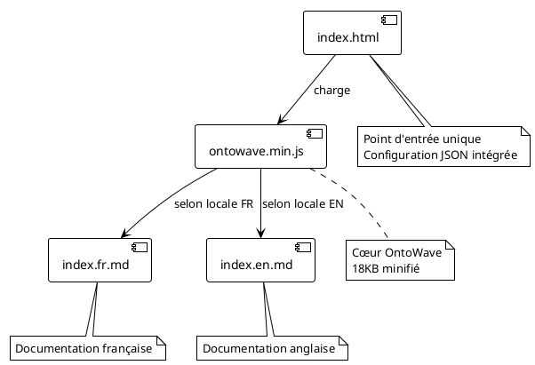
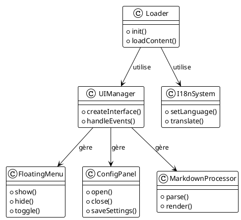
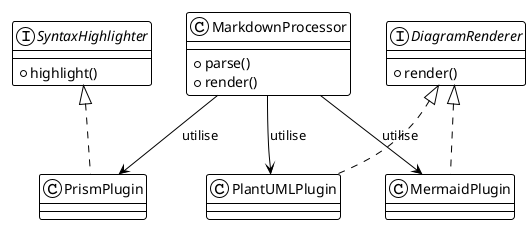

# OntoWave v1.0.9

Micro-application JavaScript légère (~80KB) pour sites statiques avec support multilingue, coloration syntaxique et diagrammes.

## Fonctionnalités

- **Traitement Markdown**: Analyse et rendu Markdown avec support alignements tableaux
- **Support Multilingue**: Internationalisation (i18n) intégrée avec détection automatique langue
- **Diagrammes Mermaid**: Rendu de flowcharts, sequence, class diagrams en SVG inline
- **Support PlantUML**: Diagrammes UML via Kroki.io avec rendu SVG inline
- **Fichiers .puml**: Chargement direct de fichiers PlantUML
- **Cache SVG Intelligent**: Cache in-memory avec TTL 5min pour performance optimale
- **Modes d'Affichage**: Normal, Split View (source + rendu), Source-only
- **Routing SPA**: Navigation hash-based sans rechargement de page
- **Léger**: ~80KB minifié, aucune dépendance lourde
- **Configuration Simple**: Script à intégrer avec initialisation automatique

### 🧪 Démonstrations Interactives

Explorez OntoWave v1.0.9 à travers des **démos interactives et testées** :

#### ✨ Capacités de Base (sans configuration)
- **[Markdown Features](demos/01-base/markdown.html)** - Tables, listes, liens, formatage
- **[Mermaid Diagrams](demos/01-base/mermaid.html)** - Flowcharts, sequence, class diagrams
- **[PlantUML via Kroki](demos/01-base/plantuml.html)** - Diagrammes UML, composants
- **[SPA Routing](demos/01-base/routing.html)** - Navigation sans rechargement, 404

#### ⚙️ Configurations Avancées
- **[Internationalisation](demos/02-config/i18n.html)** - Détection langue automatique, fallback
- **[View Modes](demos/02-config/view-modes.html)** - Split view, source-only, normal
- **[UI Customization](demos/02-config/ui-custom.html)** - Sidebar, header, TOC, minimal mode

[📋 Voir toutes les démos dans le catalogue →](demos/)

### Utilisation

```html
<!DOCTYPE html>
<html>
<head>
    <title>Mon Site avec OntoWave</title>
</head>
<body>
    <!-- CDN -->
    <script src="https://cdn.jsdelivr.net/npm/ontowave@latest/dist/ontowave.min.js"></script>
</body>
</html>
```

C'est tout ! OntoWave se charge automatiquement et affiche son interface.

### 🏗️ Architecture OntoWave

#### Vue d'ensemble des composants


```plantuml
@startuml Vue_Ensemble
!theme plain

component "index.html" as HTML
component "ontowave.min.js" as Core
component "index.fr.md" as DocFR
component "index.en.md" as DocEN

HTML --> Core : charge
Core --> DocFR : selon locale FR
Core --> DocEN : selon locale EN

note bottom of HTML : Point d'entrée unique\nConfiguration JSON intégrée
note bottom of Core : Cœur OntoWave\n18KB minifié
note bottom of DocFR : Documentation française
note bottom of DocEN : Documentation anglaise

@enduml
```

#### Classes principales


```plantuml
@startuml Classes_Principales
!theme plain

class Loader {
  +init()
  +loadContent()
}

class UIManager {
  +createInterface()
  +handleEvents()
}

class FloatingMenu {
  +show()
  +hide()
  +toggle()
}

class ConfigPanel {
  +open()
  +close()
  +saveSettings()
}

class MarkdownProcessor {
  +parse()
  +render()
}

class I18nSystem {
  +setLanguage()
  +translate()
}

Loader --> UIManager : utilise
Loader --> I18nSystem : utilise
UIManager --> FloatingMenu : gère
UIManager --> ConfigPanel : gère
UIManager --> MarkdownProcessor : gère

@enduml
```

#### Système de plugins


```plantuml
@startuml Systeme_Plugins
!theme plain

interface SyntaxHighlighter {
  +highlight()
}

interface DiagramRenderer {
  +render()
}

class PrismPlugin
class MermaidPlugin
class PlantUMLPlugin

SyntaxHighlighter <|.. PrismPlugin
DiagramRenderer <|.. MermaidPlugin
DiagramRenderer <|.. PlantUMLPlugin

class MarkdownProcessor {
  +parse()
  +render()
}

MarkdownProcessor --> PrismPlugin : utilise
MarkdownProcessor --> MermaidPlugin : utilise
MarkdownProcessor --> PlantUMLPlugin : utilise

@enduml
```

###  Licence

 **Stéphane Denis**

OntoWave est publié sous licence **CC BY-NC-SA 4.0** (Creative Commons Attribution-NonCommercial-ShareAlike).

Ce logiciel est fourni "tel quel", sans garantie d'aucune sorte, expresse ou implicite. En aucun cas les auteurs ne seront responsables de réclamations, dommages ou autres responsabilités.

**Code source :** [GitHub - OntoWave](https://github.com/stephanedenis/OntoWave)
