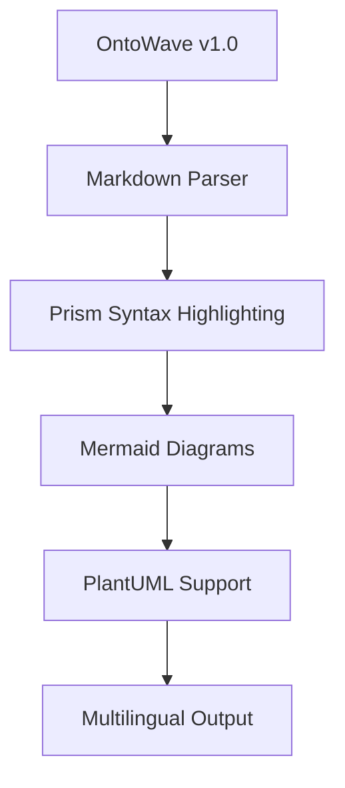
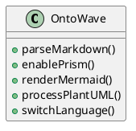

# OntoWave v1.0

<div lang="en">
A lightweight JavaScript library for creating beautiful, interactive documentation from Markdown sources with multilingual support and diagram rendering.

## Features

- **Markdown Processing**: Parse and render Markdown with syntax highlighting
- **Multilingual Support**: Built-in internationalization (i18n) 
- **Prism Integration**: Automatic syntax highlighting for code blocks
- **Mermaid Diagrams**: Render flowcharts, sequence diagrams, and more
- **PlantUML Support**: UML diagrams with online rendering
- **Lightweight**: ~18KB minified, no dependencies
- **Easy Setup**: Drop-in script with automatic initialization

## Quick Start

```html
<!DOCTYPE html>
<html>
<head>
    <title>My Documentation</title>
</head>
<body>
    <script src="https://unpkg.com/ontowave@1.0.0/dist/ontowave.min.js"></script>
</body>
</html>
```

## Configuration

```javascript
window.ontoWaveConfig = {
    locales: ["en", "fr"],
    defaultLocale: "en",
    sources: {
        en: "docs.en.md",
        fr: "docs.fr.md"
    },
    enablePrism: true,
    enableMermaid: true,
    enablePlantUML: true
};
```
</div>

<div lang="fr">
Une bibliothèque JavaScript légère pour créer de la documentation interactive et élégante à partir de sources Markdown avec support multilingue et rendu de diagrammes.

## Fonctionnalités

- **Traitement Markdown**: Analyse et rendu Markdown avec coloration syntaxique
- **Support Multilingue**: Internationalisation (i18n) intégrée
- **Intégration Prism**: Coloration syntaxique automatique pour les blocs de code
- **Diagrammes Mermaid**: Rendu de graphiques, diagrammes de séquence, etc.
- **Support PlantUML**: Diagrammes UML avec rendu en ligne
- **Léger**: ~18KB minifié, aucune dépendance
- **Configuration Simple**: Script à intégrer avec initialisation automatique

## Démarrage Rapide

```html
<!DOCTYPE html>
<html>
<head>
    <title>Ma Documentation</title>
</head>
<body>
    <script src="https://unpkg.com/ontowave@1.0.0/dist/ontowave.min.js"></script>
</body>
</html>
```

## Configuration

```javascript
window.ontoWaveConfig = {
    locales: ["fr", "en"],
    defaultLocale: "fr",
    sources: {
        fr: "docs.fr.md",
        en: "docs.en.md"
    },
    enablePrism: true,
    enableMermaid: true,
    enablePlantUML: true
};
```
</div>

### Installation

<div lang="en">
### Installation

**Via NPM:**
```bash
npm install ontowave
```

**Via CDN:**
```html
<script src="https://unpkg.com/ontowave@1.0.0/dist/ontowave.min.js"></script>
```

**Direct Download:**
Download `ontowave.min.js` and include it in your project.
</div>

**Via NPM :**
```bash
npm install ontowave
```

**Via CDN :**
```html
<script src="https://unpkg.com/ontowave@1.0.0/dist/ontowave.min.js"></script>
```

**Téléchargement direct :**
Téléchargez `ontowave.min.js` et incluez-le dans votre projet.

### Exemples de diagrammes

<div lang="en">
### Diagram Examples
</div>

#### Mermaid



#### PlantUML



### Licence

<div lang="en">
### License

**CC BY-NC-SA** - Stéphane Denis  
[](https://github.com/stephanedenis/OntoWave)

OntoWave v1.0 is distributed under Creative Commons Attribution - Non Commercial - Share Alike 4.0 license. This license allows you to share and adapt the content for non-commercial use, provided you mention the author and keep the same license for derivative works.

**Commercial licensing available** - Contact for commercial use licenses.
</div>

**CC BY-NC-SA** - Stéphane Denis  
[](https://github.com/stephanedenis/OntoWave)

OntoWave v1.0 est distribué sous licence Creative Commons Attribution - Pas d'Utilisation Commerciale - Partage dans les Mêmes Conditions 4.0. Cette licence vous permet de partager et adapter le contenu pour des usages non-commerciaux, à condition de mentionner l'auteur et de conserver la même licence pour les œuvres dérivées.

**Licence commerciale disponible** - Contactez-nous pour les licences d'usage commercial.


