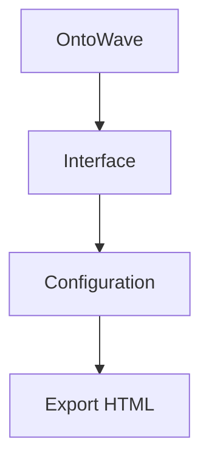
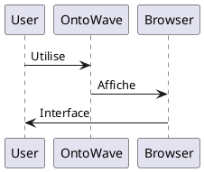

# OntoWave

<div lang="en">
A powerful JavaScript library for creating beautiful, interactive documentation from Markdown sources.

## Features

- **Markdown-based**: Write documentation in familiar Markdown syntax
- **Multilingual**: Built-in internationalization support
- **Themeable**: Customizable appearance and styling
- **Responsive**: Mobile-friendly design
- **Fast**: Optimized for performance

## Quick Start

```html
<script src="ontowave.min.js"></script>
<script>
window.ontoWaveConfig = {
    sources: { en: "documentation.md" }
};
</script>
```

## Demos

- **[Minimal Demo](demo/minimal-demo.html)** - Simple, single-language setup
- **[Advanced Demo](demo/advanced-demo.html)** - Full-featured with MkDocs-like interface
- **[Full Configuration Demo](demo/full-config.html)** - Complete configuration example
- [All Demo Files](demo/) - Browse all available demos
</div>

<div lang="fr">
Une bibliothèque JavaScript puissante pour créer de la documentation interactive et élégante à partir de sources Markdown.

## Fonctionnalités

- **Basé sur Markdown**: Rédigez la documentation dans la syntaxe Markdown familière
- **Multilingue**: Support d'internationalisation intégré
- **Personnalisable**: Apparence et style personnalisables
- **Responsive**: Design adapté mobile
- **Rapide**: Optimisé pour les performances

## Démarrage Rapide

```html
<script src="ontowave.min.js"></script>
<script>
window.ontoWaveConfig = {
    sources: { fr: "documentation.md" }
};
</script>
```

## Démonstrations

- **[Démo Minimale](demo/minimal-demo.html)** - Configuration simple, monolingue
- **[Démo Avancée](demo/advanced-demo.html)** - Interface complète similaire à MkDocs
- **[Démo Configuration Complète](demo/full-config.html)** - Exemple de configuration complète
- [Tous les Fichiers de Démo](demo/) - Parcourir toutes les démos disponibles
</div>

### Utilisation

<div lang="en">

### Usage

</div>

```html
<!DOCTYPE html>
<html>
<head>
    <title>Mon Site avec OntoWave</title>
</head>
<body>
    <script src="ontowave.min.js"></script>
</body>
</html>
```

C'est tout ! OntoWave se charge automatiquement et affiche son interface. Cliquez sur l'icône 🌊 en haut à gauche pour accéder au panneau de configuration et générer une page html configurée selon vos besoins, puis télécharger.

<div lang="en">

```html
<!DOCTYPE html>
<html>
<head>
    <title>My Site with OntoWave</title>
</head>
<body>
    <script src="ontowave.min.js"></script>
</body>
</html>
```

That's it! OntoWave loads automatically and displays its interface. Click on the 🌊 icon at the top left to access the configuration panel and generate an HTML page configured to your needs, then download.

</div>

### Diagrammes supportés

<div lang="en">

### Supported diagrams

</div>

#### Mermaid



#### PlantUML



### Configuration avancée

<div lang="en">

### Advanced configuration

</div>

C'est également là que vous pouvez télécharger le fichier ontowave.min.js et construire dynamiquement votre page HTML complète.

<div lang="en">

This is also where you can download the ontowave.min.js file and dynamically build your complete HTML page.

</div>

### Licence

<div lang="en">

### License

</div>

**CC BY-NC-SA** - Stéphane Denis  
[](https://github.com/stephanedenis/OntoWave)

OntoWave est distribué sous licence Creative Commons Attribution - Pas d'Utilisation Commerciale - Partage dans les Mêmes Conditions 4.0. Cette licence vous permet de partager et adapter le contenu pour des usages non-commerciaux, à condition de mentionner l'auteur et de conserver la même licence pour les œuvres dérivées.

<div lang="en">

OntoWave is distributed under Creative Commons Attribution - Non Commercial - Share Alike 4.0 license. This license allows you to share and adapt the content for non-commercial use, provided you mention the author and keep the same license for derivative works.

</div>


