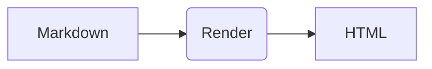

# OntoWave

<div id="lang-fr" class="lang-content">

## Micro-application pour sites statiques

**OntoWave** est une micro-application légère qui transforme vos sites statiques en plateformes de documentation interactives et modernes.

### ✨ Fonctionnalités principales

- **📝 Rendu Markdown avancé** - Support complet de la syntaxe Markdown avec extensions
- **📊 Diagrammes Mermaid** - Visualisations interactives intégrées
- **🔍 Navigation intelligente** - Préservation des ancres et navigation fluide
- **🎨 Interface moderne** - Design responsive et épuré
- **⚡ Ultra-léger** - Seulement 25KB, aucune dépendance
- **🚀 Installation en une ligne** - Un seul script à inclure

### 🎯 Utilisation

```html
<!DOCTYPE html>
<html>
<head>
    <meta charset="UTF-8">
    <title>Ma Documentation</title>
</head>
<body>
    <script src="ontowave.min.js"></script>
</body>
</html>
```

*Téléchargez le fichier `ontowave.min.js` ci-dessous et placez-le dans votre dossier de site.*

### 📚 Exemples progressifs

Découvrez OntoWave avec nos démos :

- [**01-Minimal**](01-minimal.html) - Configuration basique (8 lignes de HTML)
- [**02-Configuré**](02-basic-config.html) - Avec options personnalisées
- [**03-Thématique**](03-dark-theme.html) - Style et couleurs personnalisés
- [**04-Avancé**](04-advanced-config.html) - Fonctionnalités avancées
- [**05-Style MkDocs**](05-mkdocs-style.html) - Interface complète type MkDocs
- [**Galerie**](gallery.html) - Vue d'ensemble de toutes les démos

### 📦 Téléchargement

OntoWave est disponible pour sites statiques :

- **[📥 Télécharger ontowave.min.js](ontowave.min.js)** (18KB) - Fichier unique à inclure
- **[📁 Télécharger le dossier dist complet](dist.tar.gz)** (10KB) - Version de développement avec sources

*Pour les sites statiques, il suffit de télécharger `ontowave.min.js` et de l'inclure dans votre HTML.*

</div>

<div id="lang-en" class="lang-content" style="display: none;">

## Micro-application for static sites

**OntoWave** is a lightweight micro-application that transforms your static sites into interactive and modern documentation platforms.

### ✨ Key Features

- **📝 Advanced Markdown rendering** - Full Markdown syntax support with extensions
- **📊 Mermaid diagrams** - Integrated interactive visualizations
- **🔍 Smart navigation** - Anchor preservation and smooth navigation
- **🎨 Modern interface** - Responsive and clean design
- **⚡ Ultra-lightweight** - Only 25KB, zero dependencies
- **🚀 One-line installation** - Single script include

### 🎯 Usage

```html
<!DOCTYPE html>
<html>
<head>
    <meta charset="UTF-8">
    <title>My Documentation</title>
</head>
<body>
    <script src="ontowave.min.js"></script>
</body>
</html>
```

*Download the `ontowave.min.js` file below and place it in your site folder.*

### 📚 Progressive Examples

Discover OntoWave with our demos:

- [**01-Minimal**](01-minimal.html) - Basic setup (8 lines of HTML)
- [**02-Configured**](02-basic-config.html) - With custom options
- [**03-Themed**](03-dark-theme.html) - Custom styles and colors
- [**04-Advanced**](04-advanced-config.html) - Advanced features
- [**05-MkDocs Style**](05-mkdocs-style.html) - Complete MkDocs-like interface
- [**Gallery**](gallery.html) - Overview of all demos

### 📦 Download

OntoWave is available for static sites:

- **[📥 Download ontowave.min.js](ontowave.min.js)** (18KB) - Single file to include
- **[📁 Download complete dist folder](dist.tar.gz)** (10KB) - Development version with sources

*For static sites, just download `ontowave.min.js` and include it in your HTML.*

</div>

<div class="lang-toggle">
    <button onclick="toggleLang('fr')" id="btn-fr">🇫🇷 Français</button>
    <button onclick="toggleLang('en')" id="btn-en">🇬🇧 English</button>
</div>

<style>
.lang-toggle {
    position: fixed;
    top: 80px;
    right: 20px;
    z-index: 999;
    display: flex;
    gap: 8px;
}

.lang-toggle button {
    padding: 8px 12px;
    border: 1px solid #d0d7de;
    border-radius: 20px;
    background: rgba(255, 255, 255, 0.95);
    backdrop-filter: blur(10px);
    cursor: pointer;
    font-size: 0.8em;
    transition: all 0.2s ease;
}

.lang-toggle button:hover {
    background: #f8f9fa;
    transform: translateY(-1px);
}

.lang-toggle button.active {
    background: #0969da;
    color: white;
    border-color: #0969da;
}

.lang-content {
    transition: opacity 0.3s ease;
}
</style>

<script>
// Détection automatique de la langue du navigateur
function detectLanguage() {
    const userLang = navigator.language || navigator.userLanguage;
    return userLang.startsWith('fr') ? 'fr' : 'en';
}

// Fonction pour changer de langue
function toggleLang(lang) {
    // Masquer tous les contenus
    document.querySelectorAll('.lang-content').forEach(el => {
        el.style.display = 'none';
    });
    
    // Afficher le contenu de la langue sélectionnée
    document.getElementById('lang-' + lang).style.display = 'block';
    
    // Mettre à jour les boutons
    document.querySelectorAll('.lang-toggle button').forEach(btn => {
        btn.classList.remove('active');
    });
    document.getElementById('btn-' + lang).classList.add('active');
    
    // Sauvegarder la préférence
    localStorage.setItem('ontowave-lang', lang);
}

// Initialisation au chargement
document.addEventListener('DOMContentLoaded', function() {
    // Récupérer la langue sauvegardée ou détecter automatiquement
    const savedLang = localStorage.getItem('ontowave-lang');
    const lang = savedLang || detectLanguage();
    
    // Appliquer la langue
    toggleLang(lang);
});
</script>

```html
<!DOCTYPE html>
<html>
<head>
    <title>Ma Documentation</title>
</head>
<body>
    <script src="ontowave.min.js"></script>
</body>
</html>
```

## Installation

```bash
npm install ontowave
```

Ou via CDN :

```html
<script src="https://cdn.jsdelivr.net/npm/ontowave@latest/dist/ontowave.min.js"></script>
```i est un MVP « OntoWave ».

- Navigation: utilisez les liens markdown pour référencer d’autres pages.
- Exemples: [Page de démonstration](demo.md) · [Mermaid](demo/mermaid.md) · [PlantUML](demo/plantuml.md)

---



Formule KaTeX: $E = mc^2$.
