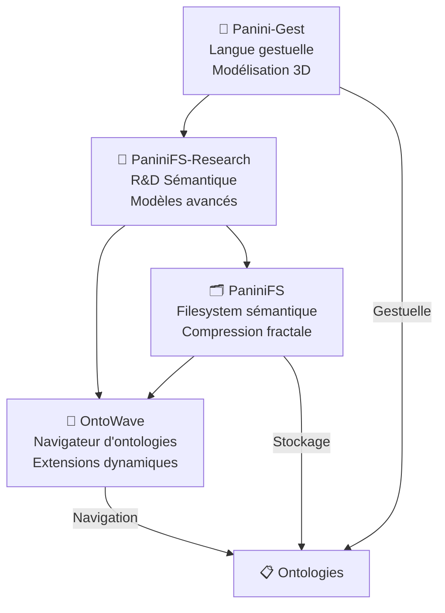

# OntoWave dans l'écosystème Panini

## 🌐 Vue d'ensemble de l'écosystème

L'écosystème Panini est centré sur le **modèle sémantique Panini** et la **compression sémantique fractale**. OntoWave y joue le rôle de navigateur d'ontologies intelligent.

## 🏗️ Architecture de l'écosystème



## 🎯 Rôle d'OntoWave

### Navigation Ontologique
- **Visualisation** des structures sémantiques stockées dans PaniniFS
- **Parcours intelligent** des graphes ontologiques
- **Chargement dynamique** d'extensions selon le contenu

### Intégration Multi-Module
```typescript
interface PaniniEcosystemIntegration {
  // Intégration PaniniFS
  filesystem: {
    semanticCompression: boolean;
    fractalNavigation: boolean;
    ontologyAccess: 'direct' | 'api';
  };
  
  // Intégration Panini-Gest  
  gestural: {
    ontologyTypes: ['gestural', 'sign-language'];
    visualization: '3d-hands' | '2d-overlay';
  };
  
  // Intégration Research
  research: {
    models: ['panksepp', 'dhatu', 'semantic-fractals'];
    algorithms: ['compression', 'ambiguity-resolution'];
  };
}
```

## 🔗 Points d'intégration

### 1. PaniniFS (Filesystem sémantique)
```javascript
// Plugin PaniniFS pour OntoWave
const PaniniFilesystemPlugin = {
  name: 'panini-filesystem',
  triggers: ['.panini', '.semantic', '.fractal'],
  
  initialize() {
    // Connexion au filesystem sémantique
    this.fs = new PaniniFS.Navigator();
  },
  
  loadOntology(path) {
    // Chargement avec décompression sémantique
    return this.fs.loadWithSemanticDecompression(path);
  }
};
```

### 2. Panini-Gest (Ontologies gestuelles)
```javascript
// Plugin Gestural pour OntoWave
const GesturalOntologyPlugin = {
  name: 'gestural-ontology',
  triggers: ['.gesture', '.sign', '.kinect'],
  
  visualize(ontology) {
    // Visualisation 3D des concepts gestuels
    return new GesturalVisualizer(ontology);
  }
};
```

### 3. PaniniFS-Research (Modèles avancés)
```javascript
// Plugin Research Models pour OntoWave
const ResearchModelsPlugin = {
  name: 'research-models',
  triggers: ['panksepp:', 'dhatu:', 'semantic-fractal:'],
  
  analyze(content) {
    // Analyse avec modèles de recherche
    return PaniniResearch.semanticAnalysis(content);
  }
};
```

## 📊 Flux de données

### Navigation typique
1. **Détection** : OntoWave détecte le type d'ontologie
2. **Chargement** : Plugin approprié se charge dynamiquement
3. **Décompression** : PaniniFS décompresse la structure sémantique
4. **Visualisation** : OntoWave affiche la navigation adaptée
5. **Enrichissement** : Research fournit des analyses avancées

### Exemple concret
```yaml
# Document détecté : onto.rdf (dans PaniniFS)
detection:
  type: 'RDF/OWL'
  compression: 'fractal-semantic'
  
loading:
  plugin: 'rdf-navigator'
  decompression: 'paniniFS-semantic'
  
visualization:
  mode: 'graph-interactive'
  enrichment: 'panksepp-emotional-layer'
```

## 🚀 Roadmap d'intégration

### Phase 1: Fondations (v1.1)
- [ ] Plugin PaniniFS Navigator
- [ ] Détection automatique des ontologies
- [ ] Interface de base avec Research

### Phase 2: Navigation avancée (v1.2)
- [ ] Visualisation des compressions fractales
- [ ] Navigation sémantique intelligente
- [ ] Intégration gestuelle basique

### Phase 3: Écosystème complet (v2.0)
- [ ] Navigation unified cross-module
- [ ] Compression temps réel
- [ ] IA sémantique intégrée

## 🔧 Configuration écosystème

### Configuration OntoWave pour Panini
```yaml
# panini-config.yml
ecosystem:
  paniniFS:
    enabled: true
    semanticCompression: true
    fractalNavigation: true
    
  research:
    models: ['panksepp', 'dhatu']
    realTimeAnalysis: true
    
  gestural:
    enabled: false  # Optionnel
    kinectIntegration: false

navigation:
  ontologyTypes:
    - 'rdf'
    - 'owl' 
    - 'skos'
    - 'panini-semantic'
    - 'fractal-compressed'
    
  plugins:
    autoLoad: true
    priority: 'content-aware'
```

## 📚 Ressources

- [PaniniFS Documentation](../../PaniniFS/docs/)
- [Panini-Gest Guide](../../Panini-Gest/README.md)
- [PaniniFS-Research Papers](../../PaniniFS-Research/docs/)
- [Modèle sémantique Panini](./semantic-model.md)
- [Architecture fractale](./fractal-architecture.md)

---

🌟 OntoWave : **Naviguer les ontologies dans l'écosystème Panini**