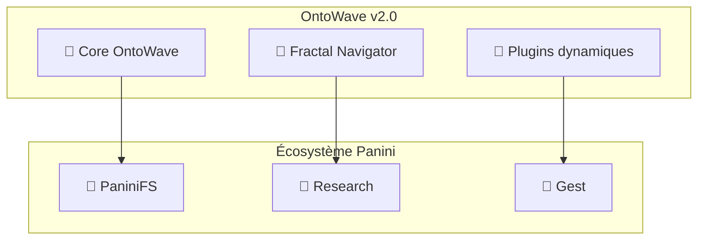

# Roadmap OntoWave - Navigateur d'ontologies

## 🎯 Vision produit

OntoWave évolue vers un **navigateur d'ontologies intelligent** intégré dans l'écosystème Panini.

## 📋 Milestones

### v1.1.0 - Navigation ontologique (Mars 2026)

Focus : Fondations de la navigation sémantique

#### Issues prioritaires

- [#20] 🧭 Système de détection de contenu ontologique
- [#21] 🔍 Navigation sémantique basique  
- [#22] 🌐 Intégration avec écosystème Panini

#### Objectifs clés

- Détection automatique des types d'ontologies
- Interface adaptative au contenu détecté
- Chargement dynamique de plugins contextuels
- Connexion avec PaniniFS

### v1.2.0 - Navigation fractale (Septembre 2026)

Focus : Architecture fractale et compression sémantique

#### Issues prioritaires v1.2

- [#23] 🔄 Navigation fractale multi-niveau
- [#24] 📊 Compression sémantique temps réel
- [#25] 🧠 Intégration modèles Panksepp/Dhatu

#### Objectifs clés v1.2

- Navigation à différents niveaux de granularité
- Compression basée sur le modèle Panini
- Enrichissement émotionnel et sémantique
- Performance optimisée

### v2.0.0 - Écosystème complet (Mars 2027)

Focus : Intégration complète et intelligence avancée

#### Objectifs stratégiques

- Intégration PaniniFS native
- Support ontologies gestuelles Panini-Gest
- Navigation prédictive avec apprentissage
- Visualisations immersives 3D

## 🔄 Architecture évolutive

### Phase 1 - Détection (v1.1.0)

Système de détection de contenu ontologique :

```typescript
// Détecteur d'ontologies
interface OntologyDetector {
  detect(content: string): Promise<OntologyType[]>;
  getPlugins(types: OntologyType[]): Promise<Plugin[]>;
}
```

Plugins de détection :

- `ontology-detector.ts` : Détection générique
- `rdf-detector.ts` : Spécifique RDF/OWL  
- `skos-detector.ts` : Vocabulaires SKOS
- `panini-detector.ts` : Format Panini sémantique

### Phase 2 - Navigation (v1.2.0)

Navigation fractale avancée :

```typescript
// Navigateur fractal
interface FractalNavigator {
  zoomTo(level: number): Promise<OntologyView>;
  compress(view: OntologyView, ratio: number): Promise<CompressedView>;
}
```

Plugins de navigation :

- `rdf-navigator.ts` : Graphes RDF
- `skos-browser.ts` : Vocabulaires hiérarchiques
- `fractal-navigator.ts` : Zoom sémantique
- `semantic-visualizer.ts` : Relations visuelles

### Phase 3 - Intelligence (v2.0.0)

Intelligence adaptative :

```typescript  
// Système d'apprentissage
interface AdaptiveLearning {
  learnFromNavigation(path: NavigationPath): Promise<void>;
  predictNext(current: OntologyNode): Promise<Suggestion[]>;
}
```

Plugins intelligence :

- `adaptive-learning.ts` : Apprentissage patterns
- `predictive-nav.ts` : Prédictions parcours
- `collaborative-nav.ts` : Navigation partagée
- `ar-visualization.ts` : Réalité augmentée

## 🌐 Intégration Panini

### Dépendances par version

#### v1.1.0 - Intégration basique

- PaniniFS : API lecture ontologies compressées
- PaniniFS-Research : Modèles enrichissement

#### v1.2.0 - Intégration avancée  

- PaniniFS : Compression/décompression temps réel
- PaniniFS-Research : Modèles Panksepp/Dhatu complets
- Panini-Gest : Détection ontologies gestuelles

#### v2.0.0 - Intégration native

- Tous modules Panini intégrés
- Communication inter-modules optimisée  
- Synchronisation temps réel

### Architecture d'intégration



## 📊 Métriques de succès

### Performance

- Temps de détection < 50ms pour ontologies moyennes
- Navigation fluide > 60fps sur ontologies complexes  
- Compression efficace > 40% de réduction

### Adoption

- Support formats : RDF, OWL, SKOS, JSON-LD, Panini-Semantic
- Ontologies testées : 100+ domaines variés
- Plugins communautaires : 10+ développés

### Intégration

- Compatibilité PaniniFS : 100% formats supportés
- Enrichissement Research : 90% ontologies enrichies
- Performance fractale : Navigation sub-seconde sur 5 niveaux

## 🎨 Expérience utilisateur

### Scénario typique v2.0

1. **Import** : Glisser-déposer ontologie complexe
2. **Détection** : "Ontologie RDF détectée, chargement navigateur..."
3. **Enrichissement** : "Analyse Panksepp appliquée"
4. **Navigation** : Interface fractale avec zoom fluide
5. **Découverte** : Suggestions basées sur l'apprentissage

### Interface évolutive

- **v1.1** : Markdown enrichi + panneau navigation
- **v1.2** : Interface fractale avec contrôles zoom
- **v2.0** : Visualisation 3D immersive avec prédictions

## 🤝 Contribution

### Standards

- **Philosophie OntoWave** : Un fichier .min.js, HTML-centric
- **Compatibilité Panini** : Intégration écosystème obligatoire
- **Performance first** : Optimisation prioritaire
- **Architecture plugin** : Extensibilité modulaire

### Processus

1. **Issues ontologiques** : Nouveaux formats supportés
2. **Plugins communautaires** : Guide de développement
3. **Tests ontologies** : Batterie sur ontologies réelles  
4. **CI Panini** : Tests d'intégration écosystème

---

🧭 **OntoWave 2027** - Navigateur d'ontologies de référence Panini
