# Intégration technique avec l'écosystème Panini

## 🔧 Architecture technique d'intégration

### Interface avec PaniniFS (Filesystem sémantique)

```typescript
interface PaniniFilesystemAPI {
  // Accès au filesystem sémantique
  loadSemanticFile(path: string): Promise<SemanticDocument>;
  compressDocument(doc: Document): Promise<CompressedDocument>;
  decompressDocument(compressed: CompressedDocument): Promise<Document>;
  
  // Navigation fractale
  getFractalStructure(path: string): Promise<FractalStructure>;
  navigateBySemanticPath(semanticPath: string[]): Promise<NavigationResult>;
  
  // Métadonnées sémantiques
  getSemanticMetadata(path: string): Promise<SemanticMetadata>;
  updateSemanticIndex(doc: Document): Promise<void>;
}

// Implémentation OntoWave
class OntoWavePaniniIntegration implements PaniniFilesystemAPI {
  private paniniFS: PaniniFileSystem;
  
  constructor() {
    this.paniniFS = new PaniniFileSystem();
  }
  
  async loadSemanticFile(path: string): Promise<SemanticDocument> {
    const compressed = await this.paniniFS.readCompressed(path);
    const decompressed = await this.decompressDocument(compressed);
    
    return {
      content: decompressed.content,
      semantics: decompressed.semantics,
      fractalStructure: await this.getFractalStructure(path),
      metadata: await this.getSemanticMetadata(path)
    };
  }
}
```

### Interface avec Panini-Gest (Ontologies gestuelles)

```typescript
interface GesturalOntologyAPI {
  // Ontologies gestuelles
  loadGesturalOntology(gestureId: string): Promise<GesturalOntology>;
  visualizeGesture(gesture: Gesture): Promise<GestureVisualization>;
  
  // Intégration Kinect
  detectGesturalNavigation(): Promise<NavigationGesture[]>;
  mapGestureToOntology(gesture: Gesture): Promise<OntologyElement>;
}

// Plugin OntoWave pour ontologies gestuelles
const GesturalPlugin = {
  name: 'panini-gestural',
  version: '1.0.0',
  
  triggers: ['.gesture', '.sign', '.kinect'],
  
  initialize() {
    this.gesturalAPI = new GesturalOntologyAPI();
    this.setupKinectIntegration();
  },
  
  async loadContent(path: string) {
    const gestural = await this.gesturalAPI.loadGesturalOntology(path);
    return {
      type: 'gestural-ontology',
      content: gestural,
      visualization: await this.gesturalAPI.visualizeGesture(gestural.mainGesture)
    };
  },
  
  render(content: GesturalOntology) {
    return `
      <div class="gestural-ontology">
        <div class="gesture-3d-viewer">${content.visualization}</div>
        <div class="gesture-semantics">${content.semantics}</div>
        <div class="kinect-controls">${this.renderKinectControls()}</div>
      </div>
    `;
  }
};
```

### Interface avec PaniniFS-Research (Modèles avancés)

```typescript
interface PaniniResearchAPI {
  // Modèles sémantiques
  analyzeWithPanksepp(content: string): Promise<PankseppAnalysis>;
  applyDhatuModel(ontology: Ontology): Promise<DhatuEnrichedOntology>;
  
  // Compression fractale
  optimizeFractalCompression(content: Document): Promise<OptimizationResult>;
  predictNavigationPath(userBehavior: UserBehavior): Promise<NavigationPath>;
  
  // Intelligence sémantique
  detectSemanticAmbiguities(text: string): Promise<AmbiguityReport>;
  resolveSemanticConflicts(conflicts: SemanticConflict[]): Promise<Resolution[]>;
}

// Plugin OntoWave pour modèles de recherche
const ResearchPlugin = {
  name: 'panini-research',
  version: '2.0.0',
  
  triggers: ['panksepp:', 'dhatu:', 'semantic-analysis:'],
  
  async enrichContent(content: string) {
    const researchAPI = new PaniniResearchAPI();
    
    // Analyse Panksepp (émotionnelle)
    const emotional = await researchAPI.analyzeWithPanksepp(content);
    
    // Modèle Dhatu
    const dhatu = await researchAPI.applyDhatuModel(content);
    
    // Détection d'ambiguïtés
    const ambiguities = await researchAPI.detectSemanticAmbiguities(content);
    
    return {
      originalContent: content,
      emotionalLayer: emotional,
      dhatuEnrichment: dhatu,
      ambiguityReport: ambiguities,
      resolutionSuggestions: await researchAPI.resolveSemanticConflicts(ambiguities.conflicts)
    };
  }
};
```

## 🌐 Flux d'intégration complet

### Scénario typique: Navigation d'une ontologie complexe

```mermaid
sequenceDiagram
    participant User
    participant OntoWave
    participant PaniniFS
    participant Research
    participant Gestural
    
    User->>OntoWave: Ouvre document.rdf
    OntoWave->>PaniniFS: loadSemanticFile("document.rdf")
    PaniniFS-->>OntoWave: Document compressé + métadonnées
    
    OntoWave->>Research: analyzeWithPanksepp(content)
    Research-->>OntoWave: Couche émotionnelle
    
    OntoWave->>Research: applyDhatuModel(ontology)
    Research-->>OntoWave: Enrichissement Dhatu
    
    OntoWave->>OntoWave: Chargement plugins dynamiques
    OntoWave->>User: Affichage enrichi avec navigation fractale
    
    User->>OntoWave: Navigation gestuelle
    OntoWave->>Gestural: detectGesturalNavigation()
    Gestural-->>OntoWave: Commandes de navigation
    
    OntoWave->>PaniniFS: navigateBySemanticPath(gesturalPath)
    PaniniFS-->>OntoWave: Nouvelle vue sémantique
    OntoWave->>User: Mise à jour interface
```



### Configuration d'intégration

```yaml
# ontowave-panini-integration.yml
integration:
  paniniFS:
    enabled: true
    apiEndpoint: "file:///paniniFS/api"
    semanticCompression: true
    fractalNavigation: true
    cachingStrategy: "semantic-aware"
    
  research:
    enabled: true
    models:
      panksepp: true
      dhatu: true
      semantic_fractals: true
    realTimeAnalysis: false  # Performance
    batchAnalysis: true
    
  gestural:
    enabled: false  # Optionnel
    kinectIntegration: false
    gestureRecognition: false
    
plugins:
  autoLoad:
    - "panini-filesystem"
    - "panini-research"
  conditionalLoad:
    - name: "panini-gestural"
      condition: "hasGesturalContent"
      
performance:
  caching:
    semanticAnalysis: 3600  # 1h cache
    fractalStructures: 1800  # 30min cache
    compressionResults: 7200  # 2h cache
  
  optimization:
    lazyLoading: true
    preloadCriticalPaths: true
    backgroundCompression: true
```

## 📊 Monitoring et métriques d'intégration

### Dashboard d'intégration

```typescript
class PaniniIntegrationDashboard {
  private metrics: IntegrationMetrics;
  
  constructor() {
    this.metrics = new IntegrationMetrics();
  }
  
  async getSystemStatus(): Promise<SystemStatus> {
    return {
      paniniFS: {
        status: await this.checkPaniniFS(),
        compressionRatio: await this.metrics.getCompressionRatio(),
        semanticAccuracy: await this.metrics.getSemanticAccuracy()
      },
      research: {
        status: await this.checkResearch(),
        analysisLatency: await this.metrics.getAnalysisLatency(),
        modelAccuracy: await this.metrics.getModelAccuracy()
      },
      gestural: {
        status: await this.checkGestural(),
        recognitionAccuracy: await this.metrics.getRecognitionAccuracy(),
        kinectConnectivity: await this.checkKinectStatus()
      }
    };
  }
  
  async generateIntegrationReport(): Promise<IntegrationReport> {
    const status = await this.getSystemStatus();
    
    return {
      timestamp: new Date().toISOString(),
      overallHealth: this.calculateOverallHealth(status),
      recommendations: this.generateRecommendations(status),
      performanceMetrics: await this.metrics.getPerformanceSnapshot(),
      errorLog: await this.getRecentErrors()
    };
  }
}
```

### Alertes et monitoring

```javascript
const IntegrationMonitor = {
  alerts: {
    // Alertes critiques
    paniniFS_unavailable: {
      severity: 'critical',
      action: 'fallback_to_local_storage'
    },
    compression_ratio_low: {
      severity: 'warning', 
      threshold: 0.3,
      action: 'optimize_compression_algorithm'
    },
    semantic_accuracy_degraded: {
      severity: 'warning',
      threshold: 0.8,
      action: 'retrain_semantic_models'
    }
  },
  
  async checkHealth() {
    const health = {
      paniniFS: await this.checkPaniniFS(),
      research: await this.checkResearch(), 
      gestural: await this.checkGestural()
    };
    
    // Déclencher alertes si nécessaire
    this.triggerAlerts(health);
    
    return health;
  }
};
```

## 🚀 Migration et déploiement

### Plan de migration vers intégration complète

```bash
#!/bin/bash
# migrate-to-panini-ecosystem.sh

echo "Migration OntoWave vers écosystème Panini complet"

# Phase 1: Sauvegarde
echo "Phase 1: Sauvegarde des données actuelles"
./scripts/backup-current-state.sh

# Phase 2: Installation des dépendances Panini
echo "Phase 2: Installation écosystème Panini"
./scripts/install-paniniFS.sh
./scripts/install-panini-research.sh
./scripts/install-panini-gestural.sh  # Optionnel

# Phase 3: Configuration d'intégration
echo "Phase 3: Configuration de l'intégration"
cp config/panini-integration-template.yml config/panini-integration.yml
./scripts/configure-panini-endpoints.sh

# Phase 4: Migration des données
echo "Phase 4: Migration vers format Panini"
./scripts/migrate-to-semantic-format.sh

# Phase 5: Tests d'intégration
echo "Phase 5: Tests d'intégration"
npm run test:integration:panini

# Phase 6: Déploiement progressif
echo "Phase 6: Déploiement avec fallback"
./scripts/deploy-with-fallback.sh

echo "Migration terminée. Monitoring activé."
./scripts/start-integration-monitoring.sh
```

### Tests d'intégration

```typescript
// tests/integration/panini-ecosystem.test.ts
describe('Intégration écosystème Panini', () => {
  let ontoWave: OntoWave;
  let paniniFS: MockPaniniFS;
  let research: MockPaniniResearch;
  
  beforeEach(() => {
    paniniFS = new MockPaniniFS();
    research = new MockPaniniResearch();
    ontoWave = new OntoWave({
      integrations: { paniniFS, research }
    });
  });
  
  test('Chargement document avec compression sémantique', async () => {
    const semanticDoc = await ontoWave.loadDocument('test.semantic.md');
    
    expect(semanticDoc).toHaveProperty('fractalStructure');
    expect(semanticDoc).toHaveProperty('compressionRatio');
    expect(semanticDoc.compressionRatio).toBeGreaterThan(0.1);
  });
  
  test('Navigation fractale multi-niveau', async () => {
    const doc = await ontoWave.loadDocument('complex-ontology.rdf');
    
    const fractalNavigation = ontoWave.createFractalNavigator(doc);
    const level1 = await fractalNavigation.zoomTo(1);
    const level2 = await fractalNavigation.zoomTo(2);
    
    expect(level1.semanticDensity).toBeGreaterThan(level2.semanticDensity);
  });
  
  test('Enrichissement avec modèles Panksepp', async () => {
    const content = "This is a test document with emotional content";
    const enriched = await ontoWave.enrichWithResearch(content);
    
    expect(enriched).toHaveProperty('emotionalLayer');
    expect(enriched.emotionalLayer).toHaveProperty('panksepp');
  });
});
```

---

🌐 **Intégration complète** - OntoWave connecté à l'écosystème Panini pour une navigation ontologique avancée