# Architecture fractale dans OntoWave

## 🔄 Concept d'architecture fractale

L'architecture fractale d'OntoWave permet la navigation à plusieurs niveaux de granularité sémantique, inspirée par le modèle de compression fractale de PaniniFS.

## 🏗️ Niveaux architecturaux

### Niveau 0: Document (Macro)

```mermaid
graph TB
    Doc["📄 Document OntoWave"]
    
    Doc --> Sections["📑 Sections"]
    Doc --> Meta["🏷️ Métadonnées"]
    Doc --> Plugins["🔌 Plugins actifs"]
    
    Sections --> Content["📝 Contenu"]
    Content --> Ontologies["🔗 Références ontologiques"]
```


### Niveau 1: Section (Méso)

```mermaid
graph TB
    Section["📑 Section"]
    
    Section --> Concepts["💡 Concepts"]
    Section --> Relations["🔗 Relations"]
    Section --> Visualizations["📊 Visualisations"]
    
    Concepts --> Terms["📝 Termes"]
    Relations --> Semantic["🧠 Liens sémantiques"]
```


### Niveau 2: Concept (Micro)

```mermaid
graph TB
    Concept["💡 Concept"]
    
    Concept --> Definition["📖 Définition"]
    Concept --> Properties["⚙️ Propriétés"]
    Concept --> Context["🌍 Contexte"]
    
    Properties --> Attributes["🏷️ Attributs"]
    Context --> Usage["💼 Utilisation"]
```


## 🔍 Navigation fractale

### Zoom sémantique
```typescript
interface FractalZoom {
  level: 'macro' | 'meso' | 'micro';
  granularity: number;           // 0.1 à 1.0
  semanticDensity: number;       // Densité d'information
  compressionRatio: number;      // Taux de compression
}

class FractalNavigator {
  zoomTo(level: FractalZoom['level'], target: SemanticElement) {
    const zoomConfig = this.calculateZoomConfig(level, target);
    const compressedView = this.applyFractalCompression(target, zoomConfig);
    
    return {
      view: compressedView,
      navigationControls: this.generateControls(zoomConfig),
      breadcrumbs: this.createSemanticBreadcrumbs(target)
    };
  }
}
```

### Compression adaptative
```typescript
class AdaptiveCompression {
  compress(content: SemanticContent, viewportSize: ViewportSize) {
    const density = this.calculateOptimalDensity(content, viewportSize);
    const fractalLevel = this.determineFractalLevel(density);
    
    return {
      compressedContent: this.applyFractalCompression(content, fractalLevel),
      compressionMetadata: {
        originalSize: content.size,
        compressedSize: compressedContent.size,
        fractalLevel: fractalLevel,
        preservedElements: this.getPreservedElements()
      }
    };
  }
}
```

## 📊 Implémentation dans OntoWave

### 1. Détecteur de structures fractales
```javascript
const FractalDetector = {
  analyzeDocument(document) {
    return {
      fractalPatterns: this.detectPatterns(document),
      recursiveStructures: this.findRecursiveElements(document),
      compressionOpportunities: this.identifyCompressionPoints(document),
      semanticHierarchy: this.buildSemanticHierarchy(document)
    };
  },
  
  detectPatterns(document) {
    // Détection de patterns fractals dans le contenu
    const patterns = [];
    
    // Pattern 1: Structures répétitives
    patterns.push(this.findRepetitiveStructures(document));
    
    // Pattern 2: Hiérarchies similaires
    patterns.push(this.findSimilarHierarchies(document));
    
    // Pattern 3: Relations sémantiques récurrentes
    patterns.push(this.findRecurringRelations(document));
    
    return patterns;
  }
};
```

### 2. Moteur de compression fractale
```javascript
const FractalCompressionEngine = {
  compress(content, fractalLevel) {
    const compressionStrategy = this.selectStrategy(fractalLevel);
    
    switch (compressionStrategy) {
      case 'hierarchical':
        return this.hierarchicalCompression(content);
      case 'semantic':
        return this.semanticCompression(content);
      case 'structural':
        return this.structuralCompression(content);
      default:
        return this.adaptiveCompression(content);
    }
  },
  
  semanticCompression(content) {
    // Compression basée sur la sémantique Panini
    const semanticGroups = this.groupBySemantic(content);
    const compressedGroups = semanticGroups.map(group => 
      this.compressSemanticGroup(group)
    );
    
    return {
      compressedContent: compressedGroups,
      metadata: {
        type: 'semantic',
        compressionRatio: this.calculateRatio(content, compressedGroups),
        preservedSemantics: this.getPreservedSemantics(compressedGroups)
      }
    };
  }
};
```

### 3. Interface utilisateur fractale
```javascript
const FractalUI = {
  renderFractalView(content, fractalLevel) {
    const viewConfig = this.generateViewConfig(fractalLevel);
    
    return {
      mainContent: this.renderMainContent(content, viewConfig),
      navigationControls: this.renderFractalControls(fractalLevel),
      semanticOverlay: this.renderSemanticOverlay(content),
      compressionIndicator: this.renderCompressionIndicator(viewConfig)
    };
  },
  
  renderFractalControls(currentLevel) {
    return {
      zoomIn: () => this.zoomTo(currentLevel + 1),
      zoomOut: () => this.zoomTo(Math.max(0, currentLevel - 1)),
      resetZoom: () => this.zoomTo(0),
      fractalSlider: this.createFractalSlider(currentLevel)
    };
  }
};
```

## 🎨 Visualisation fractale

### Indicateurs visuels
```css
/* Styles pour la navigation fractale */
.fractal-container {
  position: relative;
  overflow: hidden;
}

.fractal-level-0 {
  /* Vue macro - document complet */
  font-size: 1rem;
  line-height: 1.6;
}

.fractal-level-1 {
  /* Vue méso - sections détaillées */
  font-size: 1.1rem;
  line-height: 1.8;
}

.fractal-level-2 {
  /* Vue micro - concepts individuels */
  font-size: 1.2rem;
  line-height: 2.0;
}

.compression-indicator {
  position: fixed;
  top: 20px;
  right: 20px;
  background: rgba(0, 0, 0, 0.1);
  padding: 10px;
  border-radius: 8px;
}

.semantic-density-high {
  background: linear-gradient(45deg, #ff6b6b, #feca57);
}

.semantic-density-medium {
  background: linear-gradient(45deg, #48cae4, #023e8a);
}

.semantic-density-low {
  background: linear-gradient(45deg, #95e1d3, #f38ba8);
}
```

### Animations fractales
```javascript
const FractalAnimations = {
  zoomTransition(fromLevel, toLevel, duration = 500) {
    const animation = {
      duration: duration,
      easing: 'cubic-bezier(0.4, 0.0, 0.2, 1)',
      transform: this.calculateZoomTransform(fromLevel, toLevel),
      opacity: [1, 0.5, 1]  // Fade out/in pendant transition
    };
    
    return this.animateElement('.fractal-container', animation);
  },
  
  compressionPulse(compressionRatio) {
    // Animation pulsation selon taux de compression
    const intensity = compressionRatio * 100;
    const pulseAnimation = {
      transform: [`scale(1)`, `scale(${1 + intensity/1000})`, `scale(1)`],
      duration: 1000 + (intensity * 10),
      iterations: 'infinite'
    };
    
    return pulseAnimation;
  }
};
```

## 📈 Métriques et optimisation

### Dashboard fractal
```javascript
const FractalMetrics = {
  calculateMetrics(document, currentView) {
    return {
      fractalDepth: this.getFractalDepth(document),
      compressionEfficiency: this.calculateCompressionEfficiency(currentView),
      semanticPreservation: this.measureSemanticPreservation(currentView),
      navigationEfficiency: this.assessNavigationEfficiency(document),
      userEngagement: this.measureUserEngagement()
    };
  },
  
  optimizePerformance(metrics) {
    const optimizations = [];
    
    if (metrics.fractalDepth > 5) {
      optimizations.push('reduce_fractal_depth');
    }
    
    if (metrics.compressionEfficiency < 0.3) {
      optimizations.push('improve_compression_algorithm');
    }
    
    if (metrics.semanticPreservation < 0.8) {
      optimizations.push('enhance_semantic_preservation');
    }
    
    return this.applyOptimizations(optimizations);
  }
};
```

## 🚀 Roadmap architecture fractale

### Phase 1: Implémentation basique
- [x] Architecture de base fractale
- [ ] Navigation zoom sémantique
- [ ] Compression simple

### Phase 2: Optimisation
- [ ] Compression adaptative temps réel
- [ ] Métriques de performance
- [ ] Interface utilisateur avancée

### Phase 3: Intelligence
- [ ] Apprentissage des patterns utilisateur
- [ ] Optimisation automatique
- [ ] Prédiction de navigation

---

🔄 **Architecture fractale** - Navigation sémantique multi-échelle dans OntoWave