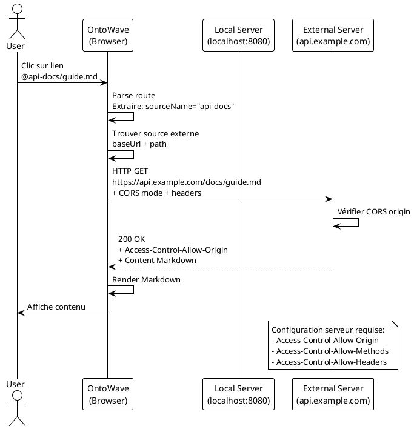

# Configuration des Sources de Données Externes (CORS)

## Vue d'ensemble

OntoWave supporte désormais le chargement de contenu Markdown depuis des serveurs externes via CORS (Cross-Origin Resource Sharing). Cette fonctionnalité permet de référencer des fichiers `.md` hébergés sur d'autres domaines tout en conservant la navigation fluide d'OntoWave.

## Configuration

### Structure de base

Ajoutez la propriété `externalDataSources` dans votre `config.json` :

```json
{
  "locales": ["fr", "en"],
  "defaultLocale": "fr",
  "sources": {
    "fr": "index.fr.md",
    "en": "index.en.md"
  },
  "externalDataSources": [
    {
      "name": "api-docs",
      "baseUrl": "https://api.example.com/docs",
      "corsEnabled": true
    }
  ]
}
```

### Propriétés de ExternalDataSource

| Propriété | Type | Requis | Description |
|-----------|------|--------|-------------|
| `name` | string | ✅ | Identifiant unique de la source (utilisé dans les chemins) |
| `baseUrl` | string | ✅ | URL de base du serveur externe (sans slash final) |
| `corsEnabled` | boolean | ⚪ | Active le mode CORS (défaut: false) |
| `headers` | object | ⚪ | En-têtes HTTP personnalisés (ex: authentification) |

### Exemple complet

```json
{
  "externalDataSources": [
    {
      "name": "api-docs",
      "baseUrl": "https://api.example.com/docs",
      "corsEnabled": true,
      "headers": {
        "Authorization": "Bearer YOUR_API_TOKEN",
        "X-Custom-Header": "value"
      }
    },
    {
      "name": "wiki",
      "baseUrl": "https://wiki.company.com/content",
      "corsEnabled": true
    }
  ]
}
```

## Utilisation

### Référencer une source externe

Utilisez la syntaxe `@sourceName/path/to/file.md` dans vos liens ou routes :

```markdown
# Documentation

Consultez aussi :
- [Documentation API](@api-docs/endpoints.md)
- [Guide Wiki](@wiki/getting-started.md)
- [Référence complète](@api-docs/reference/auth.md)
```

### Navigation par URL hash

Vous pouvez également naviguer directement via l'URL :

```
https://your-site.com/#@api-docs/endpoints
https://your-site.com/#@wiki/tutorials/intro
```

## Configuration du serveur CORS

### Prérequis côté serveur

Pour que le chargement externe fonctionne, le serveur distant doit autoriser les requêtes CORS en configurant les en-têtes HTTP appropriés :

#### En-têtes HTTP requis

```
Access-Control-Allow-Origin: https://your-ontowave-site.com
Access-Control-Allow-Methods: GET, OPTIONS
Access-Control-Allow-Headers: Content-Type, Authorization
```

#### Pour autoriser tous les domaines (développement uniquement)

```
Access-Control-Allow-Origin: *
```

### Exemples de configuration serveur

#### Apache (.htaccess)

```apache
<IfModule mod_headers.c>
    Header set Access-Control-Allow-Origin "*"
    Header set Access-Control-Allow-Methods "GET, OPTIONS"
    Header set Access-Control-Allow-Headers "Content-Type, Authorization"
</IfModule>
```

#### Nginx

```nginx
location /docs {
    add_header Access-Control-Allow-Origin *;
    add_header Access-Control-Allow-Methods "GET, OPTIONS";
    add_header Access-Control-Allow-Headers "Content-Type, Authorization";
}
```

#### Express.js

```javascript
app.use('/docs', (req, res, next) => {
  res.header('Access-Control-Allow-Origin', '*');
  res.header('Access-Control-Allow-Methods', 'GET, OPTIONS');
  res.header('Access-Control-Allow-Headers', 'Content-Type, Authorization');
  next();
});
```

#### Python Flask

```python
from flask import Flask
from flask_cors import CORS

app = Flask(__name__)
CORS(app, resources={r"/docs/*": {"origins": "*"}})
```

## Gestion des erreurs

### Messages de débogage

OntoWave affiche des messages dans la console du navigateur pour faciliter le diagnostic :

```javascript
// Source configurée avec succès
[OntoWave] External data sources configured: api-docs, wiki

// Échec du chargement
[OntoWave] Failed to fetch external content: https://api.example.com/docs/test.md (404 Not Found)

// Erreur CORS
[OntoWave] CORS error fetching https://api.example.com/docs/test.md. 
Ensure the server has proper CORS headers or enable CORS in config.
```

### Page 404 personnalisée

Si un fichier externe est introuvable, OntoWave affiche :

```
# 404 — Not found

Aucun document pour `@api-docs/missing-file`
```

## Cas d'usage

### 1. Documentation API distante

Intégrez la documentation de votre API hébergée sur un autre serveur :

```json
{
  "externalDataSources": [{
    "name": "api",
    "baseUrl": "https://api.example.com/docs",
    "corsEnabled": true
  }]
}
```

Lien dans votre markdown :
```markdown
[Endpoints API](@api/endpoints.md)
```

### 2. Wiki d'entreprise

Référencez des pages d'un wiki interne :

```json
{
  "externalDataSources": [{
    "name": "wiki",
    "baseUrl": "https://wiki.company.internal/md",
    "corsEnabled": true,
    "headers": {
      "Authorization": "Bearer INTERNAL_TOKEN"
    }
  }]
}
```

### 3. Contenu GitHub Pages

Chargez du contenu depuis un autre repo GitHub Pages :

```json
{
  "externalDataSources": [{
    "name": "shared-docs",
    "baseUrl": "https://your-org.github.io/shared-docs",
    "corsEnabled": true
  }]
}
```

## Sécurité

### Bonnes pratiques

1. **Tokens d'authentification** : Ne committez jamais de tokens en dur dans `config.json`
   - Utilisez des variables d'environnement
   - Générez des tokens avec permissions limitées

2. **CORS restreint** : En production, limitez `Access-Control-Allow-Origin` aux domaines de confiance

3. **HTTPS obligatoire** : Utilisez toujours HTTPS pour les sources externes

4. **Validation côté serveur** : Implémentez une validation des requêtes côté serveur

### Variables d'environnement

Pour éviter d'exposer des tokens :

```javascript
// Dans votre build process
const config = {
  externalDataSources: [{
    name: "api",
    baseUrl: process.env.API_DOCS_URL,
    corsEnabled: true,
    headers: {
      Authorization: `Bearer ${process.env.API_TOKEN}`
    }
  }]
}
```

## Limitations

- **Taille des fichiers** : Les fichiers très volumineux peuvent ralentir le chargement
- **Latence réseau** : Le chargement dépend de la vitesse du réseau
- **Cache** : OntoWave utilise `cache: 'no-cache'` pour les fichiers externes
- **Mode no-cors** : Si `corsEnabled: false`, les réponses opaques ne peuvent pas être lues

## Dépannage

### Le contenu ne se charge pas

1. Vérifiez la console du navigateur pour les erreurs CORS
2. Testez l'URL directement dans le navigateur
3. Vérifiez que le serveur distant renvoie bien du contenu Markdown
4. Confirmez que `corsEnabled: true` dans la config

### Erreur "Opaque response"

Cette erreur survient quand `corsEnabled: false`. Mettez-le à `true` ou configurez CORS sur le serveur distant.

### Les en-têtes personnalisés ne fonctionnent pas

Assurez-vous que le serveur distant autorise ces en-têtes via `Access-Control-Allow-Headers`.

## Exemples complets

Voir :
- [config-with-external-sources.json](../config-with-external-sources.json) - Configuration exemple
- Tests E2E CORS (à venir)

## Architecture technique



## Voir aussi

- [Configuration générale OntoWave](./SETUP-MINIMAL.md)
- [Architecture OntoWave](../../panini/fractal-architecture.md)
- [Documentation CORS MDN](https://developer.mozilla.org/fr/docs/Web/HTTP/CORS)
